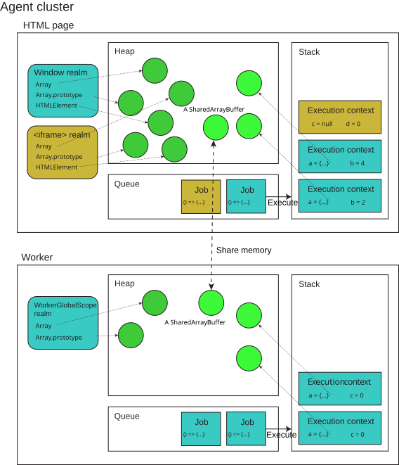
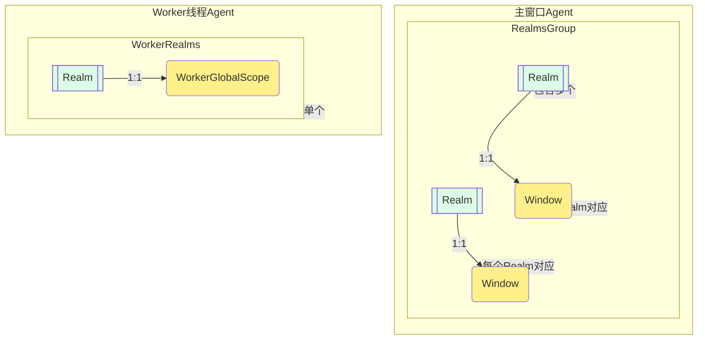
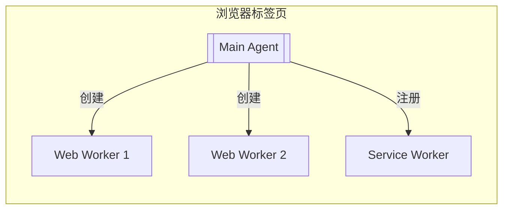

# JavaScript execution model 执行模型

This page introduces the basic infrastructure of the JavaScript runtime environment. The model is largely theoretical and abstract, without any platform-specific or implementation-specific details. Modern JavaScript engines heavily optimize the described semantics.
下文是对执行模型的介绍，主要是从规范中提取的，没有任何平台特定或实现特定的细节。现代 JavaScript 引擎高度优化了 described 语义。

This page is a reference. It assumes you are already familiar with the execution model of other programming languages, such as C and Java. It makes heavy references to existing concepts in operating systems and programming languages.
下文是一个参考文档，假设你已经熟悉其他编程语言的执行模型，例如 C 和 Java。它对操作系统和编程语言中的现有概念进行了深度引用。

## The engine and the host 引擎和主机环境

JavaScript execution requires the cooperation of two pieces of software: the **JavaScript engine** and the **host environment**.
JavaScript 执行需要两个软件的合作：**JavaScript 引擎**和**主机环境**。

The JavaScript engine implements the [ECMAScript (JavaScript) language](/en-US/docs/Web/JavaScript/Reference/JavaScript_technologies_overview#javascript_the_core_language_ecmascript), providing the core functionality. It takes source code, parses it, and executes it. However, in order to interact with the outside world, such as to produce any meaningful output, to interface with external resources, or to implement security- or performance-related mechanisms, we need additional environment-specific mechanisms provided by the host environment. For example, the HTML DOM is the host environment when JavaScript is executed in a web browser. Node.js is another host environment that allows JavaScript to be run on the server side.
JavaScript引擎实现ECMAScript(JavaScript)语言规范，提供了核心的功能。它负责解析和执行JavaScript代码。然而，为了与外部系统完成交互，比如生成更有意义的输入，与其他外部资源交互或实现安全相关和性能相关的机制，我们需要宿主环境提供的额外环境特异性机制。比如，HTML dom是JavaScript在web浏览器中的宿主环境，Node.js是允许JavaScript能够在服务端执行的另一个宿主环境。

While we focus primarily on the mechanisms defined in ECMAScript in this reference, we will occasionally talk about mechanisms defined in the HTML spec, which is often mimicked by other host environments like Node.js or Deno. This way, we can give a coherent picture of the JavaScript execution model as used on the web and beyond.
当我们关注JavaScript在web浏览器中的执行模型时，我们会偶尔提到HTML规范中定义的机制，这些机制通常被其他主机环境（如Node.js或Deno）**模仿**。这样，我们就可以给出JavaScript在web浏览器和其他环境中的执行模型的连贯图片。

## Agent execution model 执行代理模型

In the JavaScript specification, each autonomous executor of JavaScript is called an **agent**, which maintains its facilities for code execution:

- **Heap** (of objects): this is just a name to denote a large (mostly unstructured) region of memory. It gets populated as objects get created in the program. Note that in the case of shared memory, each agent has its own heap with its own version of a {{jsxref("SharedArrayBuffer")}} object, but the underlying memory represented by the buffer is shared. **堆**，正如其名称一样，是一个大的（主要是未结构化的）内存区域，用于存储对象。当程序创建对象时，它们会被填充到堆中。注意，在共享内存的情况下，每个代理都有自己的堆，每个堆都有自己版本的`SharedArrayBuffer`对象，但是缓冲区表示的底层内存是共享的。

- [**Queue** (of jobs)](#job_queue_and_event_loop): this is known in HTML (and also commonly) as the _event loop_ which enables asynchronous programming in JavaScript while being single-threaded. It's called a queue because it's generally first-in-first-out: earlier jobs are executed before later ones. **队列**，因在HTML环境中作为`event loop`，实现了JavaScript在单线程机制下的异步编程而出名。它被称为队列，是因为**先进先出**：越早加入的任务越早实现

- [**Stack** (of execution contexts)](#stack_and_execution_contexts): this is what's known as a _call stack_ and allows transferring control flow by entering and exiting execution contexts like functions. It's called a stack because it's last-in-first-out. Every job enters by pushing a new frame onto the (empty) stack, and exits by emptying the stack. **栈**，因`调用栈`的术语而出名，通过进入和退出执行上下文(函数)来转移控制流。正如其名称一样，是一个后进先出的数据结构。每个任务进入时，都会将一个新的帧压入栈中，退出时，会将栈顶的帧弹出。

These are three distinct data structures that keep track of different data. We will introduce the queue and the stack in more detail in the following sections. To read more about how heap memory is allocated and freed, see [memory management](/en-US/docs/Web/JavaScript/Guide/Memory_management). 这三个数据结构分别用于跟踪不同的数据。我们将在后续章节中详细介绍队列和栈。要了解更多关于堆内存分配和释放的信息，请参阅[内存管理](https://developer.mozilla.org/en-US/docs/Web/JavaScript/Guide/Memory_management)。


Each agent is analogous to a thread (note that the underlying implementation may or may not be an actual operating system thread). Each agent can own multiple [realms](#realms) (which 1-to-1 correlate with global objects) that can synchronously access each other, and thus needs to run in a single execution thread. An agent also has a single memory model, indicating whether it's little-endian, whether it can be [synchronously blocked](#concurrency_and_ensuring_forward_progress), whether atomic operations are [lock-free](/en-US/docs/Web/JavaScript/Reference/Global_Objects/Atomics/isLockFree), etc. 每个执行`agent`都可以拥有多个`realms`（1对1对应全局对象），可以同步访问彼此，因此需要在单个执行线程中运行。每个agent还具有单个内存模型，指示是否为小端模式、是否可以同步阻塞、原子操作是否为无锁等。

An agent on the web can be one of the following: web浏览器中的`agent`都可以是以下之一：

- A _Similar-origin window agent_, which contains various {{domxref("Window")}} objects which can potentially reach each other, either directly or by using {{domxref("Document/domain", "document.domain")}}. If the window is [origin-keyed](/en-US/docs/Web/API/Window/originAgentCluster), then only same-origin windows can reach each other. 每个执行`agent`都可以是一个同源window`agent`，它包含多个`Window`对象，这些对象可以潜在地相互访问，要么直接访问，要么通过使用`document.domain`访问。如果窗口是[origin-keyed](/en-US/docs/Web/API/Window/originAgentCluster)的，那么只有同源的窗口才能相互访问。
- A _Dedicated worker agent_ containing a single {{domxref("DedicatedWorkerGlobalScope")}}. 每个执行`agent`都可以是一个专用工作`agent`，它包含一个`DedicatedWorkerGlobalScope`对象。
- A _Shared worker agent_ containing a single {{domxref("SharedWorkerGlobalScope")}}. 每个执行`agent`都可以是一个共享工作`agent`，它包含一个`SharedWorkerGlobalScope`对象。
- A _Service worker agent_ containing a single {{domxref("ServiceWorkerGlobalScope")}}. 每个执行`agent`都可以是一个服务工作`agent`，它包含一个`ServiceWorkerGlobalScope`对象。
- A _Worklet agent_ containing a single {{domxref("WorkletGlobalScope")}}. 每个执行`agent`都可以是一个工作线程`agent`，它包含一个`WorkletGlobalScope`对象。

In other words, each worker creates its own agent, while one or more windows may be within the same agent—usually a main document and its similar-origin iframes. In Node.js, a similar concept called [worker threads](https://nodejs.org/api/worker_threads.html) is available.
换句话说，每个工作线程都创建了自己的执行`agent`，而一个或多个窗口可能在同一个`agent`中，通常是主文档和其同源`iframe`。在Node.js中，worker的类似的概念叫做[worker threads](https://nodejs.org/api/worker_threads.html)。

The diagram below illustrates the execution model of agents:



## Realms (领域？“王国”)

Each agent owns one or more **realms**. Each piece of JavaScript code is associated with a realm when it's loaded, which remains the same even when called from another realm. A realm consists of the follow information:
每一个执行`agent`都可以拥有多个`realms`，每段 JavaScript 代码在加载时都与一个`realms`相关联，即使从另一个`realms`调用时，这个`realms`也保持不变。一个`realms`包含以下信息：

- A list of intrinsic objects like `Array`, `Array.prototype`, etc. 每个`realms`都有自己的内部对象，例如`Array`、`Array.prototype`等。
- Globally declared variables, the value of [`globalThis`](/en-US/docs/Web/JavaScript/Reference/Global_Objects/globalThis), and the global object 每个`realms`都有全局声明的变量、 `globalThis` 的值以及全局对象。
- A cache of [template literal arrays](/en-US/docs/Web/JavaScript/Reference/Template_literals#tagged_templates), because evaluation of the same tagged template literal expression always causes the tag to receive the same array object. 每个`realms`都有模板字面量数组的缓存，因为对相同的标记模板字面量表达式进行求值总是导致标签接收到相同的数组对象

On the web, the realm and the global object are 1-to-1 corresponded. The global object is either a {{domxref("Window")}}, a {{domxref("WorkerGlobalScope")}}, or a {{domxref("WorkletGlobalScope")}}. So for example, every `iframe` executes in a different realm, though it may be in the same agent as the parent window. 在 Web 上，`realms`和全局对象是一对一对应的。全局对象要么是 `Window` ，要么是 `WorkerGlobalScope` ，要么是 `WorkletGlobalScope` 。因此，例如，每个 `iframe` 都在不同的`realms`中执行，尽管它可能与父窗口位于同一个`agent`中。

Realms are usually mentioned when talking about the identities of global objects. For example, we need methods such as {{jsxref("Array.isArray()")}} or {{jsxref("Error.isError()")}}, because an array constructed in another realm will have a different prototype object than the `Array.prototype` object in the current realm, so `instanceof Array` will wrongly return `false`. 当谈论全局对象的身份时，通常会提到`realms`。例如，我们需要 `Array.isArray()` 或 `Error.isError()` 这样的方法，因为在另一个`realms`中构建的数组将具有与当前`realms`中的 `Array.prototype` 对象不同的原型对象，所以 `instanceof Array` 会错误地返回 `false` 。

### Agent与Realm关系图示



完整要素说明：
1. 主窗口Agent包含两个Realm（对应两个同源iframe）
2. Worker线程Agent包含独立Realm
3. 使用不同层级的subgraph区分Agent边界
4. 添加注释说明包含关系
5. 优化线条样式增强层级感
 
### 浏览器标签页



- 每个标签页包含：
  1. 主Agent：负责DOM渲染、事件处理（对应[HTML规范中的browsing context](<mcurl name="HTML规范" url="https://html.spec.whatwg.org/multipage/browsers.html#browsing-context"></mcurl>)）
  2. 多个Worker Agent：通过`new Worker()`创建（遵循[Web Workers规范](<mcurl name="Web Workers" url="https://html.spec.whatwg.org/multipage/workers.html"></mcurl>)）

## Stack and execution contexts 栈和执行上下文

We first consider synchronous code execution. Each [job](#job_queue_and_event_loop) enters by calling its associated callback. Code inside this callback may create variables, call functions, or exit. Each function needs to keep track of its own variable environments and where to return to. To handle this, the agent needs a stack to keep track of the execution contexts. A **execution context**, also known generally as a _stack frame_, is the smallest unit of execution. It tracks the following information: 我们首先考虑同步代码执行。每个`job`通过调用其关联的回调函数进入。这个回调函数内的代码可能会创建变量、调用函数或退出。每个函数都需要跟踪自己的变量环境以及返回的位置。为了处理这种情况，代理需要一个栈来跟踪执行上下文。一个**执行上下文**，通常也称为栈帧，是执行的最小单元。它跟踪以下信息：

- Code evaluation state 代码执行状态
- The module or script, the function (if applicable), and the currently executing [generator](/en-US/docs/Web/JavaScript/Reference/Global_Objects/Generator) that contains this code 该模块或脚本、函数（如果适用），以及包含此代码的当前正在执行的生成器
- The current [realm](#realms) 该模块或脚本所在的`realms`
- [Bindings](/en-US/docs/Glossary/Binding), including:
  - Variables defined with `var`, `let`, `const`, `function`, `class`, etc. 该模块或脚本中定义的变量、函数、类等
  - Private identifiers like `#foo` which are only valid in the current context 该模块或脚本中定义的私有标识符，例如 `#foo` ，它只在当前上下文中有效
  - `this` reference `this` 引用

Imagine a program consisting of a single job defined by the following code:想象一个由以下代码定义的单个任务组成的程序：

```js
function foo(b) {
  const a = 10;
  return a + b + 11;
}

function bar(x) {
  const y = 3;
  return foo(x * y);
}

const baz = bar(7); // assigns 42 to baz
```

1. When the job starts, the first frame is created, where the variables `foo`, `bar`, and `baz` are defined. It calls `bar` with the argument `7`. 当任务开始时，会创建第一个帧，其中定义了变量 `foo` 、 `bar` 和 `baz` 。它会调用 `bar` ，参数为 `7` 。
2. A second frame is created for the `bar` call, containing bindings for the parameter `x` and the local variable `y`. It first performs the multiplication `x * y`, then calls `foo` with the result. 为 `bar` 调用创建第二个帧，其中包含参数 `x` 和局部变量 `y` 的绑定。它首先执行乘法 `x * y` ，然后调用 `foo` ，参数为乘法结果。
3. A third frame is created for the `foo` call, containing bindings for the parameter `b` and the local variable `a`. It first performs the addition `a + b + 11`, then returns the result. 为 `foo` 调用创建第三个帧，其中包含参数 `b` 和局部变量 `a` 的绑定。它首先执行加法 `a + b + 11` ，然后返回结果。
4. When `foo` returns, the top frame element is popped out of the stack, and the call expression `foo(x * y)` resolves to the return value. It then continues execution, which is just to return this result. 当 `foo` 返回时，顶部帧元素会从栈中弹出，并且调用表达式 `foo(x * y)` 会解析为返回值。然后继续执行，只是返回这个结果。
5. When `bar` returns, the top frame element is popped out of the stack, and the call expression `bar(7)` resolves to the return value. This initializes `baz` with the return value. 当 `bar` 返回时，顶部帧元素会从栈中弹出，并且调用表达式 `bar(7)` 会解析为返回值。这会将返回值初始化给 `baz` 。
6. We reach the end of the job's source code, so the stack frame for the entrypoint is popped out of the stack. The stack is empty, so the job is considered completed. 我们到达任务源代码的末尾，所以入口点的栈帧会从栈中弹出。栈为空，所以任务被认为是完成的。

### Generators and reentry 生成器和重入

When a frame is popped, it's not necessarily gone forever, because sometimes we need to come back to it. For example, consider a generator function:当一个帧被弹出时，它不一定会永远消失，因为有时我们需要返回它。例如，考虑一个生成器函数：

```js
function* gen() {
  console.log(1);
  yield;
  console.log(2);
}

const g = gen();
g.next(); // logs 1
g.next(); // logs 2
```

In this case, calling `gen()` first creates an execution context which is suspended—no code inside `gen` gets executed yet. The generator `g` saves this execution context internally. The current running execution context remains to be the entrypoint. When `g.next()` is called, the execution context for `gen` is pushed onto the stack, and the code inside `gen` is executed until the `yield` expression. Then, the generator execution context gets suspended and removed from the stack, which returns control back to the entrypoint. When `g.next()` is called again, the generator execution context is pushed back onto the stack, and the code inside `gen` resumes from where it left off.
在这种情况下，首先调用 `gen()` 会创建一个**挂起的执行上下文**——此时 `gen` 中的代码尚未执行。生成器 `g` 将这个执行上下文保存在内部。当前正在运行的执行上下文仍然是入口点。当 `g.next()` 被调用时， `gen` 的执行上下文被推入栈中， `gen` 中的代码被执行直到 `yield` 表达式。然后，生成器执行上下文被挂起并从栈中移除，控制权返回到入口点。当再次调用 `g.next()` 时，生成器执行上下文被重新推入栈中， `gen` 中的代码从上次暂停的地方继续执行。

### Tail calls 尾调用✨📌

One mechanism defined in the specification is _proper tail call_ (PTC). A function call is a tail call if the caller does nothing after the call except return the value: 规范中定义的一种机制是正确尾调用（PTC）。如果调用者在调用后除了返回值外不做任何操作，那么这个函数调用就是尾调用：

```js
function f() {
  return g();
}
```

In this case, the call to `g` is a tail call. If a function call is in tail position, the engine is required to discard the current execution context and replace it with the context of the tail call, instead of pushing a new frame for the `g()` call. This means that tail recursion is not subject to the stack size limits:
在这种情况下，对 `g` 的调用是尾调用。如果一个函数调用处于尾位置，引擎必须丢弃当前的执行上下文，并用尾调用的上下文来替换它，而不是为 `g()` 调用压入新的栈帧。**这意味着尾递归不受栈大小限制**：

```js
function factorial(n, acc = 1) {
  if (n <= 1) return acc;
  return factorial(n - 1, n * acc);
}
```

In reality, discarding the current frame causes debugging problems, because if `g()` throws an error, `f` is no longer on the stack and won't appear in the stack trace. Currently, only Safari (JavaScriptCore) implements PTC, and they have invented some [specific infrastructure](https://webkit.org/blog/6240/ecmascript-6-proper-tail-calls-in-webkit/) to address the debuggability issue.
实际上，丢弃当前帧会导致调试问题，因为如果 `g()` 抛出错误， `f` 将不再在栈上，也不会出现在堆栈跟踪中。目前，只有 Safari（JavaScriptCore）实现了 PTC，并且他们已经发明了一些特定的基础设施来解决可调试性问题。

### Closures 闭包

Another interesting phenomenon related to variable scoping and function calls is [closures](/en-US/docs/Web/JavaScript/Guide/Closures). Whenever a function is created, it also memorizes internally the variable bindings of the current running execution context. Then, these variable bindings can outlive the execution context.
与变量作用域和函数调用相关的另一个有趣现象是**闭包**。每当创建一个函数时，它也会内部记住当前运行执行上下文的变量绑定。然后，这些变量绑定可以存活于执行上下文之外。

```js
let f;
{
  let x = 10;
  f = () => x;
}
console.log(f()); // logs 10
```

## Job queue and event loop 任务队列和事件循环
> event loop里面有一个微小任务队列，这个队列里面的任务是微任务，也就是说这些微任务是先进先出的
> event loop是一个任务的集合，并不是一个队列

An agent is a thread, which means the interpreter can only process one statement at a time. When the code is all synchronous, this is fine because we can always make progress. But if the code needs to perform asynchronous action, then we cannot progress unless that action is completed. However, it would be detrimental to user experience if that halts the whole program—the nature of JavaScript as a web scripting language requires it to be [never blocking](#never_blocking). Therefore, the code that handles the completion of that asynchronous action is defined as a callback. This callback defines a **job**, which gets placed into a **job queue**—or, in HTML terminology, an event loop—once the action is completed.
**一个`agent`是一个线程**，这意味着解释器一次只能处理一条语句。当代码全部是同步的时，这是没问题的，因为我们总能继续执行。但如果代码需要执行异步操作，那么除非该操作完成，否则我们无法继续执行。然而，如果这导致整个程序停止——作为一门网络脚本语言，JavaScript 的本质要求它不能阻塞——那么这对用户体验是有害的。因此，处理该异步操作完成的代码被定义为**回调**。这个**回调**定义了一个`job`，一旦操作完成，该任务就会被放入任务队列——在 HTML 术语中，称为**事件循环**。

Every time, the agent pulls a job from the queue and executes it. When the job is executed, it may create more jobs, which are added to the end of the queue. Jobs can also be added via the completion of asynchronous platform mechanisms, such as timers, I/O, and events. A job is considered completed when the [stack](#stack_and_execution_contexts) is empty; then, the next job is pulled from the queue. Jobs might not be pulled with uniform priority—for example, HTML event loops split jobs into two categories: _tasks_ and _microtasks_. Microtasks have higher priority and the microtask queue is drained first before the task queue is pulled. For more information, check the [HTML microtask guide](/en-US/docs/Web/API/HTML_DOM_API/Microtask_guide). If the job queue is empty, the agent waits for more jobs to be added.
每次，`agent`都会从队列中拉取一个任务并执行它。当`job`被执行时，它可能会创建更多`job`，这些`job`会被添加到队列的末尾。`job`也可以通过异步平台机制的完成来添加，例如**计时器**、**I/O 和事件**。当`栈`为空时，`job`被认为已完成；然后，`agent`会从队列中拉取下一个`job`。`job`可能不会以统一的优先级被拉取——例如，HTML 事件循环将任务分为两类：`task`和`microtasks`。`microtasks`具有更高的优先级，在拉取`task`队列之前，会先清空`microtasks`队列。有关更多信息，请查看 HTML 微任务指南。如果`task`队列是空的，`agent`会等待更多任务被添加。

### "Run-to-completion" "运行至完成"

Each job is processed completely before any other job is processed. This offers some nice properties when reasoning about your program, including the fact that whenever a function runs, it cannot be preempted and will run entirely before any other code runs (and can modify data the function manipulates). This differs from C, for instance, where if a function runs in a thread, it may be stopped at any point by the runtime system to run some other code in another thread. 每个`job`在处理任何其他`job`之前会被完全处理。这在推理你的程序时提供了一些很好的特性，包括事实：每当一个函数运行时，它不能被抢占，并且会在任何其他代码运行之前完全运行（并且可以修改该函数操作的数据）。这与 C 语言不同，例如，在 C 语言中，如果一个函数在一个线程中运行，它可能会在任何时刻被运行时系统停止，以便在另一个线程中运行其他代码。

For example, consider this example:

```js
const promise = Promise.resolve();
let i = 0;
promise.then(() => {
  i += 1;
  console.log(i); // 1
});
promise.then(() => {
  i += 1;
  console.log(i); // 2
});
```

In this example, we create an already-resolved promise, which means any callback attached to it will be immediately scheduled as jobs. The two callbacks seem to cause a race condition, but actually, the output is fully predictable: `1` and `2` will be logged in order. This is because each job runs to completion before the next one is executed, so the overall order is always `i += 1; console.log(i); i += 1; console.log(i);` and never `i += 1; i += 1; console.log(i); console.log(i);`.在这个例子中，我们创建了一个已经解决的 `Promise`，这意味着任何附加到它上的回调都会立即被安排为`job`。这两个回调看似会造成竞态条件，但实际上输出是完全可预测的： `1` 和 `2` 将按顺序被记录。这是因为每个`job`都会在下一个`job`执行之前运行到完成，所以整体顺序总是 `i += 1; console.log(i); i += 1; console.log(i);` ，永远不会是 `i += 1; i += 1; console.log(i); console.log(i);` 。

A downside of this model is that if a job takes too long to complete, the web application is unable to process user interactions like click or scroll. The browser mitigates this with the "a script is taking too long to run" dialog. A good practice to follow is to make job processing short and if possible cut down one job into several jobs.这种模型的缺点在于，如果`job`执行时间过长，Web 应用程序将无法处理用户交互，如**点击**或**滚动**。浏览器通过显示"脚本运行时间过长"的对话框来缓解这一问题。一个良好的实践是使任务处理时间尽可能短，并在可能的情况下将一个`job`分解为多个`job`。

### Never blocking 从不阻塞

Another important guarantee offered by the event loop model is that JavaScript execution is never blocking. Handling I/O is typically performed via events and callbacks, so when the application is waiting for an [IndexedDB](/en-US/docs/Web/API/IndexedDB_API) query to return or a [`fetch()`](/en-US/docs/Web/API/Window/fetch) request to return, it can still process other things like user input. The code that executes after the completion of an asynchronous action is always provided as a callback function (for example, the promise {{jsxref("Promise/then", "then()")}} handler, the callback function in `setTimeout()`, or the event handler), which defines a job to be added to the job queue once the action completes.
事件循环模型提供的另一个重要保证是 JavaScript 执行**永远不会阻塞**。处理 I/O 通常通过事件和回调完成，因此当应用程序正在等待 `IndexedDB` 查询返回或 `fetch()` 请求返回时，它仍然可以处理其他事情，如**用户输入**。异步操作完成后执行的代码总是以回调函数的形式提供（例如，承诺 `then()` 处理程序、 `setTimeout()` 中的回调函数或事件处理程序），该函数定义了一个`job`，一旦操作完成，就会将其添加到`job`队列中。

Of course, the guarantee of "never-blocking" requires the platform API to be inherently asynchronous, but some legacy exceptions exist like `alert()` or synchronous XHR. It is considered good practice to avoid them to ensure the responsiveness of the application.
当然，"永不阻塞"的保证需要平台 API 本身是异步的，但存在一些遗留例外，如 `alert()` 或同步 XHR。为了避免影响应用的响应性，通常建议避免使用它们。

## Agent clusters and memory sharing `agent`集群和内存共享

Multiple agents can communicate via memory sharing, forming an **agent cluster**. Agents are within the same cluster if and only if they can share memory. There is no built-in mechanism for two agent clusters to exchange any information, so they can be regarded as completely isolated execution models.
多个`agent`可以通过内存共享进行通信，形成`agent`集群。当且仅当`agent`之间可以共享内存时，它们属于同一个集群。由于两个`agent`集群之间没有内置的任何信息交换机制，因此它们可以被视为完全隔离的执行模型。

When creating an agent (such as by spawning a worker), there are some criteria for whether it's in the same cluster as the current agent, or a new cluster is created. For example, the following pairs of global objects are each within the same agent cluster, and thus can share memory with each other:
在创建`agent`（例如通过生成工作线程）时，有一些标准来判断它是否与当前`agent`位于同一集群，还是将创建一个新的集群。例如，以下成对的全局对象各自位于同一`agent`集群内，因此可以相互共享内存：

- A `Window` object and a dedicated worker that it created. 一个 `Window` 对象和一个它创建的专用工作线程。
- A worker (of any type) and a dedicated worker it created. 一个工作线程（任意类型）和一个它创建的专用工作线程。
- A `Window` object A and the `Window` object of a same-origin `iframe` element that A created. 一个 `Window` 对象 A 和 A 创建的同源 `iframe` 元素的 `Window` 对象。
- A `Window` object and a same-origin `Window` object that opened it. 一个 `Window` 对象和一个同源打开它的 `Window` 对象。
- A `Window` object and a worklet that it created. 一个 `Window` 对象和一个它创建的工作线程。

The following pairs of global objects are not within the same agent cluster, and thus cannot share memory:以下成对的全局对象不属于同一个`agent`集群，因此不能共享内存：

- A `Window` object and a shared worker it created. 一个 `Window` 对象和一个它创建的共享工作线程。
- A worker (of any type) and a shared worker it created. 一个工作线程（任意类型）和一个它创建的共享工作线程。
- A `Window` object and a service worker it created. 一个 `Window` 对象和一个它创建的服务工作线程。
- A `Window` object A and the `Window` object of an `iframe` element that A created that cannot be same origin-domain with A. 一个 `Window` 对象 A 和 A 创建的同源 `iframe` 元素的 `Window` 对象。
- Any two `Window` objects with no opener or ancestor relationship. This holds even if the two `Window` objects are same origin. 任何两个 `Window` 对象，它们之间没有打开器或祖先关系。即使这两个 `Window` 对象是同源的，也成立。

For the exact algorithm, check the [HTML specification](https://html.spec.whatwg.org/multipage/webappapis.html#integration-with-the-javascript-agent-cluster-formalism). 要了解精确的算法，请查阅 HTML 规范。

### Cross-agent communication and memory model 跨代理通信和内存模型

As aforementioned, agents communicate via memory sharing. On the web, memory is shared via the [`postMessage()`](/en-US/docs/Web/API/Window/postMessage) method. The [using web workers](/en-US/docs/Web/API/Web_Workers_API/Using_web_workers) guide provides an overview of this. Typically, data is passed by value only (via [structured cloning](/en-US/docs/Web/API/Web_Workers_API/Structured_clone_algorithm)), and therefore does not involve any concurrency complications. To share memory, one must post a {{jsxref("SharedArrayBuffer")}} object, which can be simultaneously accessed by multiple agents. Once two agents share access to the same memory via a `SharedArrayBuffer`, they can synchronize executions via the {{jsxref("Atomics")}} object.
如前所述，`agent`通过内存共享进行通信。在 Web 上，内存通过 `postMessage()` 方法共享。使用 Web Workers 指南提供了对此的概述。通常，数据仅按值传递（通过结构化克隆），因此不会涉及任何并发复杂性。要共享内存，必须发布一个 `SharedArrayBuffer` 对象，该对象可以被多个`agent`同时访问。一旦两个`agent`通过 `SharedArrayBuffer` 共享同一内存的访问权限，它们可以通过 `Atomics` 对象同步执行。

There are two ways to access shared memory: via normal memory access (which is not atomic) and via atomic memory access. The latter is [sequentially consistent](https://en.wikipedia.org/wiki/Sequential_consistency) (which means there is a strict total ordering of events agreed upon by all agents in the cluster), while the former is unordered (which means no ordering exists); JavaScript does not provide operations with other ordering guarantees.
访问共享内存有两种方式：通过**普通内存访问**（这不是原子的）和通过**原子内存访问**。后者是顺序一致的（这意味着集群中所有`agent`都同意的事件有一个严格的完全排序），而前者是无序的（这意味着不存在排序）；JavaScript 不提供具有其他排序保证的操作。

The spec provides the following guidelines for programmers working with shared memory:该规范为处理共享内存的程序员提供了以下指南：

> We recommend programs be kept data race free, i.e., make it so that it is impossible for there to be concurrent non-atomic operations on the same memory location. Data race free programs have interleaving semantics where each step in the evaluation semantics of each agent are interleaved with each other. For data race free programs, it is not necessary to understand the details of the memory model. The details are unlikely to build intuition that will help one to better write ECMAScript.
> 我们建议程序保持无数据竞争状态，即确保同一内存位置不会发生并发非原子操作。无数据竞争状态的程序具有交错语义，其中每个`agent`的评估语义的每一步都会相互交错。对于无数据竞争状态的程序，无需理解内存模型的细节。这些细节不太可能建立有助于更好地编写 ECMAScript 的直觉。
> More generally, even if a program is not data race free it may have predictable behavior, so long as atomic operations are not involved in any data races and the operations that race all have the same access size. The simplest way to arrange for atomics not to be involved in races is to ensure that different memory cells are used by atomic and non-atomic operations and that atomic accesses of different sizes are not used to access the same cells at the same time. Effectively, the program should treat shared memory as strongly typed as much as possible. One still cannot depend on the ordering and timing of non-atomic accesses that race, but if memory is treated as strongly typed the racing accesses will not "tear" (bits of their values will not be mixed).
> 更一般地，即使一个程序不是数据竞争自由的，只要原子操作不参与任何数据竞争，并且所有竞争的操作都具有相同的访问大小，它也可能具有可预测的行为。确保原子操作不参与竞争的最简单方法是为原子操作和非原子操作使用不同的内存单元，并确保不同大小的原子访问不会同时访问相同的单元。实际上，程序应该尽可能将共享内存视为强类型的。尽管仍然不能依赖竞争的非原子访问的顺序和时间，但如果将内存视为强类型的，那么竞争的访问将不会“撕裂”（它们值的位不会混合）。

### Concurrency and ensuring forward progress 并发与确保正向进展

When multiple agents cooperate, the [never-blocking](#never_blocking) guarantee does not always hold. An agent can become _blocked_, or paused, while waiting for another agent to perform some action. This is different from waiting on a promise in the same agent, because it halts the entire agent and does not allow any other code to run in the meantime—in other words, it cannot make _forward progress_.
> 当多个`agent`合作时，永不阻塞的保证并不总是成立。一个`agent`可能会在等待另一个`agent`执行某些操作时被阻塞或暂停。这与在同一`agent`上等待一个承诺不同，因为它会停止整个`agent`，并且在此期间不允许任何其他代码运行——换句话说，它无法实现正向进展。
To prevent deadlocks, there are some strong restrictions on when and which agents can become blocked.为了防止死锁，对`agent`在何时以及哪些情况下可以变得阻塞有一些严格的限制。

- Every unblocked agent with a dedicated executing thread eventually makes forward progress. 每个未被阻塞的具有专用执行线程的`agent`最终都会向前推进。
- In a set of agents that share an executing thread, one agent eventually makes forward progress. 在一组共享执行线程的`agent`中，其中一个`agent`最终会向前推进。
- An agent does not cause another agent to become blocked except via explicit APIs that provide blocking. 一个`agent`不会通过除提供阻塞的显式 API 之外的方式使另一个`agent`被阻塞。
- Only certain agents can be blocked. On the web, this includes dedicated workers and shared workers, but not similar-origin windows or service workers. 只有特定的`agent`可以被阻塞。在 Web 上，这包括专用工作线程和共享工作线程，但不包括同源窗口或服务工作者。

The agent cluster ensures some level of integrity over the activeness of its agents, in the case of external pauses or terminations:
`agent`集群确保其代理的活跃性在出现外部暂停或终止的情况下保持一定程度的完整性：
- An agent may be paused or resumed without its knowledge or cooperation. For example, navigating away from a window may suspend code execution but preserve its state. However, an agent cluster is not allowed to be partially deactivated, to avoid an agent starving because another agent has been deactivated. For example, shared workers are never in the same agent cluster as the creator window or other dedicated workers. This is because a shared worker's lifetime is independent of documents: if a document is deactivated while its dedicated worker holds a lock, the shared worker is blocked from acquiring the lock until the dedicated worker is reactivated, if ever. Meanwhile other workers trying to access the shared worker from other windows will starve.`agent`可以在其不知情或无配合的情况下被暂停或恢复。例如，离开一个窗口可能会暂停代码执行但保留其状态。然而，`agent`集群不允许部分停用，以避免一个`agent`因另一个`agent`被停用而资源耗尽。例如，共享工作线程永远不会与创建窗口或其他专用工作线程处于同一`agent`集群中。这是因为共享工作线程的生命周期独立于文档：如果文档被停用时其专用工作线程持有锁，共享工作线程将无法获取锁，直到专用工作线程重新激活（如果重新激活的话），同时其他从其他窗口尝试访问共享工作线程的线程将资源耗尽。
- Similarly, an agent may be terminated by factors external to the cluster. For example, operating systems or users killing a browser process, or the browser force-terminating one agent because it's using too many resources. In this case, all the agents in the cluster get terminated. (The spec also allows a second strategy, which is an API that allows at least one remaining member of the cluster to identify the termination and the agent that was terminated, but this is not implemented on the web.)类似地，`agent`也可能因集群外部因素而被终止。例如，操作系统或用户终止浏览器进程，或者浏览器因`agent`使用过多资源而强制终止。在这种情况下，集群中的所有`agent`都会被终止。（规范还允许第二种策略，即一个 API，允许集群中至少一个剩余成员识别终止事件以及被终止的`agent`，但这在 Web 上并未实现。）

## Specifications

- https://tc39.es/ecma262/multipage/executable-code-and-execution-contexts.html
- https://tc39.es/ecma262/multipage/memory-model.html
- https://html.spec.whatwg.org/multipage/webappapis.html

## See also

- [Event loops](https://html.spec.whatwg.org/multipage/webappapis.html#event-loops) in the HTML standard
- [What is the Event Loop?](https://nodejs.org/en/learn/asynchronous-work/event-loop-timers-and-nexttick#what-is-the-event-loop) in the Node.js docs
