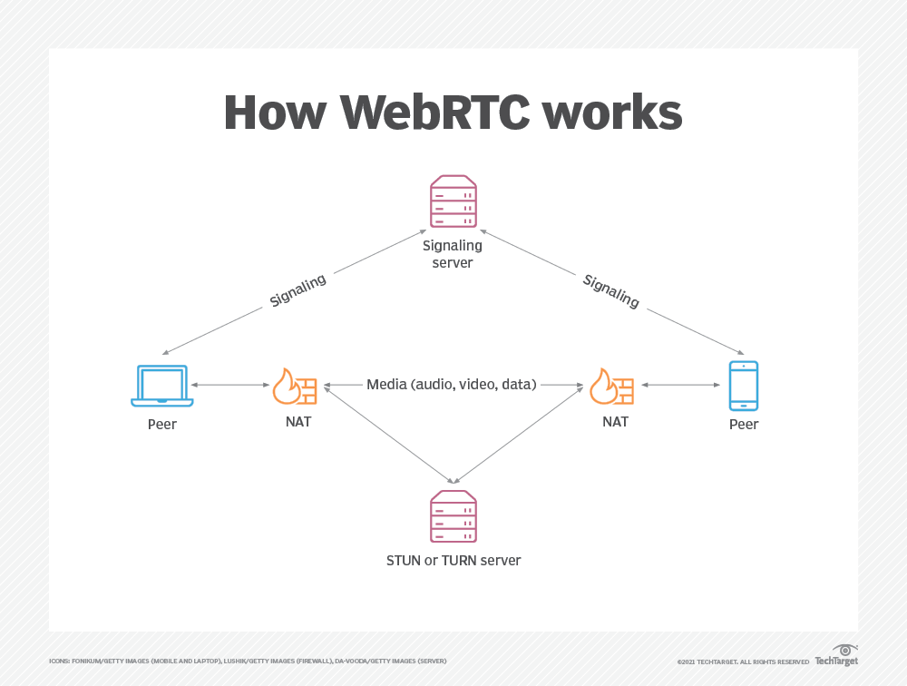

# WebRTC(Web Real-Time Communication)

- [wiki](./wiki.md)介绍

## how webRTC works

## Concepts

- STUN（Simple Traversal of User Datagram Protocol Through Network Address Translators 简单的用 UDP 穿透 NAT, 被重新命名为 Session Traversal Utilities for NAT，即 NAT 会话穿透效用
- TURN，Traversal Using Relays around NAT:Relay Extensions to Session Traversal Utilities for NAT 使用中继穿透 NAT:STUN 的扩展

## Resources

- [webrtc](https://webrtc.org/)
- p2p protocol
- [webrtc 示例代码](https://github.com/webrtc/samples)
- [coturn 搭建 stun / turn 服务器](https://juejin.cn/post/6999962039930060837)
- [MDN WebRTC](https://developer.mozilla.org/en-US/docs/Web/API/WebRTC_API)

## More Reading

- https://www.techtarget.com/searchunifiedcommunications/definition/WebRTC-Web-Real-Time-Communications
- [webrtc with cloud game](https://webrtchacks.com/open-source-cloud-gaming-with-webrtc/)
- [webrtc-server-what-it-is-and-why-you-need-one](https://www.wowza.com/blog/webrtc-server-what-it-is-and-why-you-need-one)
- [借助图片来理解消息](https://www.google.com/search?newwindow=1&q=webrtc&tbm=isch&sa=X&ved=2ahUKEwi09Zia6tD_AhVLpVYBHR2wCzEQ0pQJegQICxAB&biw=1920&bih=929&dpr=1#imgrc=5XUS8NrCp72L-M)
