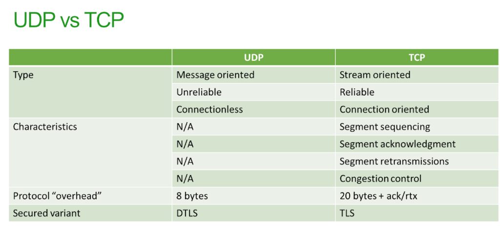
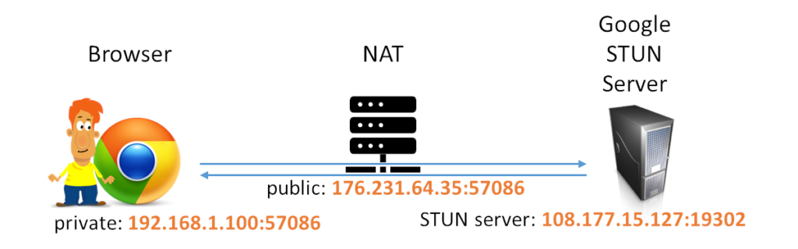
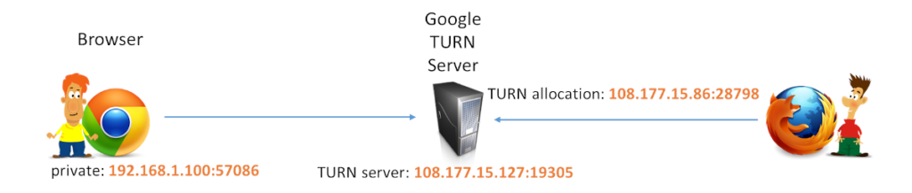

# WebRTC ports: Understanding IP addresses and port ranges in WebRTC

WebRTC IP addresses and port ranges can be a bit tricky for those unfamiliar enough with VoIP. I’d like to shed some light about this topic.
WebRTC 的 IP 地址和端口范围对于对 VoIP 不太熟悉的人来说可能有些棘手。我想对这个主题进行一些解释。

Connecting a WebRTC session takes multiple network connections and messages taking place over different types of transport protocols. There are two reasons why that decision was made for WebRTC:

1. There was a desire to have it run peer to peer, directly exchanging real time media between two browsers. This requires a different look at how to handle network entities such as NATs and firewalls
2. Real time media is different from other data sent over the internet in browsers. The transport and signaling protocols already available were just not good enough to preserve high quality and low latency

建立 WebRTC 会话需要通过不同类型的传输协议进行多个网络连接和消息传递。这种决策之所以被做出，有两个原因：

1. 首先，希望能够在两个浏览器之间点对点地运行，并直接交换实时媒体。这就需要以不同的方式处理网络实体，如 NAT 和防火墙。
2. 其次，实时媒体与在浏览器中发送的其他数据不同。现有的传输和信令协议并不能提供足够好的性能，无法保持高质量和低延迟。因此需要开发新的协议来满足实时媒体传输的需求。

## A quick explainer to internet connections

We will start by looking at the building blocks of digital communications – TCP and UDP.

The table below summarizes a bit the differences between the two:

TCP and UDP are two extremes of how transport protocols can be expressed
TCP（Transmission Control Protocol）和 UDP（User Datagram Protocol）是传输协议的两个极端表达方式。

### TCP connections

### UDP connections

由于 UDP 是无连接的，实际上没有真正的连接，没有任何上下文。

要通过 UDP 发送消息，我需要再次使用四个值的组合：

源 IP：源端口+目标 IP：目标端口

但是这一次，没有真正的连接。在这里，我只需要打开一个本地 IP：端口，每当我想发送消息时，只需告诉它目标 IP：端口，然后完成发送即可。

## WebRTC signaling connections and addresses

WebRTC signaling is just like any other web application connection.WebRTC 的信令就像任何其他的 Web 应用程序连接一样。
In order to send and receive the SDP blobs to make the connection, I need to be able to communicate between the browsers and that is done using traditional networking means available in the browser: either HTTP or WebSocket. Both (ignoring HTTP/3) are implemented on top of TCP.
为了发送和接收 SDP 数据块以建立连接，我需要能够在浏览器之间进行通信，而这是通过浏览器中可用的传统网络手段完成的：即 HTTP 或 WebSocket。这两者（忽略 HTTP/3）都是基于 TCP 实现的。

What does that mean?

- When my browser connects to the signaling server, it connects to an HTTPS or a Secure Websocket address (because… security)当我的浏览器连接到信令服务器时，它会连接到一个 HTTPS 或安全 WebSocket 地址（因为...安全性）。
- The destination address will be whatever the DNS will resolve for the name of the server I connect to; and for the most part, this connection will be done towards port 443 目标地址将是 DNS 解析为我连接的服务器名称的结果；而且在大部分情况下，这个连接将会指向端口 443。
- The local address will be whatever local address I have on my machine 本地地址将是我机器上的本地地址。
- The local port will be an arbitrary local port that the operating system will allocate 本地端口将是操作系统分配的任意本地端口。

The end result?

The **signaling server** has a static IP and port, while the client is **“dynamic”** in nature

Local ports are arbitrary (and ephemeral)本地端口是任意的（且短暂的）. Destination port is 443 (or whatever advertised by the server).

## WebRTC media connections and addresses

Media in WebRTC gets connected via SRTP. Most of the time, that would happen over UDP, which is what we will focus on in this section.在 WebRTC 中，媒体通过 SRTP 进行连接。大多数情况下，这将通过 UDP 进行传输，这是我们在本节中重点关注的。

In naive SRTP implementations from before the WebRTC era, each video call usually used 4 separate connections:在 WebRTC 出现之前的简单 SRTP 实现中，每个视频通话通常使用 4 个独立的连接：

1. RTP for sending voice data 用于发送语音数据的 RTP
2. RTCP for sending the control of the voice data 用于发送语音数据控制的 RTCP
3. RTP for sending video data 用于发送视频数据的 RTP
4. RTCP for sending the control of the video data 用于发送视频数据控制的 RTCP

While WebRTC can support this kind of craziness, it also uses [rtcp-mux](https://webrtcglossary.com/rtcp-mux/) and [BUNDLE](https://webrtcglossary.com/bundle/). These two effectively bring us down to a single connection for voice, video, media and its control.虽然 WebRTC 可以支持这种复杂性，但它还使用了 rtcp-mux 和 BUNDLE。这两个技术有效地将语音、视频、媒体及其控制归纳为单个连接。

What happens though is this –

- You create a peer connection 你创建一个对等连接（peer connection）。
- Then you add media tracks to it, effectively instructing it on what it is about to send or receive (or at least what you want it to send or receive)然后你向它添加媒体轨道，有效地告诉它你要发送或接收什么（或者至少是你希望它发送或接收什么）。
- WebRTC will then allocate and bind local IP addresses and ports to handle that traffic. As with outgoing TCP connections, the local ports are going to be arbitrary and ephemeral. WebRTC 将分配和绑定本地 IP 地址和端口来处理这些流量。与传出的 TCP 连接一样，本地端口将是任意的和短暂的。
- The allocated IP:port addresses are now going to be used in the SDP being negotiated. These will be used as the local candidates 分配的 IP:端口地址现在将在正在协商的 SDP 中使用。这些将被用作**本地候选者**。

Since these addresses and ports are local, there’s high probability that they will be blocked by firewalls for incoming traffic.
由于这些地址和端口是本地的，所以很有可能它们会被防火墙阻止进入流量。

Media servers work in the exact same way. In most cases, the addresses that they will use will be public IP addresses, but the ports will be arbitrary. That’s because media servers usually prefer handling each incoming device separately, by receiving its traffic on a dedicated socket connected to a specific port.
媒体服务器的工作方式与之前描述的方式完全相同。在大多数情况下，它们将使用公共 IP 地址，但端口是任意的。这是因为媒体服务器通常更喜欢通过在连接到特定端口的专用套接字上接收流量，单独处理每个传入设备。

媒体服务器通常使用多个套接字，每个套接字都与特定端口关联，以便处理来自不同设备的流量。这样可以更好地管理和控制传入的媒体数据，并提供更好的性能和可伸缩性。每个设备都将使用一个特定的端口连接到媒体服务器，以便进行数据传输。

## STUN “connections” and addresses

Since we’re all behind NATs with our private IP addresses, we need to know our public IP address so we can connect to others directly (peer-to-peer).
由于我们都处于带有私有 IP 地址的 NAT（网络地址转换）后面，我们需要知道我们的公共 IP 地址，以便能够直接连接到其他人（点对点）。

To do that, STUN is used. WebRTC will take the media local IP:port it created (in that section above), and use it to “connect” over UDP to a STUN server.为了实现这一点，我们使用 STUN（会话穿越 NAT 的实用工具）。WebRTC 会将它创建的媒体本地 IP:端口（在上面的部分中）用于通过 UDP 与 STUN 服务器进行"连接"。

This is in concept somewhat similar to how our signaling works – the local IP address has an arbitrary port, while the remote IP:port is known – and configured in advance in our peer connection iceServers. My advice? Have that port be 443.这在概念上与我们的信令工作方式有些相似 - 本地 IP 地址具有任意端口，而远程 IP:端口是已知的，并在我们的对等连接 iceServers 中预先配置。我的建议是将该端口设置为 443。

Why do we do all that with STUN? So that we create a pinhole through the NAT which will allocate for us a public IP address (and port). The STUN server will respond back with the IP address and port it saw, and we will publish that so that the other side will attempt reaching out to us on that public IP:port pair. If the NAT allows such binding, then we will have our session established.
为什么要使用 STUN 进行所有这些操作呢？这样我们就可以通过 NAT 创建一个"针孔"，用于为我们分配一个公共 IP 地址（和端口）。STUN 服务器将回复使用它所看到的 IP 地址和端口，我们将公布这些信息，以便对方尝试在该公共 IP:端口对上联系我们。如果 NAT 允许这样的绑定，那么我们的会话将建立起来。

The STUN server has a static IP and port, while the client (and NAT) operate with “dynamic” IP addresses and ports
The above shows how Google’s STUN server works from my machine in AppRTC:STUN 服务器具有静态 IP 地址和端口，而客户端（以及 NAT）使用"动态"IP 地址和端口。

以下展示了我在 AppRTC 中的机器上 Google 的 STUN 服务器的工作方式：

- My private address was 192.168.1.100:57086 我的私有地址是 192.168.1.100:57086
- The STUN address in the iceServers was 108.177.15.127:19302 (the 19302 is the static port Google decided to use – go figure).iceServers 中的 STUN 地址是 108.177.15.127:19302（19302 是 Google 决定使用的静态端口）
- My public IP address as was allocated by the NAT was 176.231.64.35:57086 (it managed to maintain and mirror my internal arbitrary port, which might not always be the case). This is the address that will get shared with the other participant of the session. 由 NAT 分配的我的公共 IP 地址是 176.231.64.35:57086（它成功地保持和映射了我的内部任意端口，尽管这可能不总是情况）。这是将与会话的其他参与者共享的地址。

## TURN connections, addresses and port ranges in WebRTC 在 WebRTC 中的 TURN 连接、地址和端口范围：

With TURN, the server is relaying our media towards the other user. For that to happen, my browser needed to:
在 TURN 中，服务器将我们的媒体数据转发到其他用户。为了实现这一点，我的浏览器需要：

1. Connect to a TURN server 连接到 TURN 服务器
2. Ask the TURN server to allocate an address for the relay (and let me know what that address is)请求 TURN 服务器为中继分配一个地址（并告知我该地址是什么）
3. Use that address for incoming and outgoing traffic for the remote participant of the session 使用该地址来处理会话的远程参与者的传入和传出流量

TURN servers have a static IP and port, but they allocate an address with a dynamic port for each client they serve
TURN 服务器具有静态 IP 地址和端口，但它们为每个客户端分配一个具有动态端口的地址。
The above shows how Google’s TURN server works from my machine in AppRTC:以下是展示了我在 AppRTC 中使用 Google 的 TURN 服务器时的情况：

- My private IP for this session was 192.168.1.100:57086 (it was a different port, but I was too lazy to look it up, so bear with me)本次会话中我的私有 IP 是 192.168.1.100:57086（端口可能不同，但我懒得查，所以请谅解）
- The STUN address in the iceServers was 108.177.15.127:19305 (as with STUN, the 19305 is the static port Google decided to use – still not sure why)iceServers 中的 STUN 地址是 108.177.15.127:19305（与 STUN 类似，19305 是 Google 决定使用的静态端口，具体原因尚不清楚）
- The TURN server replied back with an allocation address of 108.177.15.86:28798. This was then placed as my ICE candidate. If the remote participant were to send media towards that address, the TURN server would forward that data to me.TURN 服务器回复了一个分配地址，为 108.177.15.86:28798。这个地址被放置为我的 ICE 候选项。如果远程参与者向该地址发送媒体数据，TURN 服务器将将该数据转发给我。

UDP, TCP and TLS work similarly in TURN when it comes to address and port allocation. What is important to notice here is how the TURN server opens up and allocates ports on the its public IP address whenever someone tries to connect through it.
在 TURN 中，UDP、TCP 和 TLS 在地址和端口分配方面的工作方式类似。重要的是要注意到，当有人尝试通过 TURN 服务器连接时，TURN 服务器会打开和分配其公共 IP 地址上的端口。

## Understanding port ranges in WebRTC configurations 理解 WebRTC 配置中的端口范围

WebRTC makes use of a range of addresses, ports and transport protocols. Far more than anything else that we run in our browsers. As such, it can be quite complex to grasp. There is order and logic in this chaos – this isn’t something inflicted on you because someone wanted to be mean.
WebRTC 利用了一系列的地址、端口和传输协议，比我们在浏览器中运行的其他任何东西都要多。因此，它可能相当复杂。在这个混乱中存在着秩序和逻辑，这并不是因为有人故意要使你困惑。

In WebRTC the addresses and ports that get allocated by the end devices (=browsers), media servers and TURN servers are dynamic. This means that in many cases we have to deal with port ranges.
在 WebRTC 中，由终端设备（即浏览器）、媒体服务器和 TURN 服务器分配的地址和端口是动态的。这意味着在许多情况下，我们必须处理端口范围。

Go to any voice or video conferencing service running over the Internet. Search for their address and port configuration. They all have that information in their knowledgebase. A list of addresses and ports you need to open in your firewalls, written nicely on a page so that the IT guy will be able to copy it to his firewall rules.
访问任何在互联网上运行的语音或视频会议服务。搜索他们的地址和端口配置。他们都在他们的知识库中提供这些信息。这是一个地址和端口列表，你需要在防火墙中打开的，写得很好的页面，IT 人员可以将其复制到他们的防火墙规则中。

Should these ranges be large? As in 49,152 to 65,535? Should this range be squeezed down maybe?
这些范围应该很大吗？比如从 49,152 到 65,535？或者应该压缩这个范围吗？

I’ve seen vendors creating a port range of 10 or 100 ports. That’s usually too little to run in scale when the time comes. I’d go with a range of 10,000 ports or more. I’d probably also try first to estimate the capacity of the machine in question and figure out if more ports might be needed to maintain the sessions per second I am planning on supporting (allocated TCP ports take some time to clear up).
我见过一些供应商创建一个由 10 个或 100 个端口组成的端口范围。通常当需要大规模运行时，这些范围是不够的。我会选择一个包含 10,000 个或更多端口的范围。我可能还会尝试先估计所涉及的机器的容量，并确定是否需要更多的端口来维护我计划支持的每秒会话数（分配的 TCP 端口需要一些时间来清理）。

Is this “wholesale” port range a real security threat or just an imaginary one? How do you go about explaining the need to customers who like their networks all clamped down and closed?
这种"批发"式的端口范围是真正的安全威胁还是虚构的威胁？如何向喜欢将网络严密封闭的客户解释这种需求呢？

## Reference

- VoIP: 代表 Voice over Internet Protocol（互联网语音传输协议），它是一种将语音通信通过互联网传输的技术。它允许用户使用互联网连接进行语音通话，而不需要传统的电话线路。VoIP **技术将语音信号数字化并分割成数据包**，然后通过互联网传输到目标设备，再将数据包重新组合成原始的语音信号。这种技术提供了更灵活、成本更低并且具有更多功能的语音通信方式。

## Resources

- [link](https://bloggeek.me/webrtc-ports-ip-addresses/)
