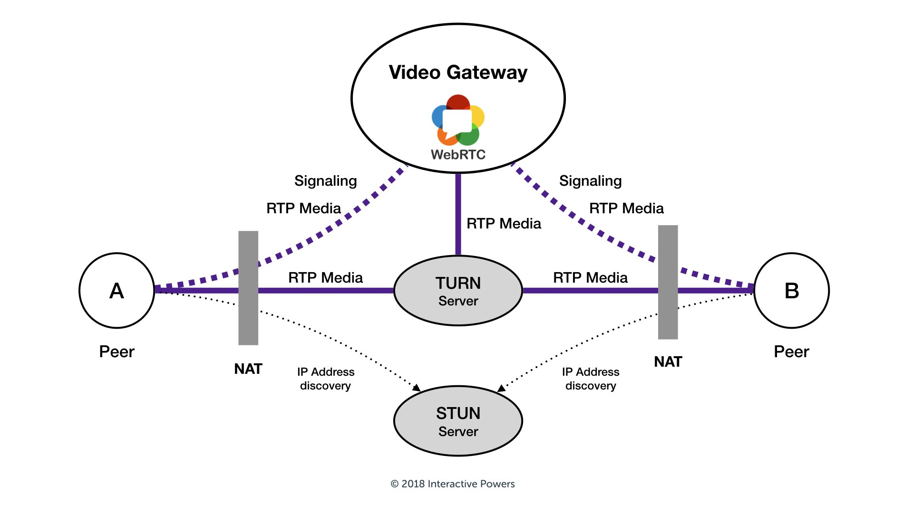

# WebRTC(Web Real-Time Communication)

- [wiki](./wiki.md)介绍

## how webRTC works

## Concepts

- STUN（Simple Traversal of User Datagram Protocol Through Network Address Translators 简单的用 UDP 穿透 NAT, 被重新命名为 Session Traversal Utilities for NAT，即 NAT 会话穿透效用
- TURN，Traversal Using Relays around NAT:Relay Extensions to Session Traversal Utilities for NAT 使用中继穿透 NAT:STUN 的扩展

## Resources

- [webrtc](https://webrtc.org/)
- p2p protocol
- [webrtc 示例代码](https://github.com/webrtc/samples)
- [coturn 搭建 stun / turn 服务器](https://juejin.cn/post/6999962039930060837)
