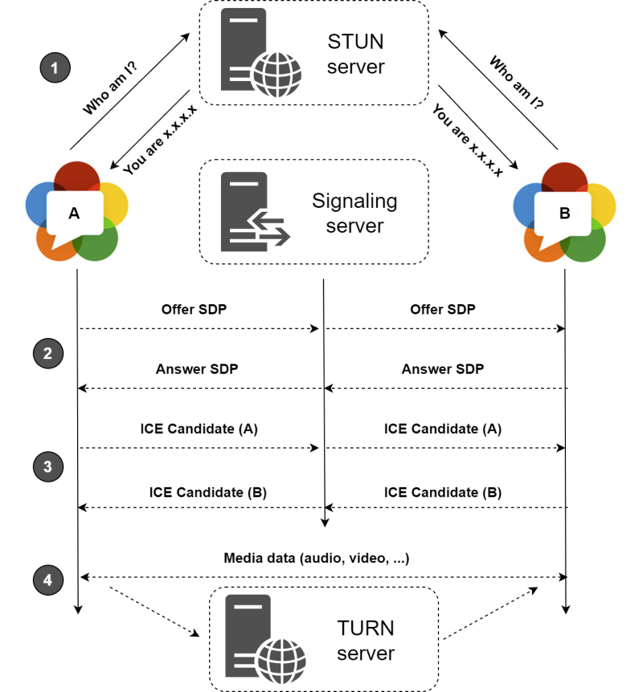

# How WebRTC works

WebRTC 最初设计的主要目的是在浏览器之间实现视频和音频连接，但也可以处理其他类型的数据。

## What does WebRTC do?

WebRTC is a technology that facilitates a direct, secure, and real time connection between two devices, avoiding passing through a server. It negotiates the shortest connection between the two devices. When both devices are on the same local network that means that the data isn't leaving that network.

It was designed primarily to magically enable video and audio connections between browsers, but can handle other types of data as well.
WebRTC 是一种技术，可以在两个设备之间建立直接、安全和实时的连接，而无需经过服务器。它会协商两个设备之间的最短连接路径。当两个设备位于同一局域网中时，数据不会离开该局域网。

## How is a connection established?

For two devices to speak directly to each other without passing through an intermediary server, they need to find out some details about one another. Most devices are hiding behind firewalls and NAT boxes and don't even know their own IP. This signaling happens through the Freedom Robotics API and using STUN servers. These temporary connections are different from the actual media packets that will get sent between the two peers (the robot and the Pilot browser). Let's take a look at how this signaling happens with Freedom Pilot:
为了使两个设备能够直接通信而无需经过中间服务器，它们需要了解彼此的一些细节。大多数设备隐藏在防火墙和 NAT 盒子后面，甚至不知道自己的 IP 地址。这个信令过程是通过 Freedom Robotics API 和使用 STUN 服务器进行的。这些临时连接与实际传输的媒体数据包（机器人和 Pilot 浏览器之间的数据包）不同。让我们来看看 Freedom Pilot 是如何进行信令的：

1. The user clicks on 'Take Over' in the Pilot tab on the browser. This sends an HTTPS package through the Freedom Robotics API that contains where to find the media channels that should be exchanged.用户在浏览器的 Pilot 选项卡中点击“Take Over”。这将通过 Freedom Robotics API 发送一个 HTTPS 包，其中包含应该交换的媒体通道的位置信息。
2. The device receives the webRTC request message from the API and responds. A process called ICE negotiation starts, which attempts several connection candidates that connect directly. If multiple connections succeed, the most favorable connection is picked and used as a backup. If no direct connection can be established in a timely manner, webRTC falls back on a relay server (a TURN server).设备从 API 接收到 WebRTC 请求消息并作出响应。一个称为 ICE 协商的过程开始，尝试多个直接连接的候选项。如果多个连接成功，会选择最有利的连接并用作备份。如果在合理的时间内无法建立直接连接，WebRTC 将回退到一个中继服务器（TURN 服务器）。
3. The devices start communicating directly to each other using this connection. ALl data is encrypted end-to-end.设备开始使用此连接直接相互通信。所有数据都经过端到端加密。

A STUN server uses [hole punching](<https://en.wikipedia.org/wiki/Hole_punching_(networking)>) to find out which port can be used on each device to communicate. Each device uses some ports to talk to these STUN and TURN servers, port 3478 or 19302, and 5349 for connections over TLS, which need to only be open outbound for the devices. The connections to the STUN and TURN servers use TCP packets, and the actual data connection will favor UDP, if available.
STUN 服务器使用 Hole Punching 技术来**确定每个设备上可用于通信的端口**。每个设备使用一些端口与 STUN 和 TURN 服务器进行通信，例如端口 3478 或 19302，并且对于通过 TLS 的连接，端口 5349 需要只对设备的出站连接开放。与 STUN 和 TURN 服务器的连接使用 TCP 数据包，而实际的数据连接将优先选择 UDP（如果可用）。

The STUN and TURN DNS addresses that should be passlisted in the firewall are:

- global.stun.twilio.com
- global.turn.twilio.com
- stun.l.google.com

## Resources

- [How WebRTC works](https://docs.freedomrobotics.ai/docs/how-webrtc-works)
