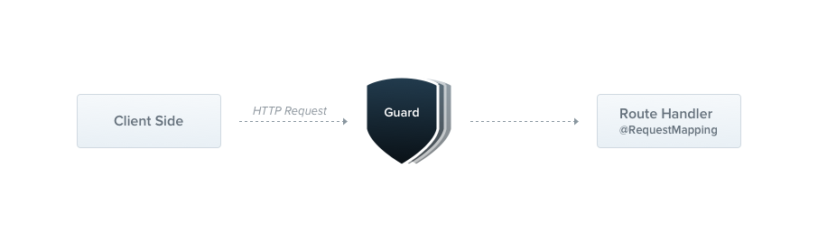

### Guards 守卫

A guard is a class annotated with the `@Injectable()` decorator, which implements the `CanActivate` interface.



Guards have a **single responsibility**. They determine whether a given request will be handled by the route handler or not, depending on certain conditions (like permissions, roles, ACLs, etc.) present at run-time. This is often referred to as **authorization**. Authorization (and its cousin, **authentication**, with which it usually collaborates) has typically been handled by [middleware](/middleware) in traditional Express applications. Middleware is a fine choice for authentication, since things like token validation and attaching properties to the `request` object are not strongly connected with a particular route context (and its metadata).
守卫有一个单一的职责。他们根据运行时存在的某些条件（如权限、角色、ACL 等）来确定给定的请求是否将由路由处理程序处理。这通常被称为授权。在传统的 Express 应用程序中，授权（及其表亲认证，它通常与之协作）通常由中间件处理。中间件是处理认证的一个很好的选择，因为像令牌验证和将属性附加到 request 对象这样的事情与特定的路由上下文（及其元数据）没有紧密的联系。

But middleware, by its nature, is dumb. It doesn't know which handler will be executed after calling the `next()` function. On the other hand, **Guards** have access to the `ExecutionContext` instance, and thus know exactly what's going to be executed next. They're designed, much like exception filters, pipes, and interceptors, to let you interpose processing logic at exactly the right point in the request/response cycle, and to do so declaratively. This helps keep your code DRY and declarative.
但是中间件，由于其本质上是纯函数，它不会知道下一个处理程序是什么。相反，**守卫**有访问 `ExecutionContext` 实例的权限，并且可以使用它来确定应该执行哪个请求处理程序。这使得它们能够在请求/响应周期的适当点进行拦截和处理，并且能够以声明的方式进行。这有助于保持代码的 DRY 和声明性。

> Guards are executed **after** all middleware, but **before** any interceptor or pipe.
> 守卫在请求/响应周期的适当点执行，并且能够在拦截器和管道之前拦截和处理。这有助于保持代码的 DRY 和声明性。

#### Authorization guard 授权守卫

As mentioned, **authorization** is a great use case for Guards because specific routes should be available only when the caller (usually a specific authenticated user) has sufficient permissions. The `AuthGuard` that we'll build now assumes an authenticated user (and that, therefore, a token is attached to the request headers). It will extract and validate the token, and use the extracted information to determine whether the request can proceed or not.
正如上面提到的，**授权**是一个很好的用例，因为特定的路由应该只允许具有特定权限的用户访问。`AuthGuard` 示例将假定一个经过身份验证的用户（通常是具有附加令牌的请求头）。它将提取和验证令牌，并使用提取的信息来确定应该执行哪个请求处理程序。

```typescript
@@filename(auth.guard)
import { Injectable, CanActivate, ExecutionContext } from '@nestjs/common';
import { Observable } from 'rxjs';

@Injectable()
export class AuthGuard implements CanActivate {
  canActivate(
    context: ExecutionContext,
  ): boolean | Promise<boolean> | Observable<boolean> {
    const request = context.switchToHttp().getRequest();
    return validateRequest(request);
  }
}
@@switch
import { Injectable } from '@nestjs/common';

@Injectable()
export class AuthGuard {
  async canActivate(context) {
    const request = context.switchToHttp().getRequest();
    return validateRequest(request);
  }
}
```

> If you are looking for a real-world example on how to implement an authentication mechanism in your application, visit [this chapter](/security/authentication). Likewise, for more sophisticated authorization example, check [this page](/security/authorization).
> 如果您正在寻找一个真实世界的示例，以实现身份验证机制，请查看 [此章节](/security/authentication)。同样，对于更复杂的授权示例，您可以查看 [此页面](/security/authorization)。

The logic inside the `validateRequest()` function can be as simple or sophisticated as needed. The main point of this example is to show how guards fit into the request/response cycle.
内部的 `validateRequest()` 函数可以是简单的，也可以是复杂的，具体取决于需要。这个例子的主要目的是展示守卫是如何与请求/响应周期的适当点相匹配的。

Every guard must implement a `canActivate()` function. This function should return a boolean, indicating whether the current request is allowed or not. It can return the response either synchronously or asynchronously (via a `Promise` or `Observable`). Nest uses the return value to control the next action:
每一个守卫都必须实现一个 `canActivate()` 函数。这个函数应该返回一个布尔值，指示当前请求是否允许。它可以返回一个同步或异步（通过 `Promise` 或 `Observable`）的结果。Nest 使用返回值来控制请求/响应周期的适当点。

- if it returns `true`, the request will be processed. 如果它返回 `true`，请求将被处理。
- if it returns `false`, Nest will deny the request. 如果它返回 `false`，Nest 将拒绝请求。

#### Execution context 执行上下文

The `canActivate()` function takes a single argument, the `ExecutionContext` instance. The `ExecutionContext` inherits from `ArgumentsHost`. We saw `ArgumentsHost` previously in the exception filters chapter. In the sample above, we are just using the same helper methods defined on `ArgumentsHost` that we used earlier, to get a reference to the `Request` object. You can refer back to the **Arguments host** section of the [exception filters](https://docs.nestjs.com/exception-filters#arguments-host) chapter for more on this topic.
这个 `canActivate()`函数接收一个 `ExecutionContext` 实例。`ExecutionContext` 继承自 `ArgumentsHost`。我们在前面的章节中已经使用过 `ArgumentsHost`。在这个示例中，我们只是使用了 `ArgumentsHost` 上的 `getRequest()` 方法，来获取 `Request` 对象。你可以参考 [此章节](/exception-filters#arguments-host) 来了解更多关于这个主题的信息。

By extending `ArgumentsHost`, `ExecutionContext` also adds several new helper methods that provide additional details about the current execution process. These details can be helpful in building more generic guards that can work across a broad set of controllers, methods, and execution contexts. Learn more about `ExecutionContext` [here](/fundamentals/execution-context).
通过拓展 `ArgumentsHost`，`ExecutionContext` 还添加了一些新的方法，用于提供更多的细节。这些细节可以帮助构建更通用的守卫，以跨一个广泛的控制器、方法和执行上下文进行处理。学习更多关于 `ExecutionContext` [这里](/fundamentals/execution-context)。

#### Role-based authentication 基于权限的授权

Let's build a more functional guard that permits access only to users with a specific role. We'll start with a basic guard template, and build on it in the coming sections. For now, it allows all requests to proceed:

```typescript
@@filename(roles.guard)
import { Injectable, CanActivate, ExecutionContext } from '@nestjs/common';
import { Observable } from 'rxjs';

@Injectable()
export class RolesGuard implements CanActivate {
  canActivate(
    context: ExecutionContext,
  ): boolean | Promise<boolean> | Observable<boolean> {
    return true;
  }
}
@@switch
import { Injectable } from '@nestjs/common';

@Injectable()
export class RolesGuard {
  canActivate(context) {
    return true;
  }
}
```

#### Binding guards 绑定守卫

Like pipes and exception filters, guards can be **controller-scoped**, method-scoped, or global-scoped. Below, we set up a controller-scoped guard using the `@UseGuards()` decorator. This decorator may take a single argument, or a comma-separated list of arguments. This lets you easily apply the appropriate set of guards with one declaration.
与**管道**和**异常过滤器**一样，守卫可以是`controller-范围`的，也可以是全局的。下面，我们使用 `@UseGuards()` 装饰器来设置一个控制器作用域的守卫：

```typescript
@@filename()
@Controller('cats')
@UseGuards(RolesGuard)
export class CatsController {}
```

> The `@UseGuards()` decorator is imported from the `@nestjs/common` package.
> `@UseGuards()` 装饰器是从 `@nestjs/common` 包中导入的。

Above, we passed the `RolesGuard` class (instead of an instance), leaving responsibility for instantiation to the framework and enabling dependency injection. As with pipes and exception filters, we can also pass an in-place instance:


```typescript
@@filename()
@Controller('cats')
@UseGuards(new RolesGuard())
export class CatsController {}
```

The construction above attaches the guard to every handler declared by this controller. If we wish the guard to apply only to a single method, we apply the `@UseGuards()` decorator at the **method level**.

In order to set up a global guard, use the `useGlobalGuards()` method of the Nest application instance:

```typescript
@@filename()
const app = await NestFactory.create(AppModule);
app.useGlobalGuards(new RolesGuard());
```

> In the case of hybrid apps the `useGlobalGuards()` method doesn't set up guards for gateways and microservices by default (see [Hybrid application](/faq/hybrid-application) for information on how to change this behavior). For "standard" (non-hybrid) microservice apps, `useGlobalGuards()` does mount the guards globally.
> 在混合应用中，`useGlobalGuards()` 方法不会为网关和微服务设置全局守卫（请参阅[混合应用](/faq/hybrid-application)以了解如何更改此行为）。对于“标准”（非混合）微服务应用，`useGlobalGuards()` 会挂载全局守卫。

Global guards are used across the whole application, for every controller and every route handler. In terms of dependency injection, global guards registered from outside of any module (with `useGlobalGuards()` as in the example above) cannot inject dependencies since this is done outside the context of any module. In order to solve this issue, you can set up a guard directly from any module using the following construction:
全局守卫适用于整个应用程序，对于每个控制器和每个路由处理程序。在依赖注入方面，全局守卫注册在任何模块之外（如上面的示例所示）时，无法注入依赖关系，因为这是在模块上下文之外完成的。为了解决这个问题，您可以从任何模块中设置全局守卫，如下所示：

```typescript
@@filename(app.module)
import { Module } from '@nestjs/common';
import { APP_GUARD } from '@nestjs/core';

@Module({
  providers: [
    {
      provide: APP_GUARD,
      useClass: RolesGuard,
    },
  ],
})
export class AppModule {}
```

> When using this approach to perform dependency injection for the guard, note that regardless of the
> module where this construction is employed, the guard is, in fact, global. Where should this be done? Choose the module
> where the guard (`RolesGuard` in the example above) is defined. Also, `useClass` is not the only way of dealing with
> custom provider registration. Learn more [here](/fundamentals/custom-providers).
> 当使用这种方法执行依赖注入时，请注意无论在哪里使用此构造，该守卫实际上都是全局的。应该在哪里执行此操作？选择定义守卫的模块（上面的示例中为 `RolesGuard`）。此外，`useClass` 不是处理自定义提供者注册的唯一方式。了解更多信息，请参阅[这里](/fundamentals/custom-providers)。

#### Setting roles per handler 为每个处理程序设置角色

Our `RolesGuard` is working, but it's not very smart yet. We're not yet taking advantage of the most important guard feature - the [execution context](/fundamentals/execution-context). It doesn't yet know about roles, or which roles are allowed for each handler. The `CatsController`, for example, could have different permission schemes for different routes. Some might be available only for an admin user, and others could be open for everyone. How can we match roles to routes in a flexible and reusable way?

This is where **custom metadata** comes into play (learn more [here](https://docs.nestjs.com/fundamentals/execution-context#reflection-and-metadata)). Nest provides the ability to attach custom **metadata** to route handlers through either decorators created via `Reflector#createDecorator` static method, or the built-in `@SetMetadata()` decorator.

For example, let's create a `@Roles()` decorator using the `Reflector#createDecorator` method that will attach the metadata to the handler. `Reflector` is provided out of the box by the framework and exposed from the `@nestjs/core` package.

```ts
@@filename(roles.decorator)
import { Reflector } from '@nestjs/core';

export const Roles = Reflector.createDecorator<string[]>();
```

The `Roles` decorator here is a function that takes a single argument of type `string[]`.

Now, to use this decorator, we simply annotate the handler with it:

```typescript
@@filename(cats.controller)
@Post()
@Roles(['admin'])
async create(@Body() createCatDto: CreateCatDto) {
  this.catsService.create(createCatDto);
}
@@switch
@Post()
@Roles(['admin'])
@Bind(Body())
async create(createCatDto) {
  this.catsService.create(createCatDto);
}
```

Here we've attached the `Roles` decorator metadata to the `create()` method, indicating that only users with the `admin` role should be allowed to access this route.

Alternatively, instead of using the `Reflector#createDecorator` method, we could use the built-in `@SetMetadata()` decorator. Learn more about [here](/fundamentals/execution-context#low-level-approach).

#### Putting it all together 

Let's now go back and tie this together with our `RolesGuard`. Currently, it simply returns `true` in all cases, allowing every request to proceed. We want to make the return value conditional based on comparing the **roles assigned to the current user** to the actual roles required by the current route being processed. In order to access the route's role(s) (custom metadata), we'll use the `Reflector` helper class again, as follows:

```typescript
@@filename(roles.guard)
import { Injectable, CanActivate, ExecutionContext } from '@nestjs/common';
import { Reflector } from '@nestjs/core';
import { Roles } from './roles.decorator';

@Injectable()
export class RolesGuard implements CanActivate {
  constructor(private reflector: Reflector) {}

  canActivate(context: ExecutionContext): boolean {
    const roles = this.reflector.get(Roles, context.getHandler());
    if (!roles) {
      return true;
    }
    const request = context.switchToHttp().getRequest();
    const user = request.user;
    return matchRoles(roles, user.roles);
  }
}
@@switch
import { Injectable, Dependencies } from '@nestjs/common';
import { Reflector } from '@nestjs/core';
import { Roles } from './roles.decorator';

@Injectable()
@Dependencies(Reflector)
export class RolesGuard {
  constructor(reflector) {
    this.reflector = reflector;
  }

  canActivate(context) {
    const roles = this.reflector.get(Roles, context.getHandler());
    if (!roles) {
      return true;
    }
    const request = context.switchToHttp().getRequest();
    const user = request.user;
    return matchRoles(roles, user.roles);
  }
}
```

> info **Hint** In the node.js world, it's common practice to attach the authorized user to the `request` object. Thus, in our sample code above, we are assuming that `request.user` contains the user instance and allowed roles. In your app, you will probably make that association in your custom **authentication guard** (or middleware). Check [this chapter](/security/authentication) for more information on this topic.

> warning **Warning** The logic inside the `matchRoles()` function can be as simple or sophisticated as needed. The main point of this example is to show how guards fit into the request/response cycle.

Refer to the <a href="https://docs.nestjs.com/fundamentals/execution-context#reflection-and-metadata">Reflection and metadata</a> section of the **Execution context** chapter for more details on utilizing `Reflector` in a context-sensitive way.

When a user with insufficient privileges requests an endpoint, Nest automatically returns the following response:

```typescript
{
  "statusCode": 403,
  "message": "Forbidden resource",
  "error": "Forbidden"
}
```

Note that behind the scenes, when a guard returns `false`, the framework throws a `ForbiddenException`. If you want to return a different error response, you should throw your own specific exception. For example:

```typescript
throw new UnauthorizedException()
```

Any exception thrown by a guard will be handled by the [exceptions layer](/exception-filters) (global exceptions filter and any exceptions filters that are applied to the current context).

> info **Hint** If you are looking for a real-world example on how to implement authorization, check [this chapter](/security/authorization).
