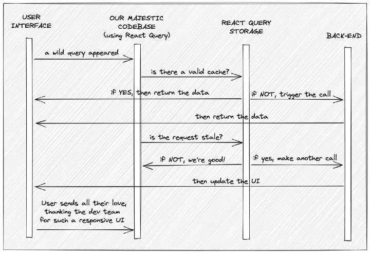

## question

have read React Query docs. Still, I do not understand how to use staleTime & cacheTime for data caching.

I want to store data for 2 mins in the cache after first-time API call. No matter if the component mounts or unmounts, I don't want an API call for 2 mins after the first time I got the data.

I used this but it does not call API after 2 min if I use **staletime** only & it calls API every time (on-mount component & unmount component) if I use **cachetime** only.

So, what is the problem? And what is the best way to do this?

```js
const query = useQuery(['getUserList'], getUserList, {
  staleTime: 120000,
  cacheTime: 120000,
})
```

## Answers

### High score answer

> No matter component mounts or unmounts, I don't want an API call for 2 mins after the first time get data

That is what `staleTime` is doing. `staleTime` tells you how fresh you data is. It is very similar to `Cache-Control: max-age=120`.

So if you set `staleTime: 120000`, in your example, you're guaranteed to not get another network request for two minutes after the first successful one.

`cacheTime` is something totally different. Think about it as a **garbage-collect time**. It basically describes how long data should be kept in the cache before it can be garbage collected. **This is only relevant for unused queries, because active queries can per definition not be garbage collected**.

I have also outlined this differences in [my blog](https://tkdodo.eu/blog/practical-react-query#the-defaults-explained):

> StaleTime: The duration until a query transitions from fresh to stale. **As long as the query is fresh, data will always be read from the cache only - no network request will happen!** If the query is stale (which per default is: instantly), you will still get data from the cache, _but a background refetch can happen under certain conditions_(什么条件呢).

> CacheTime: The duration until inactive queries will be removed from the cache. This defaults to 5 minutes. **Queries transition to the inactive state as soon as there are no observers registered, so when all components which use that query have unmounted**.

> I used this but it does not call API after 2 min

This is something totally different. When `staleTime` elapses, **your data is marked as stale - but that doesn't mean it will be instantly refetched**. `staleTime` defaults to `zero` so that wouldn't work at all.

If you want to fetch every 2 minutes, set a `refetchInterval`: `refetchInterval: 120000`


