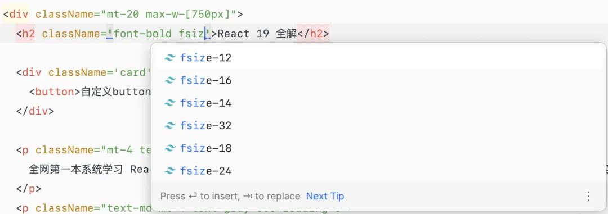
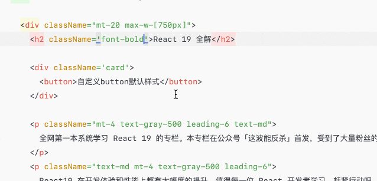
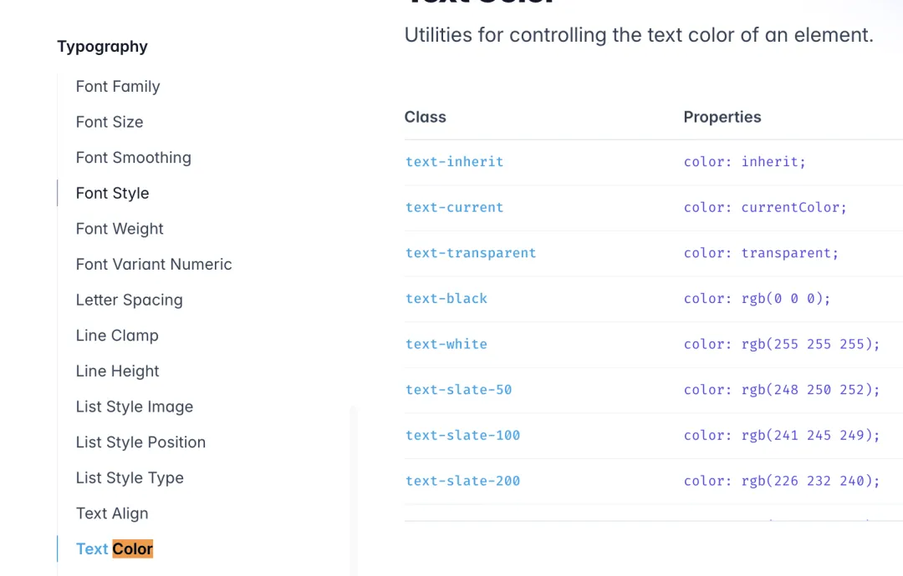
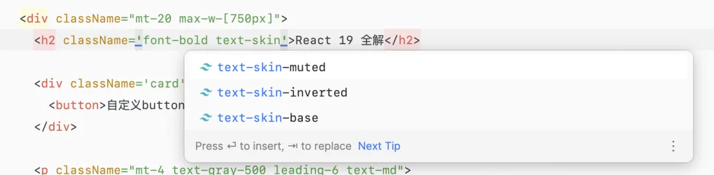
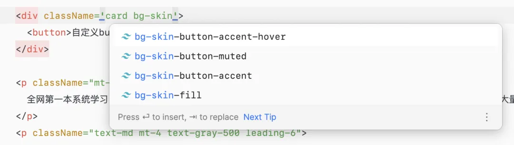
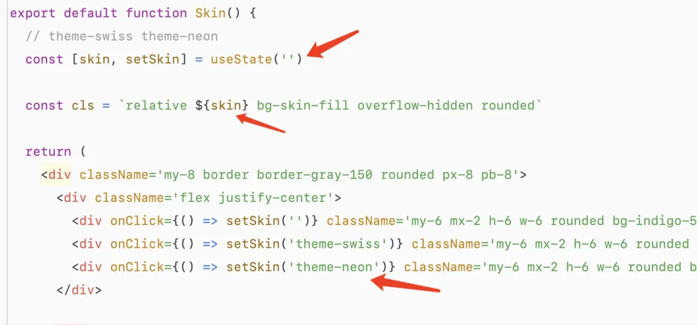

# 苦练七天，魔功大成，我已彻底拿捏 tailwindcss

## configs

`tailwind.config.js`

```sh
# 生成
npx tailwindcss init

```

### content

content 选项是一个数组，用于指定 tailwindcss 语法生效的文件集合。tailwind 使用 `fast-glob` 库来匹配文件。其中，`*` 匹配任意字符，`**` 匹配 0 个或者多个目录，`{js, jsx}` 匹配多个值。

> 为提高编译速度，需要尽可能的减少扫描区域

```js
content: ['./pages/**/*.{js,jsx}', './components/**/*.{js,jsx}', './app/**/*.{js,jsx}', './src/**/*.{js,jsx}']
```

#### 配置增强

借助 transform 来处理`md`文件

```js
const remark = require('remark')

module.exports = {
  content: {
    files: ['./src/**/*.{html,md}'],
    transform: {
      md: (content) => {
        return remark().process(content)
      },
    },
  },
  // ...
}
```

### theme

theme 字段的配置是我们拿捏 tailwindcss 的核心关键。我们可以通过这个字段自定义任意语法。

[完整的配置项](https://github.com/tailwindlabs/tailwindcss/blob/master/stubs/config.full.js#L5)

支持拓展

```js
width: ({ theme }) => {
  // 获取到当前的主题项
}
```

## 自定义语法

自定义语法更好的方式是使用 `extend` 配置去覆盖原有配置项。例如，我想要重新针对 `background-color` 定义一个语法写法如下，使用黑色的拼音缩写来表达颜色，使用数字来表示不同程度的黑色

```
bg-heise-0
bg-heise-1
bg-heise-2
bg-heise-3
bg-heise-4
```

在配置文件的 theme 块中：

```js
theme: {
 extend: {
   backgroundColor: {
     heise: {
       0: 'rgba(0, 0, 0, 0)',
       1: 'rgba(0, 0, 0, 0.1)',
       2: 'rgba(0, 0, 0, 0.2)',
       3: 'rgba(0, 0, 0, 0.3)',
       4: 'rgba(0, 0, 0, 0.4)',
     },
   }}}
```

- 有`extend`是拓展
- 无`extend`是覆盖

## 定义自己想要的功能块

tailwindcss 有三个模块。

```css
@tailwind base;
@tailwind components;
@tailwind utilities;
```

`base` 表示样式重置模块。`components` 表示组件模块，`utilities` 表示功能模块，我们可以通过插件的形式，往这几个功能模块中新增我们想要的功能块。

示例代码:

```js
const plugin = require('tailwindcss/plugin')
module.exports = {
  plugins: [
    plugin(function ({ addBase, theme }) {
      addBase({
        // 为基础button添加样式
        button: { color: theme('colors.orange.700') },
      })
    }),
  ],
}
```

通过类似的方式往 `components` 中新增样式。例如我希望新增一个 `card` 组件，用于表示一个区域的容器，那么我就可以这样写

```js
plugin(({addComponents, theme}) => {
  addComponents({
    '.card': {
      display: 'inline-block',
      padding: '1rem',
      border: '1px solid',
      borderRadius: '4px',
      borderColor: theme('colors.red.400'),
      margin: '1rem'
    }
  })
}),
```

然后我在项目中编写如下代码

```html
<div className="card">
  <button>自定义button默认样式</button>
</div>
```

### 定义自己想要的插件

> ✨✨✨

如下图所示，此时我们想要实现的一个功能是自定义字体大小的递增序列。具体的编号和对应的值都由我们自己来定 fsize-12，而不是通过默认的 `text-xxx` 来约定


首先，我们先在 `theme` 中约定配置项，数量太多的时候，你也可以通过数组遍历来快速创建

```js
theme: {
  fsizes: {
    12: '12px',
    14: '14px',
    16: '16px',
    18: '18px',
    24: '24px',
    32: '32px',
  },
}
```

然后，`plugins` 字段中，使用 `matchUtilities` 方法动态匹配后缀自增的 `class`

```js
plugin(({ matchUtilities, theme }) => {
  matchUtilities(
    {
      fsize: (value) => ({
        fontSize: value,
      }),
    },
    {
      values: theme('fsizes'),
    }
  )
})
```

搞定，最后的演示结果如图所示


### 高级用法：简单实现皮肤切换

定义主题的 css 变量

> `@layer base` 表示这些定义会运用到 `base` 模块中。

```css
@layer base {
  :root {
    --color-text-base: #fff;
    --color-text-muted: #c7d2f7;
    --color-text-inverted: #4f46e5;
    --color-fill: #4338ca;
    --color-button-accent: #fff;
    --color-button-accent-hover: #eef2ff;
    --color-button-muted: 99, 102, 241;
  }
  .theme-swiss {
    --color-text-base: #fff;
    --color-text-muted: #fecaca;
    --color-text-inverted: #dc2626;
    --color-fill: #b91c1c;
    --color-button-accent: #fff;
    --color-button-accent-hover: #fef2f2;
    --color-button-muted: 239, 68, 68;
  }

  .theme-neon {
    --color-text-base: #111802;
    --color-text-muted: #2fc306;
    --color-text-inverted: #ebfacc;
    --color-fill: #b3ff17;
    --color-button-accent: #243403;
    --color-button-accent-hover: #374f05;
    --color-button-muted: 212, 255, 122;
  }
}
```

定义好了主题之后，我们就需要去 `extend` 字段中自定义语法。首先是针对于文字颜色字段，该字段在 `css` 中为 `color`，不过在 `tailwind` 中，被重新定义了语义，称之为 `text color`



因此，我们要使用 `textColor` 来定义该语法，

```JS
extend: {
  textColor: {
    skin: {
      base: 'var(--color-text-base)',
      muted: 'var(--color-text-muted)',
      inverted: 'var(--color-text-inverted)',
    }
  },
}
```

`textColor` 的对应缩写为 `text`，因此最终我们自定义的语法名如下所示


用同样的方式定义背景颜色

```js
backgroundColor: {
  skin: {
    fill: 'var(--color-fill)',
    'button-accent': 'var(--color-button-accent)',
    'button-accent-hover': 'var(--color-button-accent-hover)',
    'button-muted': ({opacityValue}) => {
      console.log(opacityValue)
      if (opacityValue !== undefined) {
        return `rgba(var(--color-button-muted), ${opacityValue})`
      }
      return `rgb(var(--color-button-muted))`
    },
  }
},
```



在需要颜色的地方，我们使用自己定义好的语法来设置颜色。

他们的值，都由 `var` 来声明，对应到我们刚才定义的 css 变量。因此，这样做好之后，当我们改变 css 变量的生效结果，那么皮肤切换就能自定生成。

我们可以更改顶层父组件的 `className` 来做到变量名的整体切换。


## Link

- [link](https://mp.weixin.qq.com/s/1rb2h9j2cPRcnS4-Q0xNGQ)

## More Reading

- [用过 tailwindcss 才知道，命名真的是顶级痛点](https://mp.weixin.qq.com/s?__biz=MzI4NjE3MzQzNg==&mid=2649869950&idx=1&sn=6a2e8ecc67d25297c89f2ef34001c48d&chksm=f245a284fc8ca8eacabad9c3a850a5a65b4d54288db6d758e47b78806f09d1412f94eb2ec378&scene=132&exptype=timeline_recommend_article_extendread_samebiz&show_related_article=1&subscene=0&scene=132#wechat_redirect)
- [丢人啊，工作 10 年了，才知道用这种方式实现 CSS 换肤](https://mp.weixin.qq.com/s?__biz=MzI4NjE3MzQzNg==&mid=2649869287&idx=1&sn=0534589c18b6e2165f236d989cdfb068&chksm=f23451d7fae589ebfa8c1f2d21f16e2309457e3f688c7c76d4ef90719966a7596a18f923c56d&scene=132&exptype=timeline_recommend_article_extendread_samebiz&show_related_article=1&subscene=132&scene=132#wechat_redirect)
- [研究三天，我找到了 tailwindcss 的正确打开姿势](https://mp.weixin.qq.com/s?__biz=MzI4NjE3MzQzNg==&mid=2649869991&idx=1&sn=4047d3c4886ccd41f845628df7b5aaac&chksm=f2e3c5398ef00c56dd89dba5c87df3ba52ea9d72cc0d50ea4a15ef4c90e3d57dae8677a2f5bc&scene=132&exptype=timeline_recommend_article_extendread_samebiz&show_related_article=1&subscene=132&scene=132#wechat_redirect)

## Expanding Thinking

- [shadcn UI](https://ui.shadcn.com/) 实现
