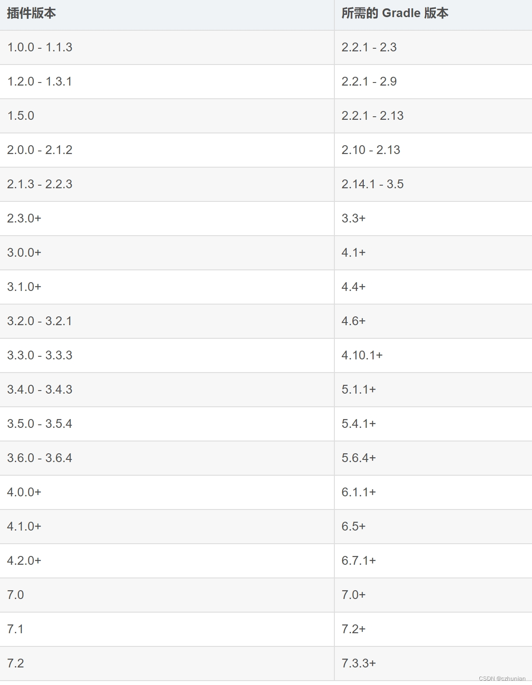
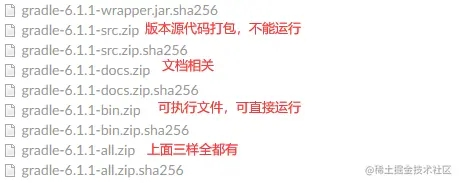

# Gradle

## gradle plugin

[文档说明](https://developer.android.google.cn/build/releases/gradle-plugin)

版本对应关系


## gradle 文件说明



```conf
distributionUrl=file:///C:/Users/liuts/gradle/gradle-8.2.1-all.zip
distributionUrl=https\://mirrors.cloud.tencent.com/gradle/gradle-8.0.1-all.zip
```

## FAQs

```groovy
// 代码片段
gradle.beforeSettings {
    pluginManagement.repositories.enableMirror()
    dependencyResolutionManagement.repositories.enableMirror()
}
// 
settingsEvaluated {

}
// setting.gradle 文件的作用
```

## Resources

- [补齐 Android 技能树 - 玩转 Gradle(一) | 小册免费学 - 掘金](https://juejin.cn/post/6950643579643494431#heading-8)✨✨✨✨✨
- [补齐 Android 技能树 - 玩转 Gradle(二) | 小册免费学 - 掘金](https://juejin.cn/post/6955008819868991495)
- [补齐 Android 技能树 - 玩转 Gradle 插件 | 小册免费学 - 掘金](https://juejin.cn/post/6956517422606057479)✨✨✨✨✨
- [🍵 补齐 Android 技能树——从 AGP 构建过程到 APK 打包过程 - 掘金](https://juejin.cn/post/6963527524609425415?searchId=20240624164048D239CFEDF362C4384935)
- [coder_pig 的个人主页 - 搜索 - 掘金](https://juejin.cn/user/4142615541321928/search?search_type=1)
- [Android Gradle 学习笔记整理-腾讯云开发者社区-腾讯云](https://cloud.tencent.com/developer/article/1918910)
- [AndroidTotal/Android 中 Gradle 的基础构建.md at master · LoganZy/AndroidTotal · GitHub](https://github.com/LoganZy/AndroidTotal/blob/master/Android%E4%B8%ADGradle%E7%9A%84%E5%9F%BA%E7%A1%80%E6%9E%84%E5%BB%BA.md)
- [史上最全 Android build.gradle 配置详解，你懂的！ - 掘金](https://juejin.cn/post/6844903933584883720)
- [gradle distributions](https://services.gradle.org/distributions/)下载
- [userguide](https://docs.gradle.org/8.0.1/userguide/userguide.html)
