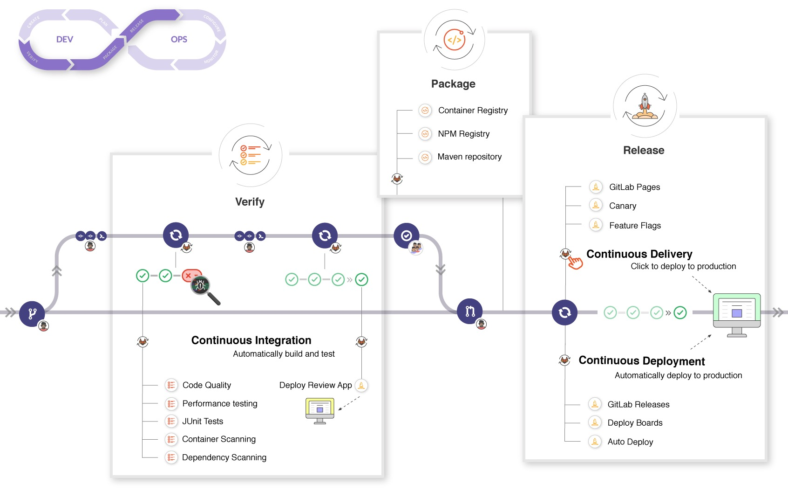

# CICD

- **持续交付**：将代码交给专业的测试团队去测试
- **持续部署**：将测试通过的代码，发布到生产环境

## 哲学

## 原理

## 最佳实践

### Gitlab

- [Continuous integration best practices](https://about.gitlab.com/topics/ci-cd/continuous-integration-best-practices/)
- [How to keep up with CI/CD best practices](https://about.gitlab.com/blog/2022/02/03/how-to-keep-up-with-ci-cd-best-practices/)

### Github

### travis

### jenkins

### 云产品

- 阿里云云效： 云服务商提供的持续集成服务
- fastlane: 构建工具集

## Resources

- [sonar](https://github.com/SonarSource/sonarqube)
