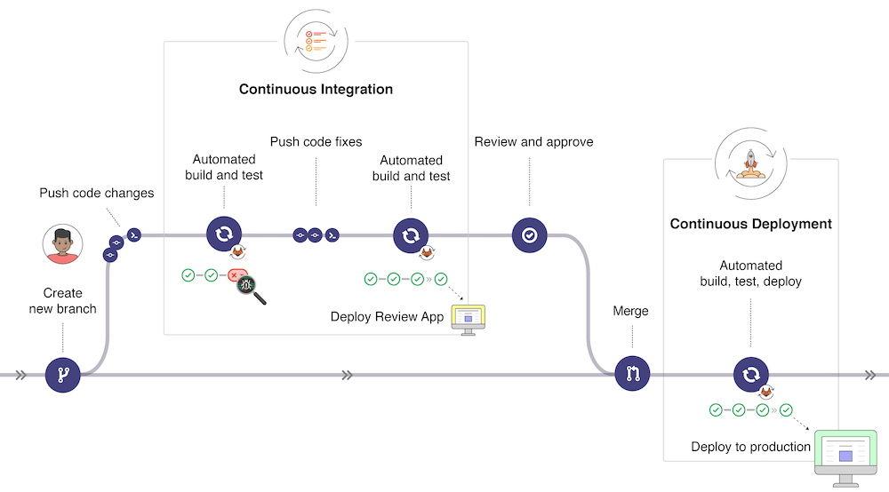
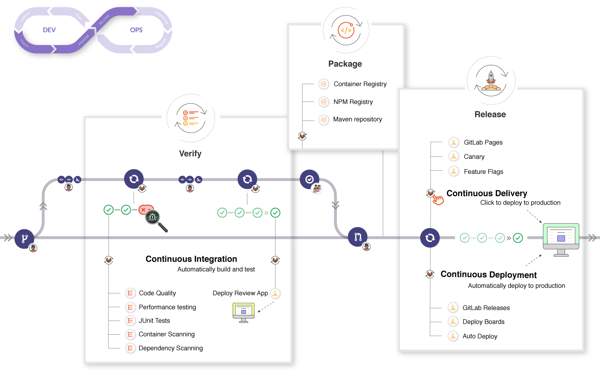

# CICD

## 概念

### 持续集成

考虑一个应用程序，它的代码存储在极狐 GitLab 的 Git 存储库中。开发人员每天多次推送代码更改。对于每次推送到仓库，您可以创建一组脚本来自动构建和测试您的应用程序。这些脚本有助于减少您在应用程序中引入错误的机会。

这种做法称为持续集成。提交给应用程序的每个更改，甚至是开发分支，都会自动且连续地构建和测试。这些测试可确保更改通过您为应用程序建立的所有测试、指南和代码合规性标准。

### 持续交付

持续交付 是超越持续集成的一步。每次将代码更改推送到代码库时，不仅会构建和测试您的应用程序，还会持续部署应用程序。但是，对于持续交付，您需要手动触发部署。

持续交付会自动检查代码，但需要人工干预以手动和战略性地触发更改的部署。

### 持续部署

持续部署是超越持续集成的又一步，类似于持续交付。不同之处在于，不是手动部署应用程序，而是将其设置为自动部署。不需要人工干预。

## Resources

- [sonar](https://github.com/SonarSource/sonarqube)
