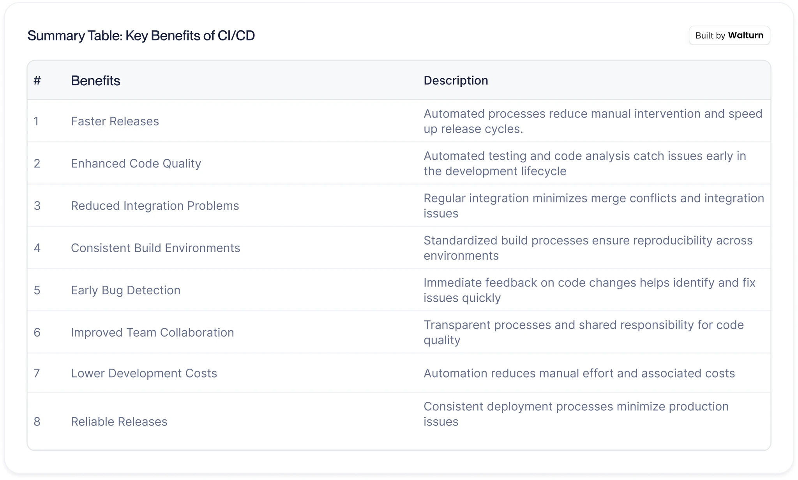

# gitlab CI/CD

Continuous Integration and Continuous Deployment (CI/CD) offer numerous benefits for software development. By automating processes, development cycles become faster as manual intervention is reduced which allows for quicker release schedules. Code quality is enhanced through automated testing and code analysis, which not only catch issues earlier in the development phase but also ensure that your codebase is readable. Regular integration further minimizes merge conflicts and integration problems, ensuring smoother collaboration among team members which is essential for product engineering.
持续集成和持续交付（CI/CD）为软件开发提供了诸多益处。通过自动化流程，开发周期变得更快，因为减少了人工干预，从而允许更快的发布计划。通过自动化测试和代码分析，代码质量得到提升，这不仅能在开发阶段早期发现问题，还能确保代码库的可读性。定期集成进一步减少了合并冲突和集成问题，确保团队成员之间更顺畅的合作，这对于产品工程至关重要。

## 重要的几个点

### Pipeline(流水线)✨✨✨
- 流水线的分类
- 流水线的创建

### Job(作业)
- job类型
- job中的scripts
- job之间的关系
- job的产物
- job的缓存
- 矩阵job

### Cache(缓存)
- 缓存的设置

## Resources

- [Use CI/CD to build your application](https://docs.gitlab.com/topics/build_your_application/)✨✨✨ 全部 topic 的入口
- [Gitlab CI/CD 概念](https://docs.gitlab.cn/jh/ci/introduction/index.html#%E6%8C%81%E7%BB%AD%E9%9B%86%E6%88%90)
- https://zhuanlan.zhihu.com/p/441581000 GitLab Runner 介绍及安装
- https://docs.gitlab.com/runner/executors/docker.html
- https://www.zhihu.com/question/485285429 gitlab + jenkins
- [docker in docker](https://hub.docker.com/_/docker)
- [gitlab ci examples](https://docs.gitlab.com/ee/ci/examples/)
- [ci yaml 配置参考](https://docs.gitlab.com/ee/ci/yaml/index.html)
- [jenkins-vs-gitlab](https://www.browserstack.com/guide/jenkins-vs-gitlab)
- [Migrating from Jenkins](https://docs.gitlab.com/ee/ci/migration/jenkins.html)
- [mac 下安装 gitlab-runner](https://docs.gitlab.com/runner/install/osx/)
- [Building Smarter with CI/CD in Flutter](https://www.walturn.com/insights/building-smarter-with-ci-cd-in-flutter), 实践分享
- [gitlab api文档](- https://gitlab.com/gitlab-org/gitlab/-/blob/master/doc/api/openapi/openapi_v2.yaml)
- [gitlab术语解释](https://docs.gitlab.com/development/documentation/styleguide/word_list/#gitlab-runner)