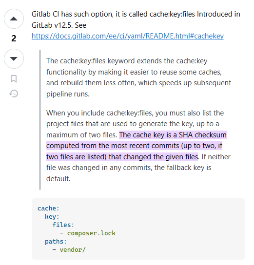

## files-based cache key

The `cache:key:files` keyword extends the `cache:key` functionality by making it easier to reuse some caches, and rebuild them less often, which speeds up subsequent pipeline runs.

When you include `cache:key:files`, you must also list the project files that are used to generate the key, up to a maximum of two files. **The cache key is a SHA checksum computed from the most recent commits (up to two, if two files are listed) that changed the given files**. If neither file was changed in any commits, the fallback key is default.

## Resources
- [Dependency Caching in Gitlab CI based on the SHA1 of my dependencies list](https://stackoverflow.com/questions/56124729/dependency-caching-in-gitlab-ci-based-on-the-sha1-of-my-dependencies-list#:~:text=The%20cache%20key%20is%20a%20SHA%20checksum%20computed%20from%20the%20most%20recent%20commits%20%28up%20to%20two%2C%20if%20two%20files%20are%20listed%29%20that%20changed%20the%20given%20files)
- [gitlab cache-key实现 - kimi AI](https://www.kimi.com/chat/d1qum01l88blfu9lp9b0)
- [gitlab cache-key配置文档](https://docs.gitlab.com/ci/yaml/#cachekey)
