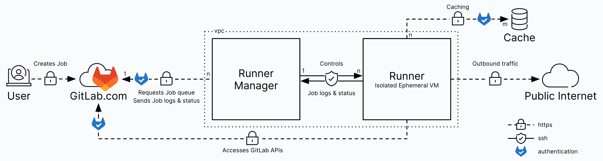

# runner

> 基础功能：访问 gitlab 仓库，拉取代码
> 类似去接任务的中间人，然后将任务发给 executor 去做

## install

按安装环境区分，可分为安装到宿主机中或安装到容器中

### windows

### macos

### docker

### 升级

runner 客户端的功能与 gitlab server 的版本是相关的

## register

```sh
.\gitlab-runner.exe register  --url https://gitlab.com  --token glrt-t3_adJG93ivi2SZALt32FU5
```

runner 配置参考

```toml
# nodejs runner
[[runners]]
  name = "nodejs-docker-runner"
  url = "https://gitlab.com"
  id = 45846384
  token = "glrt-t3_ass78_RwMSUBq4421LRp"
  token_obtained_at = 2025-02-06T09:31:39Z
  token_expires_at = 0001-01-01T00:00:00Z
  executor = "docker"
  limit = 0
  request_concurrency = 4
  [runners.cache]
    Type = "s3"
    Shared = true
    MaxUploadedArchiveSize = 0
    [runners.cache.s3]
      ServerAddress = "192.168.130.71:9000"
      AccessKey = "Ilr66DKJSk4xlGKc4z0L"
      SecretKey = "kAaDhDzw7Co0EkOlHgVHTCwWivbbckQ4YJK1iLTe"
      BucketName = "gitlab-cache"
      Insecure = true
  # https://docs.gitlab.com/runner/configuration/advanced-configuration/#the-runnersdocker-section
  [runners.docker]
    # Enable or disable TLS verification of connections to the Docker daemon.
    tls_verify = false
    image = "alpine:3.20.3"
    # Make the container run in privileged mode. Insecure.
    privileged = false
    # Disable the image entrypoint overwriting.
    disable_entrypoint_overwrite = false
    # If an out-of-memory (OOM) error occurs, do not terminate processes in a container✨.
    oom_kill_disable = false
    disable_cache = false
    # TODO Additional volumes that should be mounted. Same syntax as the Docker -v flag✨.
    volumes = ["/cache"]
    # A list of volumes to inherit from another container in the form <container name>[:<access_level>]✨ Access level defaults to read-write, but can be manually set to ro (read-only) or rw (read-write).
    volumes_from=["storage_container:ro"]
    # The image pull policy: never, if-not-present or always (default)
    pull_policy = ["if-not-present"]
    # Shared memory size for images (in bytes).
    shm_size = 0
    # 最大传输单元（Maximum Transmission Unit, MTU） FIXME 为0，默认不覆盖?
    network_mtu = 0
    # TODO Absolute path to a directory where builds are stored in the context of the selected executor. For example, locally, Docker, or SSH.
    builds_dir = "/builds"
    # TODO Absolute path to a directory where build caches are stored in context of selected executor. For example, locally, Docker, or SSH. If the docker executor is used, this directory needs to be included in its volumes parameter. 构建缓存存储的绝对路径。如果docker executor被使用，这个目录需要包含在volumes参数中。
    cache_dir = "/cache"
    # The Docker executor has two levels of caching: a global one (like any other executor) and a **local cache based on Docker volumes**. This configuration flag acts only on the local one which disables the use of automatically created (not mapped to a host directory) cache volumes. In other words, it only prevents creating a container that holds temporary files of builds, it does not disable the cache if the runner is configured in distributed cache mode. 控制是否自动创建本地的Docker 缓存卷。换句话说，这个选项控制是否禁用本地缓存，不会禁止runner的了分布式缓存配置。NOTE
    disable_cache = false
    # Number of CPUs (available in Docker 1.13 or later). A string
    cpus = "2"
    # (Advanced) The default helper image used to clone repositories and upload artifacts✨.
    helper_image = "alpine:3.20.3"
    # Containers that should be linked with container that runs the job✨.
    links=["mysql_container:mysql"]
    # The memory limit. A string.
    memory = "128m"
    memory_swap = "256m"
    memory_reservation = "64m"
    # Ulimit values that are passed to the container. Uses the same syntax as the Docker --ulimit flag.
    ulimit=""
    container_labels=""

```

## docker-autoscaler

```sh
.\gitlab-runner.exe fleeting install
```

如果失败，需要升级 `gitlab-runner.exe`

升级步骤：

```sh
# 停止服务
./gitlab-runner.exe stop
# 下载最新的exe文件
# 替换旧的exe文件
# 启动服务
./gitlab-runner.exe start
# 版本检测
./gitlab-runner.exe --version
```

## Runner 并行工作

> 需要去理解 runner 的执行机制 ✨✨✨

### 配置项

全局配置项

```yml
concurrent = 10 # 全局同时执行的job数量
# Limits how many jobs can run concurrently, across all registered runners. Each [[runners]] section can define its own limit, but this value sets a maximum for all of those values combined. For example, a value of 10 means no more than 10 jobs can run concurrently. 0 is forbidden. If you use this value, the runner process exits with a critical error.
```

runner 配置项

```yml
[[runners]]
  limit = 10 # Limit how many jobs can be handled concurrently by this registered runner. 0 (default) means do not limit. 限制每个job能同时处理的最大job数量
  request_concurrency = 10 # Limit number of concurrent requests for new jobs from GitLab. Default is 1. 限制每个runner同时请求的job数量，充分利用runner的去执行任务。每个runner会去请求gitlab的api获取job，然后执行job。

```

### 多 Runner 和单 Runner 多任务

> 嗯，用户的问题是关于在单机环境下，注册多个 Runner 和设置单个 Runner 的 request_concurrency 是否没有区别。我需要结合提供的搜索结果来解答这个问题。首先，用户提到的单机环境，也就是所有 Runner 都运行在同一台物理机或虚拟机上。这种情况下，资源是有限的，所以需要考虑两种方式的资源利用情况。

> 根据之前的回答，注册多个 Runner 和调整单个 Runner 的并发数各有优缺点。在单机环境下，这两种方式可能会有相似的效果，但可能还存在一些差异。比如，注册多个 Runner 每个都是独立进程，而设置高并发的单个 Runner 则是同一进程处理多个任务。这时候需要考虑资源隔离、任务管理、配置复杂度等因素。

> 网页 1 提到如何配置多个 Runner，每个 Runner 需要独立注册并分配不同的标签。网页 3 则提到 GitLab Runner 的工作流程和注册过程，特别是使用 Docker 执行器的例子。虽然网页 2 主要介绍 CI/CD 的基本操作，但其中也提到了注册多个 Runner 的步骤和标签管理的重要性。

> 在单机环境下，如果多个 Runner 共享同一资源池，比如 CPU 和内存，那么即使有多个 Runner，整体资源仍然是受限的。这时候，设置单个 Runner 的高并发数可能会更高效，因为减少了进程间切换的开销。但如果有不同的任务需要不同的环境或资源限制，多个 Runner 可能更有优势，每个可以配置不同的资源限制，比如使用不同的 Docker 容器。

> 另外，网页 3 中的 Docker 配置示例显示，可以通过设置不同的执行器和资源限制来优化任务运行。比如，每个 Runner 可以绑定到不同的 Docker 镜像，或者分配不同的 CPU 和内存资源。这种情况下，多个 Runner 在单机上仍然能提供一定的资源隔离，避免任务间的干扰。

> 不过，如果所有 Runner 都使用相同的配置，并且没有资源限制，那么多个 Runner 和单个高并发 Runner 可能在资源使用上差别不大。但需要注意，多个 Runner 的维护成本更高，需要管理多个配置文件和进程状态，而单个 Runner 的配置更简单。

> 总结来说，在单机环境下，两者的区别可能不如多机环境下明显，但仍存在资源管理、隔离性、维护复杂度等方面的差异。需要根据具体需求和任务类型来选择最合适的方案。

在单机环境下，注册多个 Runner 与设置单个 Runner 的`request_concurrency`（即并发任务数）**虽然表面上的总并行任务数可能相同**，但两者在**资源隔离性、任务调度机制、维护成本**等方面仍存在关键区别。以下是具体分析：

---

### **1. 核心区别**

| **维度**       | **注册多个 Runner**                                                            | **单个 Runner 高并发**                                                     |
| -------------- | ------------------------------------------------------------------------------ | -------------------------------------------------------------------------- |
| **资源隔离性** | **部分隔离**：每个 Runner 独立进程，但共享单机资源（CPU/内存/IO）              | **无隔离**：所有任务共享同一 Runner 进程的资源，易因资源争用导致性能下降。 |
| **任务调度**   | **多进程调度**：由 GitLab 协调不同 Runner 的任务分配。                         | **单进程调度**：由单个 Runner 内部调度任务，需依赖其并发管理机制。         |
| **环境隔离**   | 可通过不同标签（tags）或执行器（executor）实现环境隔离（如不同 Docker 容器）。 | 需手动配置资源限制（如 Docker 的 CPU/内存参数）才能实现部分隔离。          |
| **维护复杂度** | **较高**：需管理多个 Runner 配置文件及标签路由规则。                           | **较低**：仅需调整单个 Runner 的`concurrent`参数。                         |

---

### **2. 适用场景对比**

#### **场景 1：需要任务环境隔离**

• **注册多个 Runner**：更适合需要不同任务运行在独立环境的情况。  
 _示例_：  
 • 通过不同 Docker 镜像（如`node:16`和`python:3.10`）隔离前端和后端任务。  
 • 使用标签（tags）定向分配任务（如`dev`标签用于开发环境测试，`prod`用于生产构建）。  
• **单个 Runner 高并发**：需依赖执行器配置（如 Docker 资源限制）才能模拟隔离，灵活性较低。

#### **场景 2：资源利用率优化**

• **单个 Runner 高并发**：更适合轻量级任务（如 Lint 检查、单元测试），减少进程切换开销。  
• **注册多个 Runner**：若任务类型差异大（如 CPU 密集型与 IO 密集型混合），多 Runner 可减少资源争用导致的性能波动。

---

### **3. 性能影响**

• **资源争用风险**：  
 • 多个 Runner 共享单机资源时，若未配置资源限制，仍可能因任务总量超负荷导致系统崩溃。  
 • 单个 Runner 的高并发任务若未设置资源限制（如 Docker 的`cpus`参数），同样可能耗尽资源。  
• **解决方案**：  
 • 对 Docker 执行器配置资源限制（如`cpus: "2"`, `memory: "4G"`），无论单/多 Runner 均需此操作。

---

### **4. 实际配置建议**

#### **方案 1：混合模式（推荐）**

```toml
# 单Runner高并发 + 资源限制（config.toml示例）
concurrent = 10
[[runners]]
  name = "high-concurrency-runner"
  executor = "docker"
  [runners.docker]
    cpus = "2"   # 限制每个任务的CPU
    memory = "4G" # 限制每个任务的内存
```

• **优势**：平衡性能与维护成本，适用于大部分单机场景。

#### **方案 2：多 Runner + 标签路由**

```bash
# 注册两个不同标签的Runner（命令行示例）
gitlab-runner register --tag-list "frontend" --executor "docker" --docker-image "node:16"
gitlab-runner register --tag-list "backend" --executor "docker" --docker-image "python:3.10"
```

• **优势**：通过标签实现任务分类，避免环境冲突（如依赖库版本问题）。

---

### **5. 总结**

在单机环境下，若**无需环境隔离且任务类型相似**，两者区别较小；但若**需隔离环境或优化资源分配**，注册多个 Runner 仍具优势。建议根据实际任务类型选择：  
• **简单任务** → 单个 Runner 高并发 + 资源限制。  
• **复杂任务** → 多 Runner + 标签路由。

## Resources

### [gitlab 自建的 runners](https://docs.gitlab.com/ci/runners/hosted_runners/)



[linux runner](https://docs.gitlab.com/ci/runners/hosted_runners/linux/)
[GPU runner](https://docs.gitlab.com/ci/runners/hosted_runners/gpu_enabled/)
[macos runner](https://docs.gitlab.com/ci/runners/hosted_runners/macos/)
[windows runner](https://docs.gitlab.com/ci/runners/hosted_runners/windows/)
[查看个人 runner 的使用额度](https://gitlab.com/-/profile/usage_quotas)

- `gitlab-org`
- `gitlab-org-docker`
- `saas-linux-small-amd64`: 2cpus 8GB 30gb
- `saas-linux-medium-amd64`: 4cpus 16GB 50gb
- `saas-linux-large-amd64`: 8cpus 32GB 100gb
- `saas-linux-xlarge-amd64`: 16cpus 64GB 200gb
- `saas-linux-2xlarge-amd64`: 32cpus 128GB 200gb
- `saas-linux-small-arm64`: 2cpus 8GB 30GB
- `saas-linux-medium-arm64 (Premium and Ultimate only)`: 4cpus 16GB 50GB
- `saas-linux-large-arm64 (Premium and Ultimate only)`: 8cpus 32GB 100GB
- `saas-linux-medium-amd64-gpu-standard`: 4cpus 15GB 50GB 1 Nvidia Tesla T4 (or similar) 16GB
- `saas-macos-medium-m1`: 4cpus 8GB 50GB
- `saas-macos-large-m2pro`: 6cpus 16GB 50GB
- `saas-windows-medium-amd64`: 2cpus 7.5GB 75GB
- `e2e-runner3`
- `e2e-runner2`

### Reading List

- [runner advanced configuration](https://docs.gitlab.com/runner/configuration/advanced-configuration.html)
- [runner advanced configuration 译文](https://gitlab.cn/docs/runner/configuration/advanced-configuration.html)
- [docker executor 配置项](https://docs.gitlab.com/runner/executors/docker.html)
