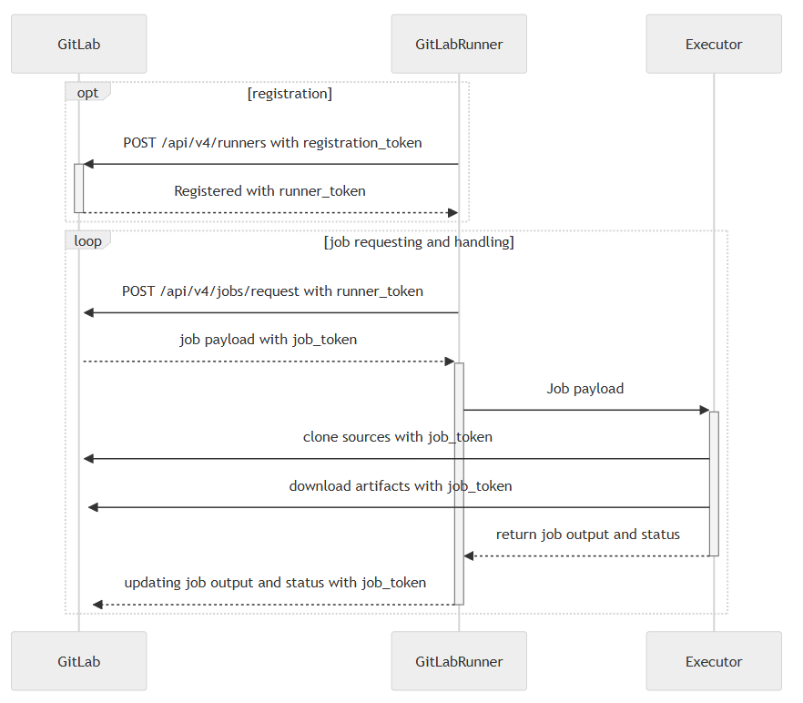

# Runner

## Resources

### gitlab 自建的 runners

[link](./gitlab自建的runner.md)

### Runner 并行任务设置

[link](./runner并行任务设置.md)

### Reading List

- [gitlab runner文档](https://docs.gitlab.com/runner/)✨✨✨
- [runner advanced configuration](https://docs.gitlab.com/runner/configuration/advanced-configuration.html) runner高级设置
- [runner advanced configuration 译文](https://gitlab.cn/docs/runner/configuration/advanced-configuration.html)
- [docker executor文档](https://docs.gitlab.com/runner/executors/docker.html)
- [gitlab-runner 源码](ttps://gitlab.com/gitlab-org/gitlab-runner.git)
- [bitnami/gitlab-runner 镜像](https://github.com/bitnami/containers/tree/main/bitnami/gitlab-runner)
- [gitlab/gitlab-runner 镜像](https://hub.docker.com/r/gitlab/gitlab-runner)