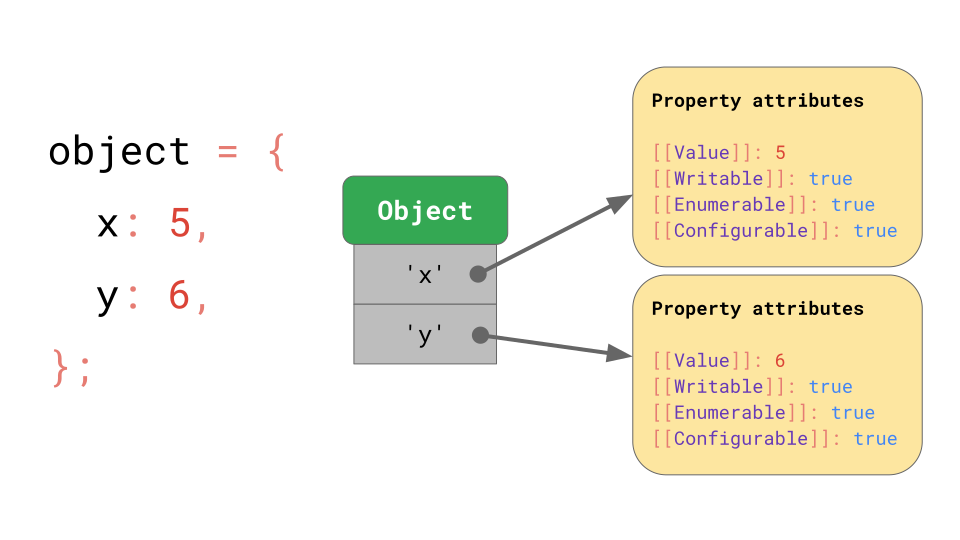
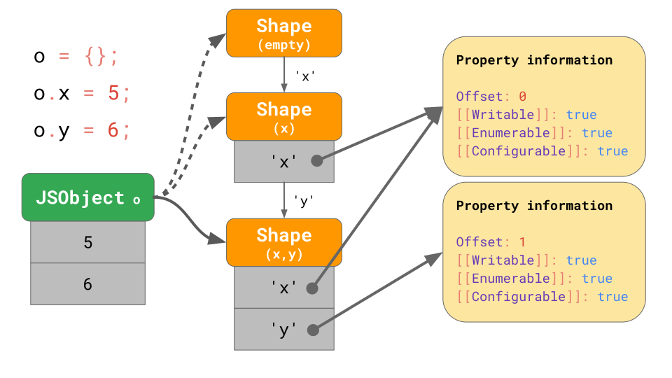

# JavaScript engine fundamentals: Shapes and Inline Caches
This article describes some key fundamentals that are common to all JavaScript engines — and not just [V8](https://twitter.com/v8js), the engine the authors ([Benedikt](https://twitter.com/bmeurer) and [Mathias](https://twitter.com/mathias)) work on. As a JavaScript developer, **having a deeper understanding of how JavaScript engines work helps you reason about the performance characteristics of your code**.

[video](https://youtu.be/5nmpokoRaZI)

## The JavaScript engine pipeline
It all starts with the JavaScript code you write. The JavaScript engine parses the source code and turns it into an `Abstract Syntax Tree (AST)`. Based on that `AST`, the interpreter can start to do its thing and produce bytecode. Great! At that point the engine is actually running the JavaScript code.


To make it run faster, the bytecode can be sent to the optimizing compiler along with profiling data. The optimizing compiler makes certain assumptions based on the profiling data it has, and then **produces highly-optimized machine code**.

If at some point one of the assumptions turns out to be incorrect, the optimizing compiler deoptimizes and goes back to the interpreter.
### Interpreter/compiler pipelines in JavaScript engines
Now, let’s zoom in on the parts of this pipeline that actually run your JavaScript code, i.e. where code gets interpreted and optimized, and go over some of the differences between major JavaScript engines.

Generally speaking, there’s a pipeline containing an interpreter and an optimizing compiler. The interpreter generates unoptimized bytecode quickly, and the optimizing compiler takes a little longer but eventually produces highly-optimized machine code.


This generic pipeline is pretty much exactly how V8, the JavaScript engine used in Chrome and Node.js, works:


The interpreter in V8 is called **Ignition**, and is responsible for generating and executing bytecode. While it runs the bytecode, it collects profiling data, which can be used to speed up the execution later. When a function becomes hot, for example when it’s run often, the generated bytecode and the profiling data are passed on to **TurboFan**, our optimizing compiler, to generate highly-optimized machine code based on the profiling data.


**SpiderMonkey**, Mozilla’s JavaScript engine as used in Firefox and in [SpiderNode](https://github.com/mozilla/spidernode), does it a little differently. They have not one but **two optimizing compilers**. The interpreter optimizes into the Baseline compiler, which produces somewhat optimized code. Combined with profiling data gathered while running the code, the IonMonkey compiler can produce heavily-optimized code. If the speculative optimization fails, IonMonkey falls back to the Baseline code.


**Chakra**, Microsoft’s JavaScript engine as used in Edge and [Node-ChakraCore](https://github.com/nodejs/node-chakracore), has a very similar setup with **two optimizing compilers**. The interpreter optimizes into SimpleJIT — where JIT stands for Just-In-Time compiler — which produces somewhat optimized code. Combined with profiling data, the FullJIT can produce more-heavily-optimized code.


**JavaScriptCore** (abbreviated as JSC), Apple’s JavaScript engine as used in Safari and React Native, takes it to the extreme with **three different optimizing compilers**. **LLInt**, the Low-Level Interpreter, optimizes into the Baseline compiler, which can then optimize into the DFG (Data Flow Graph) compiler, which can in turn optimize into the FTL (Faster Than Light) compiler.

**Why do some engines have more optimizing compilers than others**? It’s all about **trade-offs**.
- An interpreter can produce bytecode quickly, *but bytecode is generally not very efficient*.
- An optimizing compiler on the other hand takes a little longer, *but eventually produces much more efficient machine code*.

**There is a trade-off between quickly getting code to run (interpreter) or taking some more time, but eventually running the code with optimal performance (optimizing compiler)**.

Some engines choose to add multiple optimizing compilers with different time/efficiency characteristics, allowing for more fine-grained control over these trade-offs at the cost of additional complexity. Another trade-off relates to memory usage; see [our follow-up article](https://mathiasbynens.be/notes/prototypes#tradeoffs) for details on that.

We’ve just highlighted the **main differences in the interpreter and optimizing compiler pipelines for each JavaScript engine**.
But besides these differences, at a high level, all JavaScript engines have the same architecture: **there’s a parser and some kind of interpreter/compiler pipeline**.

## JavaScript’s object model

Let’s look at what else JavaScript engines have in common by zooming in on how some aspects are implemented.

For example, *how do JavaScript engines implement the JavaScript object model, and which tricks do they use to speed up accessing properties on JavaScript objects?* As it turns out, **all major engines implement this very similarly**.

The ECMAScript specification essentially defines all objects as dictionaries, with string keys mapping to [property attributes](https://tc39.es/ecma262/#sec-property-attributes).


Other than the `[[Value]]` itself, the spec defines these properties:
- `[[Writable]]` which determines whether the property can be reassigned to,
- `[[Enumerable]]` which determines whether the property shows up in `for-in` loops,
- and `[[Configurable]]` which determines whether the property can be deleted.

The `[[double square brackets]]` notation looks funky, but that’s just how the spec represents properties that aren’t directly exposed to JavaScript. You can still get to these property attributes for any given object and property in JavaScript by *using the Object.`getOwnPropertyDescriptor` API*:

Ok, so that’s how JavaScript defines objects. What about arrays?

You can think of arrays *as a special case of objects*.
- One difference is that arrays have special handling of array indices. Here array index is a special term in the ECMAScript specification. *Arrays are limited to 2³²−1 items in JavaScript*. An array index is any valid index within that limit, i.e. any integer number from *0 to 2³²−2*.
- Another difference is that arrays also have a magical `length` property.

JavaScript **defines arrays similarly to objects**. For example, *all the keys including array indices are represented as strings explicitly*. The first element in the array is stored under the key '0'.


The `'length'` property is just another property that happens to be non-enumerable and non-configurable.

Once an element is added to the array, JavaScript automatically updates the `[[Value]]` property attribute of the `'length'` property.


Generally speaking, **arrays behave pretty similarly to objects**.

## Optimizing property access

Now that we know how objects are defined in JavaScript, let’s dive into how JavaScript engines enable working with objects efficiently.

Looking at JavaScript programs in the wild, *accessing properties* is by far the most common operation. **It’s crucial for JavaScript engines to make property access fast**.

### Shapes
In JavaScript programs, it’s common to have multiple objects with the same property keys. Such objects have the same shape.
```js
const object1 = { x: 1, y: 2 };
const object2 = { x: 3, y: 4 };
// `object1` and `object2` have the same shape.
```
It’s also very common to access the same property on objects with the same shape:

With that in mind, **JavaScript engines can optimize object property access based on the object’s shape**. Here’s how that works.

Let’s assume we have an object with the properties `x` and `y`, and it uses the dictionary data structure we discussed earlier:
- it contains the keys as strings,
- and those point to their respective property attributes.



If you access a property, e.g. `object.y`, the JavaScript engine looks in the `JSObject` for the key `'y'`, then loads the corresponding property attributes, and finally returns the `[[Value]]`.

*But where are these property attributes stored in memory*? Should we store them as part of the `JSObject`? If we assume that we’ll be seeing more objects with this shape later, then it’s wasteful to store the full dictionary containing the property names and attributes on the `JSObject` itself, as the property names are repeated for all objects with the same shape. That’s a lot of duplication and unnecessarily memory usage.

As an optimization, *engines store the `Shape` of the object separately*.


This `Shape` contains all the property names and the attributes, except for their `[[Value]]`s. Instead the `Shape` contains the offset of the values inside of the `JSObject`, so that the JavaScript engine knows where to find the values. Every `JSObject` with this same shape points to exactly this `Shape` instance. Now every `JSObject` only has to store the values that are unique to this object.


The benefit becomes clear when we have multiple objects. No matter how many objects there are, *as long as they have the same shape, we only have to store the shape and property information once*!

**All JavaScript engines** use shapes as an optimization, but they don’t all call them shapes:
- Academic papers call them *Hidden Classes* (confusing w.r.t. JavaScript classes)
- V8 calls them *Maps* (confusing w.r.t. JavaScript `Map`s)
- Chakra calls them *Types* (confusing w.r.t. JavaScript’s dynamic types and `typeof`)
- JavaScriptCore calls them *Structures*
- SpiderMonkey calls them *Shapes*

Throughout this article, we’ll continue to use the term *shapes*.
### Transition chains and trees
What happens if you have an object with a certain shape, but then you add a property to it? How does the JavaScript engine find the new shape?
```js
const object = {};
object.x = 5;
object.y = 6;
```
The shapes form so-called *transition chains* in the JavaScript engine. Here’s an example:


- The object starts out without any properties, so it points to the empty shape.
- The next statement adds a property `'x'` with a value 5 to this object, so the JavaScript engine transitions to a shape that contains the property `'x'` and a value 5 is added to the `JSObject` at the first offset 0.
- The next line adds a property `'y'`, so the engine transitions to yet another shape that contains both `'x'` and `'y'`, and appends the value `6` to the `JSObject` (at offset `1`).
> Note: The order in which properties are added impacts the shape. For example, `{ x: 4, y: 5 }` results in a different shape than `{ y: 5, x: 4 }`.

We don’t even need to store the full table of properties for each `Shape`. **Instead, every `Shape` only needs to know about the new property it introduces**. For example, in this case we don’t have to store the information about `'x'` in that last shape, because it can be found earlier in the chain. To make this work, **every `Shape` links back to its previous shape**:

