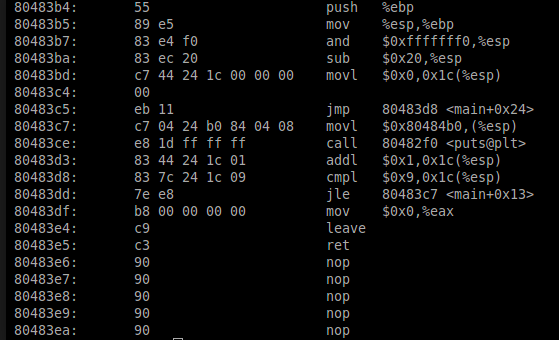

# Understanding How the Chrome V8 Engine Translates JavaScript into Machine Code
the thing that is sitting inside your computer right now and allowing you to read this:
- Microprocessors are tiny machines that work with electrical signals and ultimately do the job.
- We give microprocessors the instructions.
- The instructions are in the language that microprocessors can interpret.
- Different microprocessors speak different languages.
- Some of the most common are IA-32, x86–64, MIPS, and ARM.
- These languages directly interact with the hardware so the code written in them is called machine code.
- Code that we write on our computers is converted or compiled into machine code.

## language layer
High-level languages are abstracted from(抽象成) machine language. In the level of abstraction below, you can see how far JavaScript is abstracted from the machine level. `C/C++` are relatively much closer to the hardware and hence much faster than other high-level languages.

## v8 engine
> powerfull open source Javascript engine provided by Google

It is a program that converts JavaScript code into lower level or machine code that microprocessors can understand.

### different JavaScript engines
some engines:
- Rhino
- JavaScriptCore
- SpiderMonkey
- ...

the common point of JavaScript engies:
- follow the ECMAScript Standards
- ECMAScript defines the standard for the scripting language
- JavaScript is based on ECMAScript standards
- These standards define how the language should work and what features it should have

