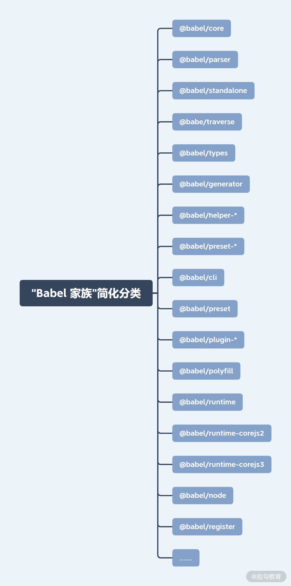
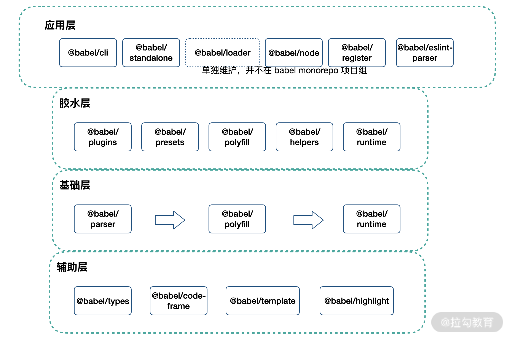

babel 配置：

- lib: 支持 es6
- component
- app

- 公共库就要兼顾性能和易用性，要注重质量和广泛度
- 对于一个应用项目来说，“只要能在需要兼容的环境中跑起来”就达到了基本目的

## 后编译

## babel

### monorepo 架构包

## idea

- 工具库支持 tree-shaking
- polyfill 尽可能的使用公共代码
- 能够兼容旧版本浏览器
- 参考 libs
  - rc-utils
