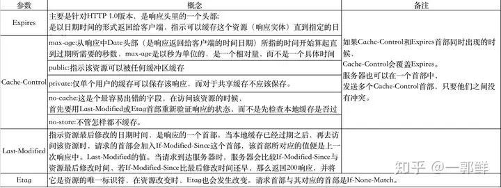

## 强缓存，协商缓存，不缓存

- 强缓存：用户第一次访问后，浏览器将一些数据和资源缓存在浏览器里，在**过期时间内**，都不会请求服务器，都是会从缓存里拿资源；控制强缓存的字段分别是 `Expires` 和 `Cache-Control`，其中 `Cache-Control` 比 `Expires` 的优先级高的多，`200` `from memory cache` 和 `200` `from disk cache` 属于强制缓存；
- 协商缓存：协商缓存就是浏览器和服务器通信的结果，第一次请求从服务器返回资源，并且返回一个缓存标识，一起存在浏览器的数据库里；在之后的请求资源中，浏览器先将缓存标识发给服务器，服务器拿到标识判断是否匹配，如果匹配到了，表示没有更新，返回 `304`，浏览器就返回缓存中的数据，如果没有匹配到，服务器就将新的标识和资源一起返回到浏览器中；与协商缓存的字段是 `Last-Modified`/`IF-Modified-Since`、`Etag`/`IF-None-Match`；
- 不缓存：即每次请求都到服务器中请求，也就是每次都能拿到最新的资源。

用户行为对缓存的影响：

| 用户操作     | Expires/Cache-Control | Last-Modified/Etag |
| ------------ | --------------------- | ------------------ |
| 地址栏回车   | 有效                  | 有效               |
| 页面链接跳转 | 有效                  | 有效               |
| 新开窗口     | 有效                  | 有效               |
| 前进回退     | 有效                  | 有效               |
| F5 刷新      | 无效                  | 有效               |
| CTRL+F5 刷新 | 无效                  | 无效               |

缓存的策略
仅对 index.html 设置缓存策略

```conf
location  ~^ /index.html{
   add_header Cache-Control "no-cache no-store private max-age=0";
}
```

## 浏览器缓存策略

在了解浏览器缓存前，我们需要先了解一下相关的概念：`cache-control`，`expires`，`last-Modified`，`ETag`。



浏览器通过请求头实现缓存，关键的请求头有 `cache-control`，`expires`，`last-Modified`，`ETag` 等。我们从时间和空间两个角度来看浏览器缓存。

### 时间

浏览器发送第一次请求：不缓存，服务端根据设定的缓存策略返回相应的 header，如：`cache-control`，`expires`，`last-Modified`，`ETag`。

浏览器发送第二次请求：

- **强缓存策略**：**不需要和服务端通信就决定是否使用缓存**，`cache-control` 优先级大于 `expires` 1.有 `cache-control` 且不过期，返回本地磁盘缓存，状态值 `200`；2.有 `expires` 且不过期，返回本地磁盘缓存，状态值 `200`。
- **协商缓存策略**：**需要和服务端通信决定是否用缓存**，`Etag` 优先级大于 `last-Modified`。1.有 `Etag`，请求头添加 `If-None-Match`，值就是上次返回的 `Etag` 值，然后发送给服务端。服务端对比 `If-None-Match` 与现有的 `Etag` 值是否一样；一样的话只返回 `header`，状态码 `304`，**浏览器从本地磁盘获取缓存信息**；不一样走正常流程，返回 `header`+`body`，状态码 `200`；2.有 `last-Modified`，添加请求头 `If-Modified-Since`，值是上次返回的 `last-Modified`，然后发送给服务端。服务端对比 `If-Modified-Since` 与现有的是否一样；一样的话返回只返回 `header`，状态码 `304`，浏览器从本地磁盘获取缓存信息；不一样走正常流程，返回 `header`+`body`，状态码 `200`
- 无缓存

### 空间

- 浏览器和服务端：服务端需要决定使用哪种缓存策略并在响应头返回；前端不需要设置，是浏览器本身机制。
- html 和静态资源：**通常 html 不设置缓存，因为其它资源的入口都是 html 文件**；**静态资源（`js`，`css`，图片等）会设置缓存**

### 部署时缓存的问题

在实际应用有个严重的问题，**我们不仅要缓存代码，还需要更新代码**。如果静态资源名字不变，怎么让浏览器即能缓存又能在有新代码时更新。**最简单的解决方式就是静态资源路径添加一个版本值，版本不变就走缓存策略，版本变了就加载新资源**。如下：

```js
<script src="xx/xx.js?v=24334452"></script>
```

然而这种处理方式在部署时有问题。
场景：**静态资源和页面是分开部署**

- 先部署页面再部署静态资源，会出现用户访问到旧的资源
- 先部署静态资源再部署页面，会出现没有缓存用户加载到新资源而报错

这些问题的本质是以上的部署方式是`覆盖式发布`，解决方式是`非覆盖式发布`。即用静态资源的文件摘要信息给文件命名，这样每次更新资源不会覆盖原来的资源，先将资源发布上去。**这时候存在两种资源，用户用旧页面访问旧资源，然后再更新页面，用户变成新页面访问新资源，就能做到无缝切换**。简单来说就是给静态文件名加`hash`值。
