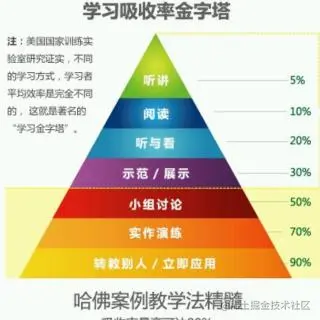
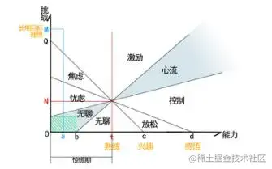

# 四句话总结我的学习观

## 围绕工作学

> 1. 有方向感
> 2. 有持续反馈

工作中用到的技术是直接有场景可以落地的，通过这些场景你可以把这门技术学的更深入，而且把这门技术学的深入了也能帮你更好的做好工作，做比较深入的创新，从而拿更高的绩效，对简历、面试也有很大的帮助。

那反过来，如果不围绕工作学呢？可能你**学的技术没有比较深入的场景**，只停留在 demo 级。而没有深入使用的场景也很难真正把它学好。而且没有真实用在项目里你也很难写到简历里，或者在面试中证明你对这门技术是有深入掌握的。费时费力还没有很好的收益。

## 多用`debugger`

`debugger` 可以让程序在你关心的逻辑处断住，一步一步的运行，看环境中的变量，输入输出都是什么。每一步其实是容易看懂的，比如赋值语句、循环语句，这些细小的单元是很容易懂的，而把这些基本单元搞懂之后，串联起来就能搞懂复杂的逻辑。

想读懂复杂业务逻辑，想看懂各种库的源码，离不开 `debugger`。只有通过 `debugger` 搞懂每一步，才能逐渐搞懂几千几万行的代码。

## 重视计算机基础

> 计算机基础知识半衰期很长，学好作用很大

语言虽然出了很多，但是用到的编译原理基本没变过。

前后端框架虽然有很多，但是也都是基于操作系统的能力做的上层封装，在操作系统这一层是变化很小的。

计算机基础技术是变化最小，半衰期最长，更值得去投入时间学习的。

- 编译原理（它把人能读懂的源代码转成计算机能运行的代码）
- 操作系统（它封装了硬件能力给上层应用，并且很好的调度各种软件资源）
- 计算机网络（它提供了计算机和计算机之间的长距离通信的机制，是互联网的基础）
- 计算机图形学（它是显示器中显示二维、三维图形的基础）
- 音视频处理（它是音视频相关技术的基础）

## 多做 `effort processing`

> 输入后就需要多输出

是不是经常感觉在看完一篇篇文章，听完一门门课之后，貌似学了很多，但是所记住的，理解比较深入的却很少。

这是因为不同方式的吸收率是不一样的：

为什么教给别人学习效率就会高呢？因为这是 `effort processing` 的事情。也就是**要费脑力去做的事情**。

从生物机制上讲，你**费脑力去做一件事情的时候，神经之间会建立更多的连接，那学习效果自然也会更好，记忆的会更牢固，理解的会更深刻**。

所以，不要惧怕做**技术分享**、**写文章**、**给别人讲解技术点**、**解决技术问题**等，这些事情都是 `effort processing` 的事情，**虽然会耗费脑力，会有点难，但也能让你有非常好的学习效果**。

而且，当你在做有点难，有点挑战的事情的时候，能**进入心流状态，也就是会极度专注，忘记时间，这种体验的感觉是很好的，而且效率也会很高**。

## Reference

- [链接](https://juejin.cn/post/7022629591311188004)
