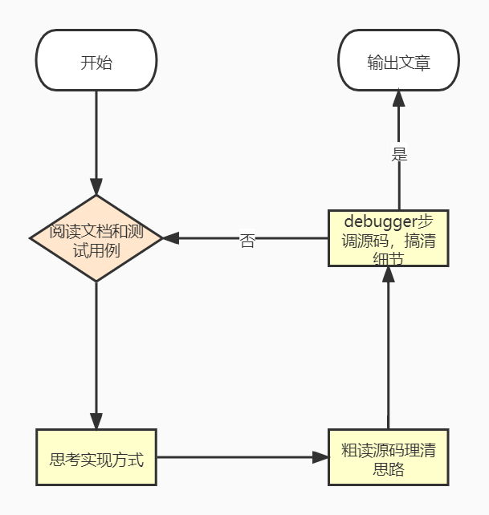

# 我阅读源码的五步速读法

## 通过文档和测试用例了解代码的功能

> 了解功能是阅读源码的基础，后面才有方向感

- 了解代码做了什么
- 输入和输出是什么

## 自己思考功能的实现方式

直到了源码的有啥功能后，要先思考下如果自己实现的话会怎么做(大概的思路)。

- 想不通：查看项目依赖的第三方库，这些库提供了哪些功能，再想下应该怎么实现

## 粗读源码理清实现思路

有了大概的思路后，再去读源码，看下它是怎么实现的：

- 与你思路类似的地方 => 略过去
- 与你思路不一样的地方 => 通过读代码搞清楚它的实现思路

> 不必关心细节，直到某段代码是干啥的就行，关键是和自己的思路做 diff，理清它的整体实现思路

## 通过 debugger 理清实现细节

通过`debugger`来断点调试

构建一个能触发该功能的测试用例，在关心的代码处打断点，通过 `debugger` 运行代码。

这时你已经直到这部分代码的功能，单步调试也很容易理清每一句代码的功能，这样一条一条代码搞懂之后，你就很容易把这部分代码的实现细节理清楚。

这样一部分一部分的通过 `debugger` 理清细节之后，你就对整体代码的思路和细节的实现都有了比较好的掌握。

## 输出文章来讲述源码实现思路

当你觉得对源码的实现有了比较好的掌握的时候，可以输出一篇文章的方式来讲述源码的整体思路。

因为可能会有一些部分是你没注意到的，而在输出的过程中，会进行更全面的思考，这时候你发现一些你没有读到点，可以再通过前面几步去阅读源码，直到能清晰易懂的把源码的实现讲清楚。这样才算真正的把代码读懂了。

## 总结

我阅读源码的方法分为五步：

- 通过文档和测试用例了解代码的功能
- 自己思考功能的实现方式
- 粗读源码理清实现思路
- 通过`debugger`理清实现细节
- 输出文章来讲述源码实现思路

这五步缺一不可：

- 缺了第一步，不了解功能就开始读源码，那读代码会没有方向感
- 缺了第二步，不经过思考直接读源码，理解代码实现思路的效率会降低
- 缺了第三步，不理清整体思路就开始 debugger，会容易陷入细节，理不清整体的思路
- 缺了第四步，不 debugger 只大概理下整体思路，这样不能从细节上真正理清楚
- 缺了第五步，不通过输出文章来检验，那是否真的理清了整体思路和实现细节是没底的

## Reference

[链接](https://juejin.cn/post/7024084789929967646)
