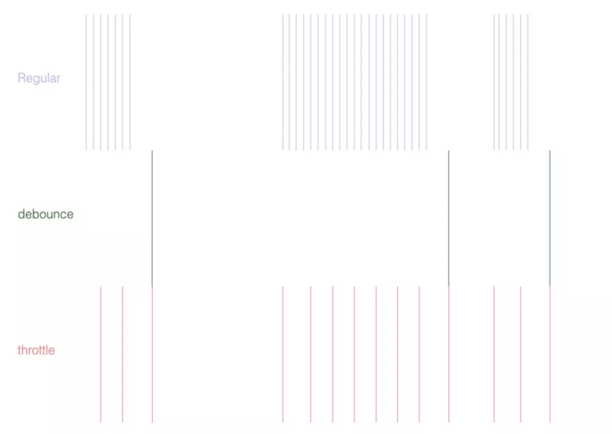

# 防抖节流场景及应用

场景：

- 搜索查询，实时输入反馈搜索结果
- 商品搜索页滑动浏览商品，监听窗口滚动来发送埋点请求

为了限制这种短时间内高频触发函数调用情况发生，我们可以借助**防抖**和**节流**。

**函数防抖**和**节流**，都是通过控制事件触发频率达到优化函数执行效率的效果。我们先通过下面这张图直观的看一下**常规**、**防抖**和**节流**的区别。

## 防抖与节流场景分析

### 防抖

防抖，顾名思义，防止抖动。用于将用户的操作行为触发转换为程序行为触发，防止用户操作的结果抖动。一段时间内，事件在我们规定的间隔`n`秒内多次执行，回调只会执行一次。

特点：等待某种操作停止后，加以间隔进行操作

- 持续触发不执行
- 不触发的一段时间之后再执行

#### 应用场景：

- `mousemove` 鼠标滑动事件

### 节流

节流，顾名思义，控制流量。用于用户在与页面交互时控制事件发生的频率，一般场景是单位的时间或其它间隔内定时执行操作。一段时间内，事件在每次到达我们规定的间隔`n`秒时触发一次。

特点：每等待某种间隔后，进行操作

- 持续触发并不会执行多次
- 到一定时间 / 其它间隔 ( 如滑动的高度 )再去执行

#### 应用场景

- 埋点场景。商品搜索列表、商品橱窗等，用户滑动时，**定时**/**定滑动的高度**，发送埋点请求
- 运维系统查看应用运行日志时，每`n`秒刷新一次

节流控制事件触发的频率，同时限制了事件执行的上限和下限，即事件触发过程中每间隔 `n` 秒去执行。同样的场景可能还有 `scroll` `mousemove` 等更加频繁触发的事件、浏览器进度条位置计算、`input` 动态搜索等。

## Reference

- [链接](https://mp.weixin.qq.com/s/XzqwfdG4-whUaAxxnXITmg)
- [Lodash 防抖和节流是如何实现的](https://cloud.tencent.com/developer/article/1460880)
- [JavaScript 专题之跟着 underscore 学防抖](https://github.com/mqyqingfeng/Blog/issues/22)
- [JavaScript 专题之跟着 underscore 学节流](https://github.com/mqyqingfeng/Blog/issues/26)
- [可视化比较，在线查看](http://demo.nimius.net/debounce_throttle/)
- [debouncing-throttling-explained-examples](https://css-tricks.com/debouncing-throttling-explained-examples/)
