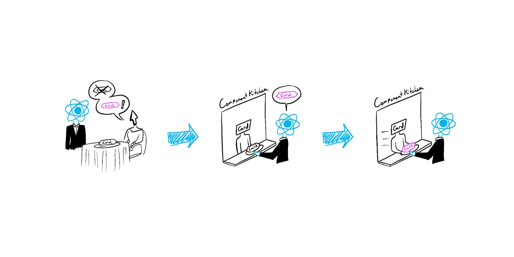

# React 为什么重新渲染



更新（重新渲染）是 `React` 的重要特性 —— 当用户与应用交互的时候，`React` 需要**重新渲染**、**更新UI**，**以响应用户的输入**。但是，`React` 为什么会重新渲染呢？如果不知道 `React` 为什么会重新渲染，我们如何才能避免额外的重新渲染呢？

## TL; DR

**状态改变**是`React`树内部发生更新的唯二原因之一。

这句话是 `React` 更新的公理，不存在任何例外。本文也将会围绕解释这句话展开。为了避免有人抬杠，这句话引入了一些限制定语和关键词：

## 名词解释

### 「更新」和「重新渲染」

在 `React` 中，「更新」和「重新渲染」是关系紧密，但是含义完全不同的两个词。下面这句话才能正确表达这两个词的正确含义：

`React` 的「更新」 包含三个阶段：

- **渲染（Render）**，使用 **`createElement`** 或 **`jsx-runtime`** 产生全新的`React Element`对象、组装出一颗`React` 树；
- `Reconcilation`，`React Reconciler` 比较新生成的 `React` 树和 当前的 `React` 树，判断如何用最高效的方法实现「更新」；
- `Commit`，操作 `Host`（如 `DOM`、`Native` 等），使新的 `UI` 呈现在用户面前。

大部分开发者会把「更新」和「重新渲染」混为一谈，因为在上述三个阶段中，**只有「渲染」这一阶段是开发者可以控制的**（「`Reconcilation`」和「`Commit`」分别由 `react-reconciler` 和 `React Host` 控制）。本文接下来的部分中，「重新渲染」一律指代 `React` 组件在「更新」时的「渲染」阶段，而「更新」则一律指代（重新）渲染、`Reconcilation` 和 `Commit` 整个过程。

### 「React 树」和「React 树内部」

React Tree 本身可以在任意时候更新。实际上，如果你曾经通过 React 文档学习 React，你在「Hello World」一章就已经见过这个 Pattern 了：

```tsx
const root = ReactDOM.createRoot(document.getElementById('root'))

function tick() {
  const element = (
    <div>
      <h1>Hello, world!</h1>
      <h2>It is {new Date().toLocaleTimeString()}.</h2>
    </div>
  )
  root.render(element)
  // 如果你是在 React 18 发布以前学习的 React，你可能会用 ReactDOM.render()：
  // ReactDOM.render(element, document.getElementById('root'));
}

setInterval(tick, 1000)
```

每秒钟调用一次 `ReactDOM` 提供的 `render` 使一整颗 `React` 树进行了完整的更新。但是绝大部分时候，你不会更新一整颗 `React 树`，而是 `React` 树内的一部分组件（在 `React` 应用中，你只会调用一次 `createRoot().render` 或者 `hydrateRoot()`）。

> `Reconcilation`计算出更新的组件？

### 「唯二原因」

如果你在使用 `React class` 组件，那么你可以使用继承自 `React.Component` 的 `forceUpdate` 方法更新一个组件：

```tsx
class MyComponent extends React.Component {
  handleInput() {
    this.forceUpdate() // vue.js也提供了一个这样的实例方法 `this.$forceUpdate()`
  }
}
```

因此，我们也可以把这句话改写成：如果一颗 `React` 树中所有的 `class` 组件都没有使用 `forceUpdate` 方法，那么状态改变是这颗 `React Tree` 内部发生更新的唯一原因。

在正文开始之前，先放出一句非常具有迷惑性的话：

> 误区 0：`React` 组件更新有三个原因：**状态改变**，**`prop` 改变**，**`Context` 改变**。

如果你去问一些使用 `React` 的开发者「为什么 `React` 会更新/重新渲染」，大概会得到这个答案。_这句话不无道理，但是并不能反应真实的 `React` 更新机制_。

> 本文只会介绍 `React` 为什么会发生更新，不会介绍如何避免「不必要」的更新（也许我会以这个为话题另外写一篇文章？）。

## 状态更新和单向数据流

让我们以计数器为例：

```ts
const BigNumber = ({ number }) => <div style={{ fontWeight: 700, fontSize: 36 }}>{number}</div>

const Counter = () => {
  const [count, setCount] = useState(0)
  const handleButtonClick = useCallback(() => setCount((count) => count + 1), [])

  return (
    <div>
      <BigNumber number={count} />
      <button onClick={handleButtonClick}>Increment</button>
    </div>
  )
}

const App = () => (
  <>
    <Counter />
    <footer>
      <a href="https://skk.moe/">Sukka</a>
    </footer>
  </>
)
```

在这个例子中，我们声明了三个组件，根组件 `<App />` 渲染了 `<Counter />`；而 `<Counter />` 渲染了 `<BigNumber />`。在 `<Counter />` 组件中，我们声明了一个组件内的状态 `count`，当点击按钮时会改变状态 `count`使其递增。

当我们点击按钮的时候，`setCount` 被调用、`count` 状态发生改变，`React` 更新了 `<Counter />` 组件。而当 `React` 更新一个组件时，也会更新这个组件下的所有子组件（至于为什么，很快就会讲的）。因此 `<Counter />` 组件更新时，子组件 `<BigNumber />` 也会更新。

现在让我们先厘清一个最简单的误区：

> 误区 1：当一个状态发生改变时，整颗 `React` 树都会更新。

有少数使用 `React` 的开发者会相信这一点（还好不是大多数！）。实际上，当状态发生改变的时候，`React` 只会更新「拥有这个状态」的组件，和这个组件的所有子组件。

为什么父组件（在这个例子中，`<App />` 是 `<Counter />` 的父组件）没有发生更新呢？因为 `React` 的主要任务就是保持 `React` 内的状态和 `React` 渲染的 `UI` 的同步。`React` 更新，就是找出如何改变 `UI`，使其和新的状态同步。而在 `React` 中，数据是自上而下单向传递的（单向数据流，The Data Flows Down）。在这个例子中，`<Counter />` 组件的状态 `count` 向下流向了 `<BigNumber />` 组件的 `prop number`，但是不可能向上流向了 `<App />` 组件。因此，`count` 状态改变，`<App />` 组件并不需要更新。

当 `count` 状态改变时，`<Counter />` 组件及其子组件 `<BigNumber />` 都发生了更新。而 `<BigNumber />` 组件更新时，使用了 `prop number` 的新的值进行渲染。那么 `<BigNumber />` 组件更新的原因是因为 `prop number` 的改变吗？

## 不，和 props 完全没有关系

> 误区 2：`React` 组件更新的其中一个原因是它的 `prop` 发生了改变。
> 现在让我们修改一下上面那个例子：

```TS
import BigNumber from './big-number';

const SomeDecoration = () => <div>Hooray!</div>

const Counter = () => {
  const [count, setCount] = useState(0);
  const handleButtonClick = useCallback(() => setCount(count => count + 1), []);

  return (
    <div>
      <BigNumber number={count} />
      <button onClick={handleButtonClick}>Increment</button>
      <SomeDecoration />
    </div>
  );
};

const App = () => (
  <>
    <Counter />
    <footer>
      <a href="https://skk.moe/">Sukka</a>
    </footer>
  </>
);
```

`<SomeDecoration />` 组件不接受任何 `prop`、不使用其父组件 `<Counter />` 的 `count` 状态，但是当 `count` 状态发生改变时，`<SomeDecoration />` 组件仍然发生了更新。**当一个组件更新时，`React` 会更新 所有的子组件，不管这个子组件是否接受一个 `prop`：`React` 并不能百分之百肯定 `<SomeDecoration />` 组件是否直接/间接地依赖了 `count` 状态**。

理想中，每一个 `React` 组件都应该是一个 纯函数 —— 一个「纯」的 `React` 组件，当输入相同的 `props` 时，总是会渲染相同的 `UI`。_但是现实是骨感的，我们非常容易写出一个「不纯」的 `React` 组件_：

```TS
const CurrentTime = () => <p>Last rendered at {new Date().toString()}</p>
```

`<CurrentTime />` 组件不接受任何 `prop`，但是每次渲染得到的 `UI` 却是不一样的。

> 包含了状态（使用了 `useState`）的组件也不是纯组件：**即使 `prop` 不改变，组件也会因为状态不同而渲染出不同的 `UI`**。

有的时候，你很难判断一个组件是否是纯组件。你可能会将一个 `Ref` 作为 `prop` 传递给一个组件（`forwardRef`，`useImperativeHandle`，诸如此类的 `case`）。`Ref` 本身是 `Reference Stable` 的、`React` 并不能知道 `Ref `中的值是否改变。

**`React` 的目标是展示最新、维持一致的 `UI`。为了避免向用户展示过时的 `UI`，当父组件更新时，`React` 会更新所有子组件，即使子组件不接受任何 `prop`。`props`和组件更新没有任何关系**。

## 纯组件和 `memo`

你大概很熟悉（或者至少听说过）`React.memo`、`shouldComponentUpdate` 或者 `React.PureComponent`，这些工具允许我们「忽略更新」：

```tsx
const SomeDecoration = memo(() => <div>Hooray!</div>)
```

当我们将 `<SomeDecoration />` 组件的声明包裹在 `memo` 中时，我们实际上做的是告诉 `React`**「嘿！我觉得这是个纯组件，只要它的 `prop` 不改变，我们就别更新它」**。

现在，让我们把 `<SomeDecoration />` 和 `<BigNumber />` 都包裹在 `memo` 中，看看会发生什么：

```ts
const BigNumber = memo(({ number }) => <div style={{ fontWeight: 700, fontSize: 36 }}>{number}</div>)

const SomeDecoration = memo(() => <div>Hooray!</div>)

const Counter = () => {
  const [count, setCount] = useState(0)
  const handleButtonClick = useCallback(() => setCount((count) => count + 1), [])

  return (
    <div>
      <BigNumber number={count} />
      <button onClick={handleButtonClick}>Increment</button>
      <SomeDecoration />
    </div>
  )
}

const App = () => (
  <>
    <Counter />
    <footer>
      <a href="https://skk.moe/">Sukka</a>
    </footer>
  </>
)
```

现在，当 `count` 状态更新后，`React` 会更新 `<Counter />` 组件及其所有子组件，`<BigNumber />` 和 `<SomeDecoration />`。由于 `<BigNumber />` 接受一个 `prop number`，而 `number` 的值发生了改变，因此 `<BigNumber />` 会更新。但是 `<SomeDecoration />` 的 `prop` 没有发生改变（因为不接受任何 `prop`），所以 `React` 跳过了 `<SomeDecoration />` 的更新。

于是你想，为什么 `React` 不默认所有组件都是纯组件呢？为什么 `React` 不 `memo` 所有组件呢？事实上，`React` **组件更新的开销没有想象中的那么大**。以 `<SomeDecoration />` 组件为例，它只需要渲染一个 `<div />`。

还记得「渲染」是什么意思吗？不记得了的话赶紧回去看看。

如果一个组件接受很多复杂的 `prop`，有可能渲染这个组件并对比 `Virtual DOM` 的性能开销甚至小于等于浅比较所有 `prop` 的开销。_绝大部分时候，`React` 是足够快的_。因此，**只有当一个 `纯组件` 有大量纯的子组件、或者这个 `纯组件` 内部有很多复杂计算时，我们才需要将其包裹在 memo 中**。

当一个包裹在 `memo` 中的组件使用了 `useState`、`useReducer` 或者 `useContext`，当这个组件内的状态发生改变时，这个组件仍然会更新。

另外一个 `React` 默认不 `memo` 所有组件的原因是：让 `React` 在 `Runtime` 中判断子组件的全部依赖、以跳过子组件的不必要更新，是非常困难、非常不现实的。计算子组件依赖的最好时机是编译期间。关于这个 idea 的更多细节，可以看看黄玄在 `React Conf 2021` 上的演讲 [React without memo](https://www.youtube.com/watch?v=lGEMwh32soc)。

## 让我们谈谈 Context

> 误区 3：`React` 组件更新的其中一个原因是 `Context.Provider` 的 `value` 发生了更新。

如果说，当一个组件由于状态改变而更新时，其所有子组件都要随之更新。那么当我们通过 `Context` 传递的状态发生改变时，订阅了这个 `Context` 的所有子组件都要更新也是毫不意外的了。

对于纯组件来说，`Context` 可以视为一个「隐藏的」、或者「内部的」`prop`：

```ts
const User = memo(() => {
  const user = useContext(UserContext)

  if (!user) {
    return 'Hello, new comer!'
  }

  return `Hello, ${user.name}!`
})
```

在上面的例子中，`<User />` 组件是一个不接受任何 `prop`、不使用 `useState`、也没有任何副作用的纯组件。但是，`<User />` 组件依赖 `UserContext`。当 `UserContext` 保存的状态发生改变时，`<User />` 组件也会更新。

众所周知，当 `Context` 的 `value` 发生改变的时候，所有 `<Context.Provider />` 的子组件都会更新。那么为什么即使不依赖 `Context` 的子组件也会更新呢？`Context` 本身并不是一个状态管理工具，只是一种状态传递工具。`Context` 的 `value` 发生改变的根本原因还是状态的改变：

```ts
const CountContext = createContext(0)

const BigNumber = memo(() => {
  const number = useContext(CounterContext)
  return <div style={{ fontWeight: 700, fontSize: 36 }}>{number}</div>
})

const Counter = () => {
  const [count, setCount] = useState(0)
  const handleButtonClick = useCallback(() => setCount((count) => count + 1), [])

  return (
    <div>
      <CountContext.Provider value={count}>
        <BigNumber number={count} />
      </CountContext.Provider>
      <SomeDecoration />
      <button onClick={handleButtonClick}>Increment</button>
    </div>
  )
}
```

正如上面的例子，`CountContext` 发生改变的原因，是 `<Counter />` 组件的 `count` 状态发生了改变；发生更新的，也不仅仅是 `CountContext` 的消费组件（及其子组件），还包括 `<Counter />` 所有的子组件。

## 后记

感谢许多人对本文的关注。有人在 V2EX 质疑本文是对[「Why React Re-Renders」](https://www.joshwcomeau.com/react/why-react-re-renders/)一文的洗稿。如果说本文没有受到 Josh W. Comeau 的影响的话，那肯定是不属实的。但是直接说是洗稿，则有一点康生的行为了。

本文的草稿是我从两年前开始自学 React 后一周开始动笔的、原本是单纯作为自己的学习笔记。当时，React (Current) Docs 的学习路线还是从 class component 开始、React Beta Docs 和 Josh W. Comeau 的这篇文章也还不存在。随着我实践项目、包括成为 `React` 框架 `Next.js` 活跃贡献者之一，我觉得可以将我的学习笔记整理成为一篇文章，丢到自己的博客上。

正式动手撰写本文的时候，我确实查找了这个话题的有关文章，例如 React Team 为 React Beta Docs 编写的[「Render and Commit」](<https://blog.skk.moe/post/(https:/beta.reactjs.org/learn/render-and-commit)/>)，也包括 Josh W. Comeau 的[「Why React Re-Renders」](https://www.joshwcomeau.com/react/why-react-re-renders/)，对本文成型影响很大。如果这两篇文章哪怕提前一年问世的话，我在自学 `React` 时能够少走很多的弯路、大概也不会有这篇文章了。

正如我所说，这篇文章受到了 Josh W. Comeau 一文的影响，包括行文的结构、计数器的 Example；然而在内容上，我和 Josh W. Comeau 的观点是不一致的。例如，Josh W. Comeau 和其它文章一样、将 `React` 更新简单解释为「重新渲染」，而实际上 React 状态更新会触发从渲染、到 `Reconcilation`、`Commit` 的完整环节，在这正文开始前我就强调了这一点；Josh W. Comeau 通过快照来解释为什么子组件的状态更新不能影响父组件，非常容易引起误解、陷入「状态更新导致 `React` 整棵树 `Reconcilation`」的误区，我在解释这个问题时直接通过单向数据流的角度、也更符合 `React` 实际的 `Recoilation` 过程；Josh W. Comeau 对于 `Context` 的讲解也主要着重于其传染性。真要说的话，本文许多观点应该更接近 Gupta Garuda 在 2020 年 1 月份发表的 [React Hooks - Understanding Component Re-renders](https://medium.com/@guptagaruda/react-hooks-understanding-component-re-renders-9708ddee9928)。

本文发表以后，也有人推荐了 Nadia Makarevich 的[「React re-renders guide: everything, all at once」](https://www.developerway.com/posts/react-re-renders-guide)，通过实际行为自顶向下地介绍 React 更新，相比介绍 React 原理要更为直观和「实用」。除此以外，他的[「The mystery of React Element, children, parents and re-renders」](https://www.developerway.com/posts/react-elements-children-parents)详细描述了父组件和子组件之间的关系，一并推荐给大家。

## 参考资料

- [Render and Commit - React Beta Docs](https://beta.reactjs.org/learn/render-and-commit)
- [React Hooks - Understanding Component Re-renders](https://medium.com/@guptagaruda/react-hooks-understanding-component-re-renders-9708ddee9928)

- [Why React Re-Renders](https://www.joshwcomeau.com/react/why-react-re-renders/)

## 补充资料

- [「The mystery of React Element, children, parents and re-renders」](https://www.developerway.com/posts/react-elements-children-parents)
- [「React re-renders guide: everything, all at once」](https://www.developerway.com/posts/react-re-renders-guide)
- [「Why React Re-Renders」](https://www.joshwcomeau.com/react/why-react-re-renders/)
- [React without memo](https://www.youtube.com/watch?v=lGEMwh32soc)
