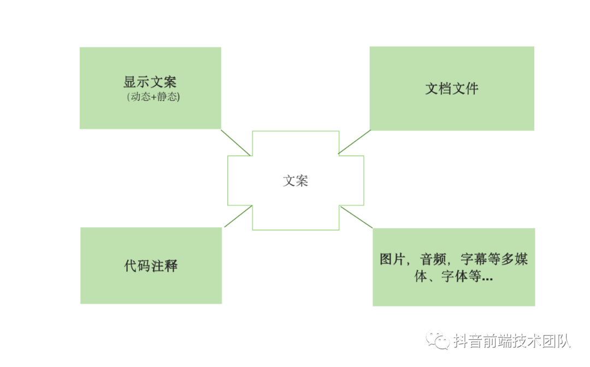

# 抖音前端团队国际化是怎么做的？

## 国际化

### 国际化 internationalization(I18n)

在设计软件，将软件与特定语言及地区脱钩的过程, 应用程序的功能和代码设计考虑在不同地区运行的需要，简化不同地区版本的生产

### 本地化 localization (I10n)

移植软件时，加上特定区域信息和翻译文件的过程。如：布局顺序、图片、货币、日期格式...

### 全球化 globalization(g11n)

全球化 = 国际化 + 本地化

## 国际化对象

围绕显示文案、动态文案、代码注释、图片多媒体等四个方面

### 文案

- 静态文案：代码中静态书写的
- 动态文案：
  - 接口返回的 -> 约定同样的接口
  - 运行时产生的字符串拼接(可以规避)

### 代码注释

如果开发代码，涉及到多个语种的研发，方便理解代码 or 某些合规需求，那么嵌入到代码注释文案也需纳入改造范围

### 接入图片,多媒体音频,字体等

## 基础建设

- 扫描、提取、覆盖率分析
- 管理维护平台
  - 多角色
  - 多项目
  - 翻译接口
- 基础建设
  - 开发工具
  - 编辑器插件
  - figma 插件
