## Part 1："闪开"优化项目概述

### 目标

点击打开正文 → 直出体验(无白屏)，动画流畅(不卡顿)

### 已有优化

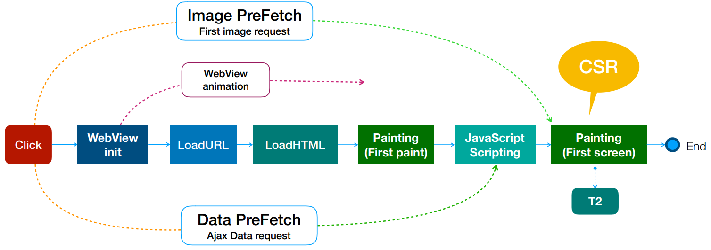

### 遗留问题

- 主⽂档没有缓存
- `Data PreFetch` 命中率低
- 前端技术栈⽼旧，冗余，发版的性能抖动明显

## Part 2: 优化的方案设计过程

### 容器的选择

- Weex
- H5
  - PWA
  - SSR

### PWA 的问题

1. 进入启动流程
2. 分派进程/线程
3. 加载`sw.js`
4. 启动`SW`线程
5. 通知启动完成

| 步骤   | 覆盖安装, ⾸次启动 | 重启浏览器, ⾸次启动 | 不退出浏览器, 再次启动 | 保持⻚⾯不关闭, 锁屏 → 开屏 → 启动 SW |
| ------ | ------------------ | -------------------- | ---------------------- | ------------------------------------- |
| 步骤 1 | 2ms                | 1ms                  | 1ms                    | 1ms                                   |
| 步骤 2 | 265ms              | 151ms                | 37ms                   | 56ms                                  |
| 步骤 3 | 757ms              | 37ms                 | 20ms                   | 108ms                                 |
| 步骤 4 | 33ms               | 29ms                 | 23ms                   | 186ms                                 |
| 步骤 5 | 2ms                | 2ms                  | 2ms                    | 1ms                                   |
| 总耗时 | 1059ms             | 220ms                | 83ms                   | 352ms                                 |

- `PWA` 对信息流业务有用的只有`ServiceWorker`
- `SW` 启动和保活成本大，耗时 100-1000ms
- `SW` 缓存本质也是 `HttpCache`，从内核角度，它不是最快的

### `SSR` 是最好的选择吗？

`SSR` 能对⻬ `Native` 的性能吗？

### 假设正⽂是 `Native` 的，它到底是多快？

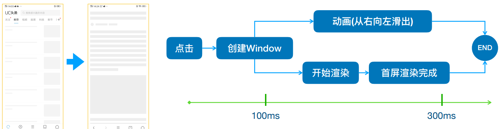

**闪开体验**：点击到首屏完成的耗时<=`300ms`

### ⾸屏渲染的阶段分拆

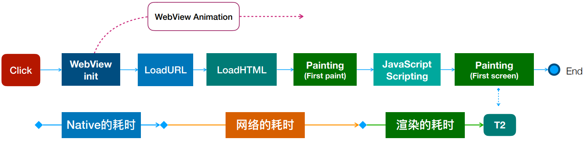

### 分拆后的优化分析

- Native 的耗时可以优化吗
- 网络的耗时可否消除
- 渲染的耗时可以优化吗

### 重新理解⻚⾯的渲染

`UI页面` = `F模板(Data数据)`

加载模板和数据 -> 组装数据和模板 -> ⽣成 HTML ⽂档 -> 浏览器 -> 渲染

### 渲染的最短路径

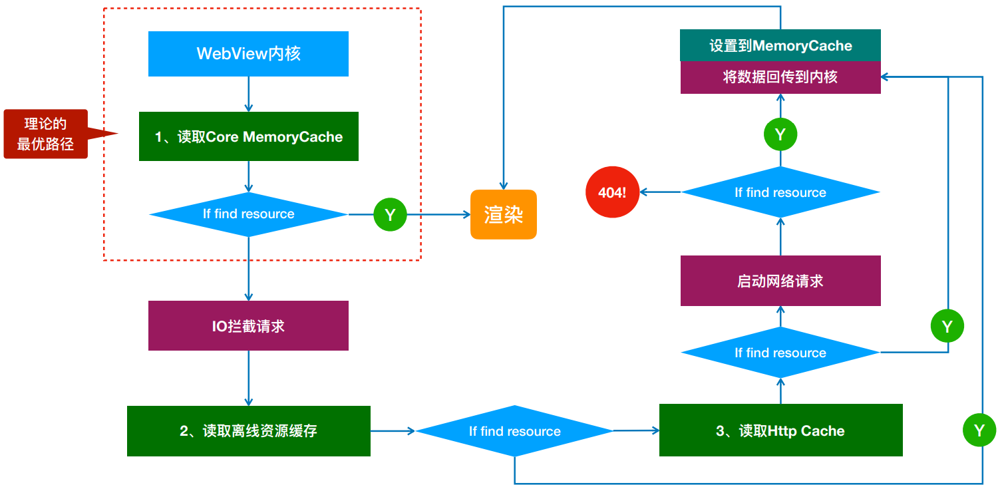

### 模板和数据预处理的时机

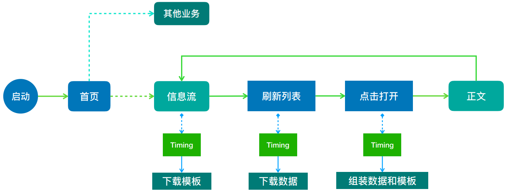

## Part 3：`NSR` 预渲染的移动架构设计

### 信息流的⻚⾯特征

> 同类⽂章的 URL 和数据不相同，但模板相同

- 页面的类型是有限的
- 用户很少会反复阅读同一篇文章
- 同类文章的页面结构是相同的

### 渲染流程设计

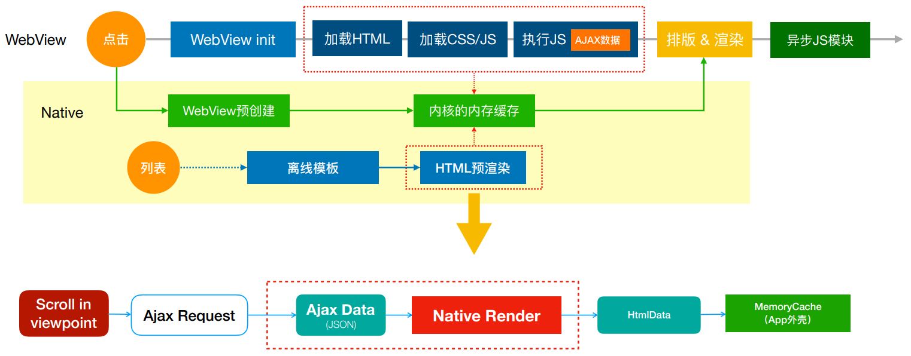

### 渲染流程对客户端的诉求

- 离线模板的加载和管理
- 数据预加载
- 预渲染`Server`
- 缓存匹配

### 移动端预渲染架构

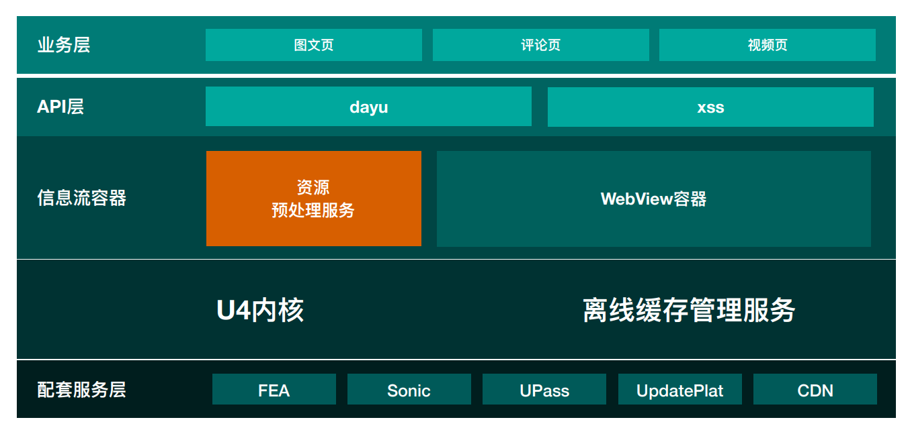

### ⻚⾯缓存处理

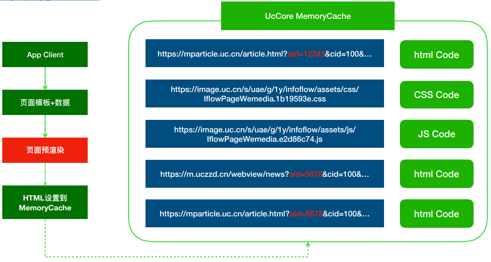

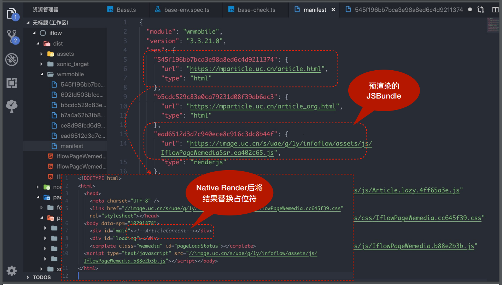

## Part 4：三端同构的前端架构演进

### 渲染流程对⽐

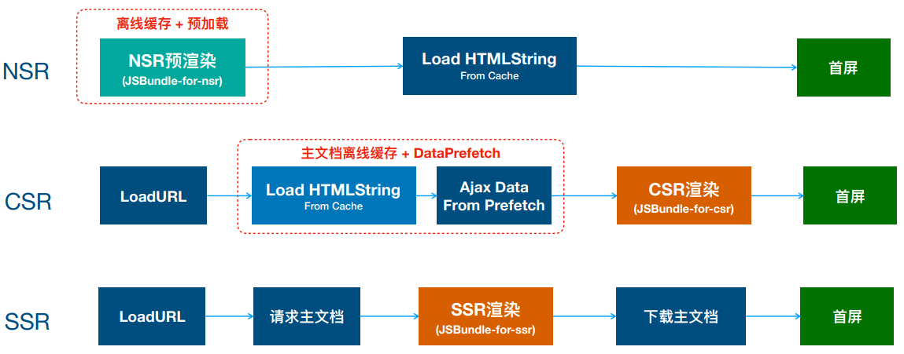

### 预渲染的延伸问题

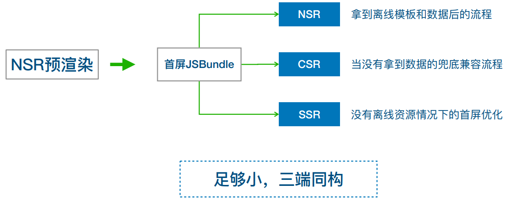

### 前端的解法是什么

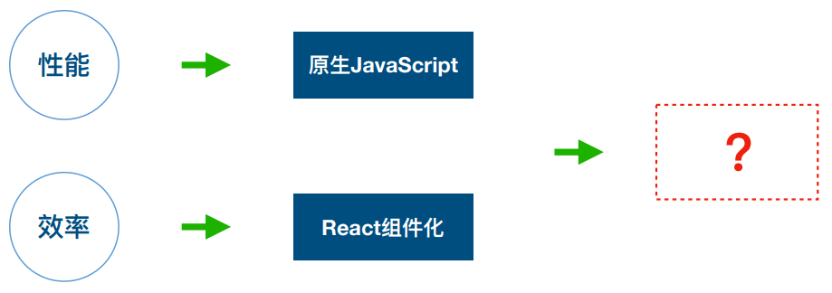

### 优化前的前端架构

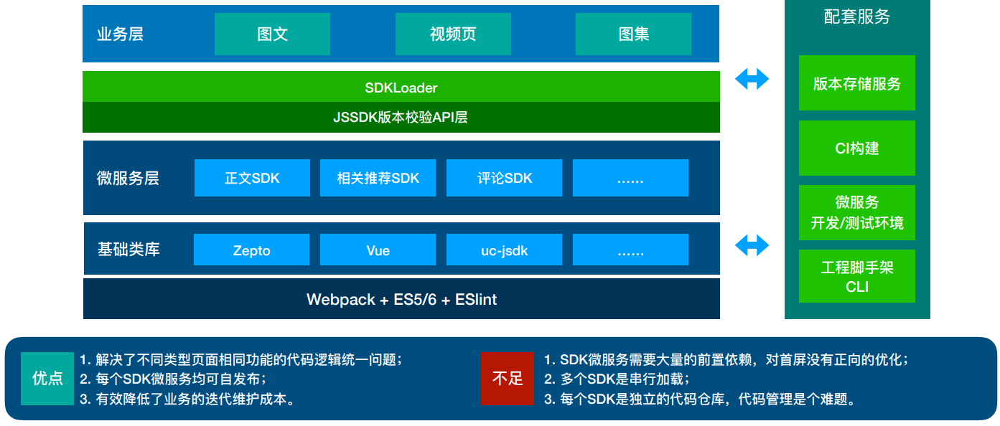

### 优化后的前端架构

组件方案：首屏`PureJSX` + 非首屏`Preact`
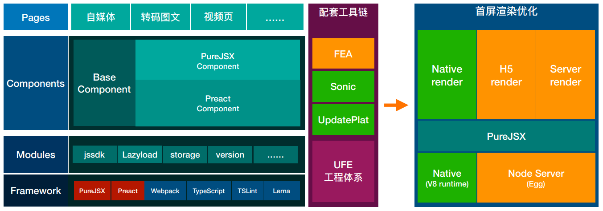

### PureJSX 是什么

⼀个没有 `Vdom` 的但保留最⼩组件周期的 `React` 实现，只有 1KB。

### ⾸屏最⼩化

✦ 通⽤类库移除或异步：

> ⾸屏仅依赖 PureJSX 来实现逻辑，`Preact`则在异步`Chunk`中才会引⼊；

✦ ⾸屏模块语法约束：

> ⾸屏仅使⽤兼容`ES5`的语法，避免引⼊`polyfill`，⽽⾮⾸屏部分则不做限制；

✦ 重新定义⾸屏的功能：

> 将⾸屏所包含事件绑定、统计上报等逻辑全部移到异步`chunk`中，⾸屏只做展示渲染。

### ⾸屏改造的前后对⽐

| xx        | 改造前                                                                     | 改造后                                                |
| --------- | -------------------------------------------------------------------------- | ----------------------------------------------------- | ---------------------------- |
| 前置依赖  | `polyfill`、`zepto`、`vue`、`uc-jssdk`、`tracker`、`lazyload`、`sdkLoader` | `PureJSX`                                             |
| ⾸屏功能  | 标题、作者信息(关注功能的实现)、正⽂、                                     | 图⽚ `Lazyload`、正⽂相关统计                         | 标题、作者信息(仅展示)、正⽂ |
| ⾸屏 Size | 主⽂档：`36KB/13KB` CSS：`40KB/12KB` JS：`600KB/230KB`                     | 主⽂档：`1.3KB/0.6KB` CSS：`18KB/8KB` JS：`30KB/12KB` |

## Part 5：优化效果对⽐及总结

### 优化前后的对⽐

- T2 平均值 `1515ms` → `318ms`
- T2 闪开率 `0` → `79%`
- 错误率 `0.2%` → `0.01%`
- ⼈均 CTR `+3.6%`

### 各优化策略的贡献

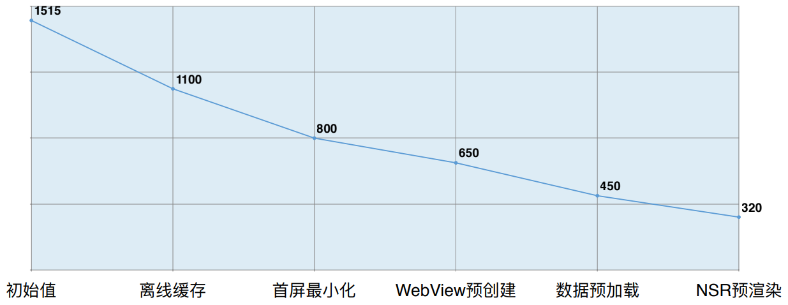

### 优化策略的逻辑

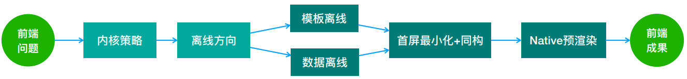

从前端开始到前端结束，**⼤量⼯作是⾮前端实现的**，但**整个过程需要前端视⻆进⾏串联**。

### NSR 的本质

### 优化的成本和⻛险

- 数据的预加载
- 技术实现

### 前端开发者的挑战

- 深刻理解浏览器的渲染原理和缓存机制
- 要跳出某个端的范畴来思考整体的最优策略
- 优化手段不局限于已有的经验

### 优化的⽅法论

> 将模板和数据分拆处理，并尽可能保障⽤户触达前获取，然后根据场景选择合适的组装“地点”.

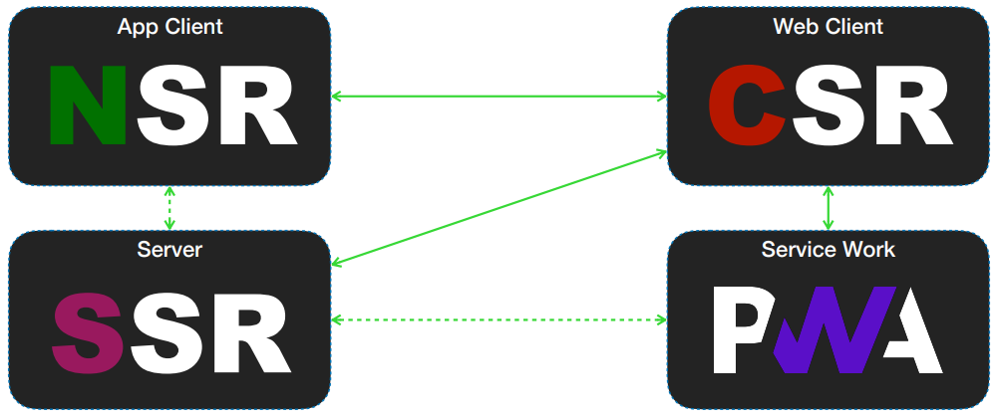

## Reference

- [0.3s 完成渲染！UC 信息流正文“闪开”优化实践](https://www.infoq.cn/article/9ukos4xh_6wl4fh1fogl)
