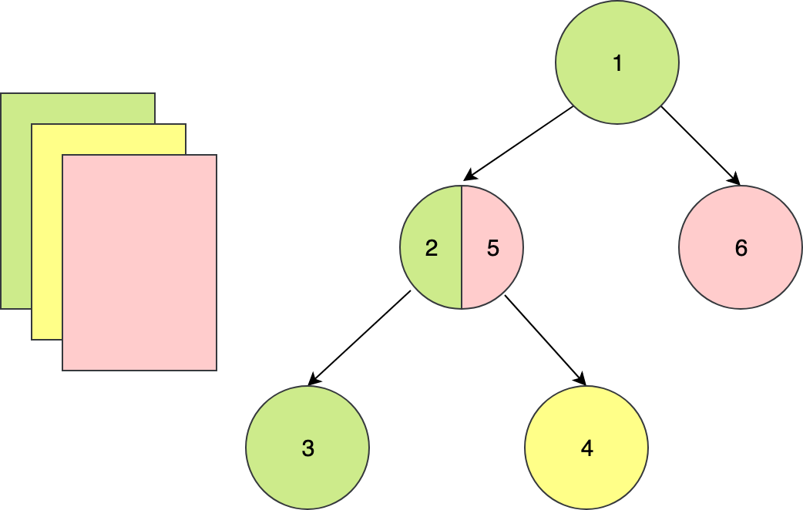

# Flutter 核心技术

## 历史背景

> 从 2017 年 5 月，谷歌公司发布的了 Alpha 版本的 Flutter，到 2018 年底 Flutter Live 发布的 1.0 版本，再到现在

为不同的操作系统开发拥有相同功能的应用程序，开发人员只有两个选择：

- 使用原生开发语言（即 Java 和 Objective-C），针对不同平台分别进行开发。
- 使用跨平台解决方案，对不同平台进行统一开发。

原生开发方式的体验最好，但研发效率和研发成本相对较高；而跨平台开发方式研发虽然效率高，但为了抹平多端平台差异，各类解决方案暴露的组件和 API 较原生开发相比少很多，因此研发体验和产品功能并不完美。

所以，最成功的跨平台开发方案其实是依托于浏览器控件的 **Web**。浏览器保证了 99% 的概率下 Web 的需求都是可以实现的，不需要业务将就“技术”。不过，Web 最大的问题在于它的性能和体验与原生开发存在肉眼可感知的差异，因此并不适用于对体验要求较高的场景。

## Flutter 是怎么运转的

与用于构建移动应用程序的其他大多数框架不同，Flutter 是重写了一整套包括**底层渲染逻辑**和**上层开发语言**的完整解决方案。这样不仅可以保证视图渲染在 Android 和 iOS 上的高度一致性（即高保真），在代码执行效率和渲染性能上也可以媲美原生 App 的体验（即高性能）。

这，就是 Flutter 和其他跨平台方案的本质区别：

- React Native 之类的框架，只是通过 JavaScript 虚拟机扩展调用系统组件，由 Android 和 iOS 系统进行组件的渲染；
- Flutter 则是自己完成了组件渲染的闭环。

## Skia 是什么

要想了解 Flutter，你必须先了解它的底层图像渲染引擎 Skia。因为，Flutter 只关心如何向 GPU 提供视图数据，而 Skia 就是它向 GPU 提供视图数据的好帮手。

Skia 是一款用 C++ 开发的、性能彪悍的 2D 图像绘制引擎，其前身是一个向量绘图软件。2005 年被 Google 公司收购后，因为其出色的绘制表现被广泛应用在 Chrome 和 Android 等核心产品上。Skia 在图形转换、文字渲染、位图渲染方面都表现卓越，并提供了开发者友好的 API。

因此，架构于 Skia 之上的 Flutter，也因此拥有了彻底的跨平台渲染能力。通过与 Skia 的深度定制及优化，Flutter 可以最大限度地抹平平台差异，提高渲染效率与性能。

底层渲染能力统一了，上层开发接口和功能体验也就随即统一了，开发者再也不用操心平台相关的渲染特性了。也就是说，Skia 保证了同一套代码调用在 Android 和 iOS 平台上的渲染效果是完全一致的。

## 为什么是 Dart？

> 语言的发展及不断的定位变化

但，Google 公司给出的原因很简单也很直接：Dart 语言开发组就在隔壁，对于 Flutter 需要的一些语言新特性，能够快速在语法层面落地实现；而如果选择了 JavaScript，就必须经过各种委员会和浏览器提供商漫长的决议。

1. Dart 同时支持即时编译 JIT 和事前编译 AOT。在开发期使用 JIT，开发周期异常短，调试方式颠覆常规（支持有状态的热重载）；而发布期使用 AOT，本地代码的执行更高效，代码性能和用户体验也更卓越。
2. Dart 作为一门现代化语言，集百家之长，拥有其他优秀编程语言的诸多特性（比如，完善的包管理机制）。也正是这个原因，Dart 的学习成本并不高，很容易上手。
3. Dart 避免了抢占式调度和共享内存，可以在没有锁的情况下进行对象分配和垃圾回收，在性能方面表现相当不错。

而随着 Flutter 的发布，Dart 开始转型，其自身定位也发生了变化，专注于改善构建客户端应用程序的体验

## Flutter 的原理

Flutter 架构采用分层设计，从下到上分为三层，依次为：**Embedder**、**Engine**、**Framework**。

- Embedder 是操作系统适配层，实现了渲染 Surface 设置，线程设置，以及平台插件等平台相关特性的适配。从这里我们可以看到，Flutter 平台相关特性并不多，这就使得从框架层面保持跨端一致性的成本相对较低。
- Engine 层主要包含 Skia、Dart 和 Text，实现了 Flutter 的渲染引擎、文字排版、事件处理和 Dart 运行时等功能。Skia 和 Text 为上层接口提供了调用底层渲染和排版的能力，Dart 则为 Flutter 提供了运行时调用 Dart 和渲染引擎的能力。而 Engine 层的作用，则是将它们组合起来，从它们生成的数据中实现视图渲染。
- Framework 层则是一个用 Dart 实现的 UI SDK，包含了动画、图形绘制和手势识别等功能。为了在绘制控件等固定样式的图形时提供更直观、更方便的接口，Flutter 还基于这些基础能力，根据 Material 和 Cupertino 两种视觉设计风格封装了一套 UI 组件库。我们在开发 Flutter 的时候，可以直接使用这些组件库。

接下来，我以界面渲染过程为例，和你介绍 Flutter 是如何工作的。

页面中的各界面元素（Widget）以树的形式组织，即控件树。Flutter 通过控件树中的每个控件创建不同类型的渲染对象，组成渲染对象树。而渲染对象树在 Flutter 的展示过程分为四个阶段：**布局**、**绘制**、**合成**和**渲染**。

## 布局

Flutter 采用**深度优先**机制遍历渲染对象树，决定渲染对象树中各渲染对象在屏幕上的位置和尺寸。在布局过程中，渲染对象树中的每个渲染对象都会接收父对象的布局约束参数，决定自己的大小，然后父对象按照控件逻辑决定各个子对象的位置，完成布局过程。

为了防止因子节点发生变化而导致整个控件树重新布局，Flutter 加入了一个机制——**布局边界**（Relayout Boundary），可以在某些节点自动或手动地设置布局边界，当边界内的任何对象发生重新布局时，不会影响边界外的对象，反之亦然。

## 绘制

布局完成后，渲染对象树中的每个节点都有了明确的尺寸和位置。Flutter 会把所有的渲染对象绘制到不同的图层上。与布局过程一样，绘制过程也是**深度优先遍历**，而且总是先绘制自身，再绘制子节点。以下图为例：节点 1 在绘制完自身后，会再绘制节点 2，然后绘制它的子节点 3、4 和 5，最后绘制节点 6。

可以看到，由于一些其他原因（比如，视图手动合并）导致 2 的子节点 5 与它的兄弟节点 6 处于了同一层，这样会导致当节点 2 需要重绘的时候，与其无关的节点 6 也会被重绘，带来性能损耗。

为了解决这一问题，Flutter 提出了与布局边界对应的机制——**重绘边界**（Repaint Boundary）。在重绘边界内，Flutter 会强制切换新的图层，这样就可以避免边界内外的互相影响，避免无关内容置于同一图层引起不必要的重绘。

重绘边界的一个典型场景是 Scrollview。ScrollView 滚动的时候需要刷新视图内容，从而触发内容重绘。而当滚动内容重绘时，一般情况下其他内容是不需要重绘的，这时候重绘边界就派上用场了。

## 合成和渲染

终端设备的页面越来越复杂，因此 Flutter 的渲染树层级通常很多，直接交付给渲染引擎进行多图层渲染，可能会出现大量渲染内容的重复绘制，所以还需要先进行一次图层合成，即将所有的图层根据大小、层级、透明度等规则计算出最终的显示效果，将**相同的图层归类合并，简化渲染树，提高渲染效率**。

合并完成后，**Flutter 会将几何图层数据交由 Skia 引擎加工成二维图像数据，最终交由 GPU 进行渲染，完成界面的展示**。这部分内容，我已经在前面的内容中介绍过，这里就不再赘述了。

## flutter 知识体系

