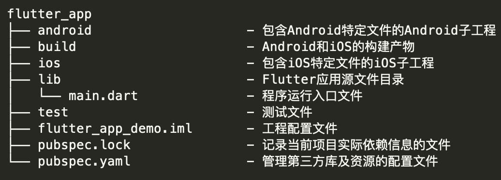

# flutter 项目结构

因为 Flutter 虽然是跨平台开发方案，但却需要一个容器最终运行到 Android 和 iOS 平台上，所以 Flutter 工程实际上就是一个同时内嵌了 Android 和 iOS 原生子工程的父工程：我们在 lib 目录下进行 Flutter 代码的开发，而某些特殊场景下的原生功能，则在对应的 Android 和 iOS 工程中提供相应的代码实现，供对应的 Flutter 代码引用。

Flutter 会将相关的依赖和构建产物注入这两个子工程，最终集成到各自的项目中。而我们开发的 Flutter 代码，最终则会以原生工程的形式运行。

## 工程代码

- 第一部分是应用入口、应用结构以及页面结构，可以帮助你理解构建 Flutter 程序的基本结构和套路；
- 第二部分则是页面布局、交互逻辑及状态管理，能够帮你理解 Flutter 页面是如何构建、如何响应交互，以及如何更新的。

Flutter 对这个机制做了优化，其框架内部会通过一个中间层去收敛上层 UI 配置对底层真实渲染的改动，**从而最大程度降低对真实渲染视图的修改，提高渲染效率，而不是上层 UI 配置变了就需要销毁整个渲染视图树重建**。

> diff 机制
