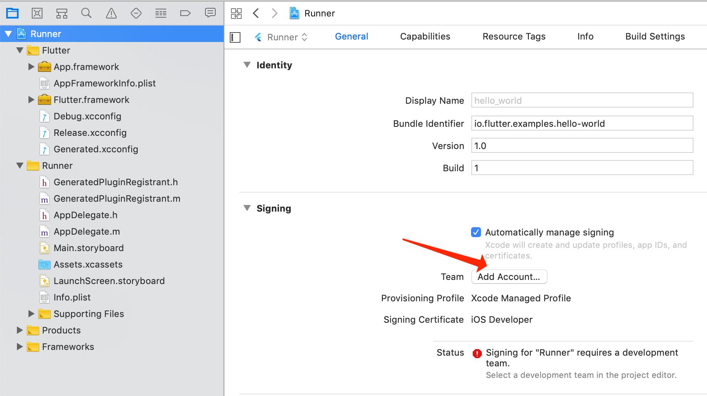

# 环境搭建

## windows

### android

- 安装 android studio

## macOS

### android

- 安装 android studio

### ios

- 安装 xcode

```bash
open -a Simulator
```

## 安装 flutter

### 配置国内镜像

linux\macos:

```bash
export PUB_HOSTED_URL=https://pub.flutter-io.cn
export FLUTTER_STORAGE_BASE_URL=https://storage.flutter-io.cn
```

windows:

新增用户变量

PUB_HOSTED_URL，其值为https://pub.flutter-io.cn；
FLUTTER_STORAGE_BASE_URL，其值为https://storage.flutter-io.cn

### 设置 flutter 环境变量

## Tips

### flutter doctor 检测环境是否配置好

### flutter commands

```bash
flutter emulators
flutter emulators --launch apple_ios_simulator
flutter run
```

### ios 工具链配置

```bash
brew update
brew install --HEAD usbmuxd
brew link usbmuxd
brew install --HEAD libimobiledevice
brew install ideviceinstaller
```

#### Xcode 签名配置

打开 hello_world 项目中的 ios/Runner.xcworkspace，在 Xcode 中，选择导航面板左侧最上方的 Runner 项目



在 General > Signing > Team 中，我们需要配置一下开发团队，也就是用你的 Apple ID 登录 Xcode。当配置完成时，Xcode 会自动创建并下载开发证书。

### Android 工具链配置

android studio 安装 flutter\dart 插件即可

## Resources

- https://docs.flutter.dev/community/china
- https://docs.flutter.dev/release/archive?tab=macos
