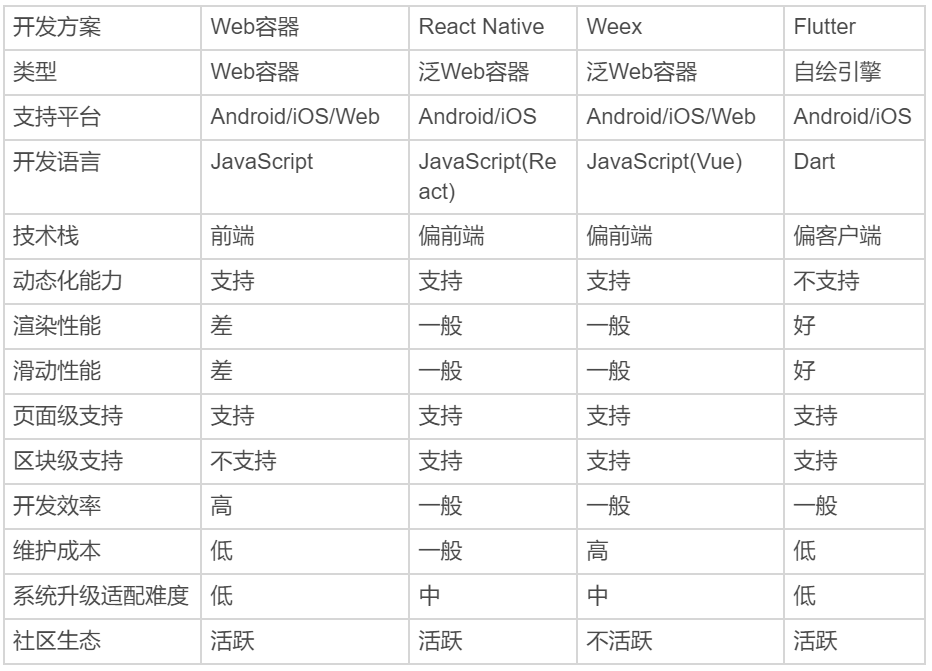

# 跨端方案

## 跨平台开发方案的三个时代

根据实现方式的不同，业内常见的观点是将主流的跨平台方案划分为三个时代。

- Web 容器时代：基于 Web 相关技术通过浏览器组件来实现界面及功能，典型的框架包括 Cordova(PhoneGap)、Ionic 和微信小程序。
- 泛 Web 容器时代：采用类 Web 标准进行开发，但在运行时把绘制和渲染交由原生系统接管的技术，代表框架有 React Native、Weex 和快应用，广义的还包括天猫的 Virtual View 等。
- 自绘引擎时代：自带渲染引擎，客户端仅提供一块画布即可获得从业务逻辑到功能呈现的多端高度一致的渲染体验。Flutter，是为数不多的代表。

## 方案对比

