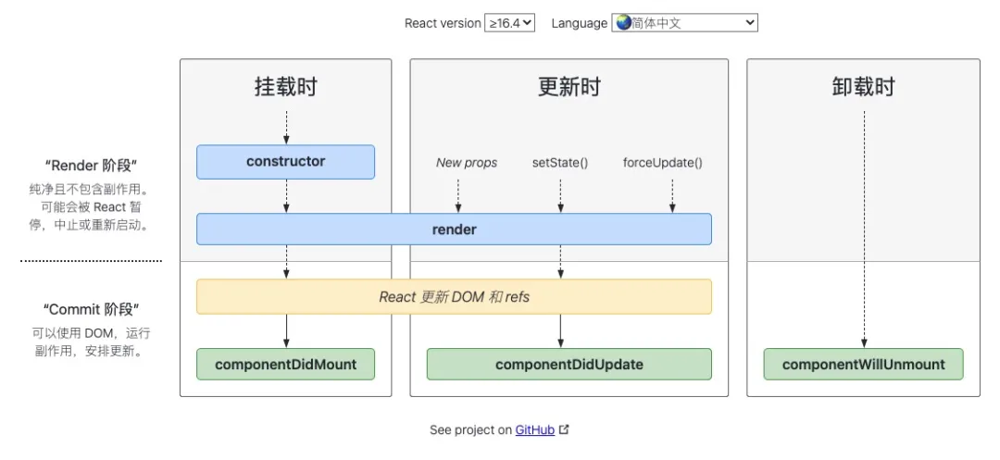

# React Profile

## React 生命周期

从概念上讲，React 分为两个阶段工作，React 的生命周期图谱如下所示：

### 渲染阶段

确定哪些进行了更改，比如 DOM，在此阶段 React 调用`render`，然后讲结果与上次渲染的结果进行比较

### 提交阶段

发生在 React 应用变化时。在此阶段 React 还会调用`ComponentDidMount`和`ComponentDidUpdate`之类的生命周期方法。(对于 React DOM 来说，会发生在插入、更新及删除 DOM 节点的时候)

React Devtool usage
## Reference

- [links](https://mp.weixin.qq.com/s/L9sSAR0iaoFSpMnzARfxcw)
