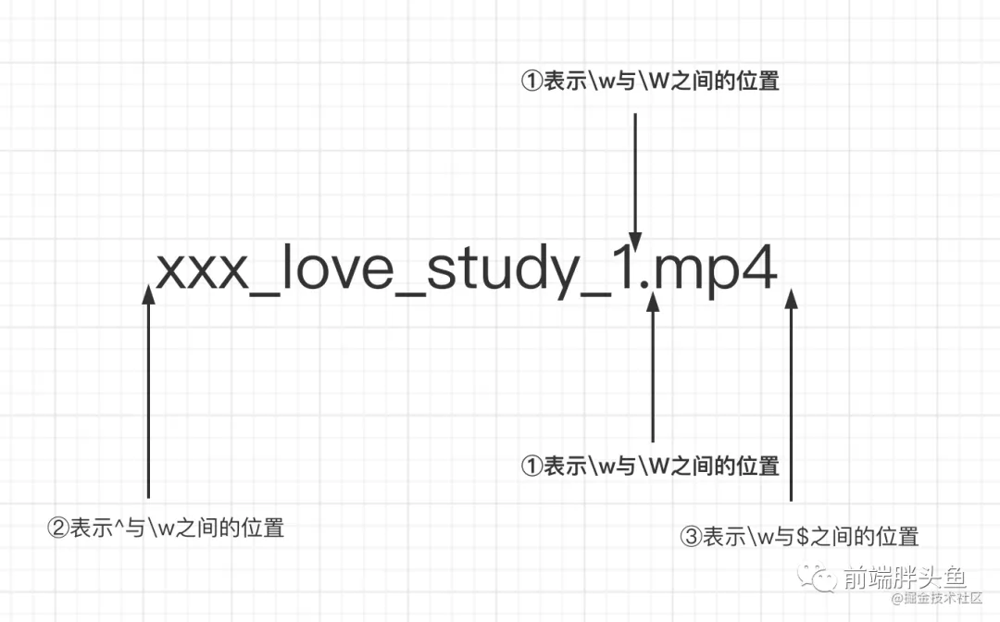
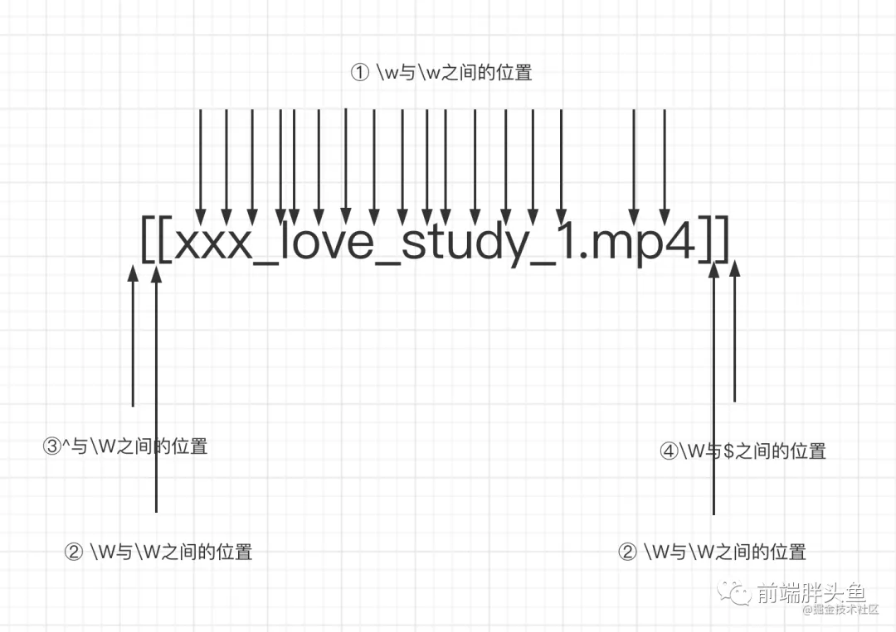
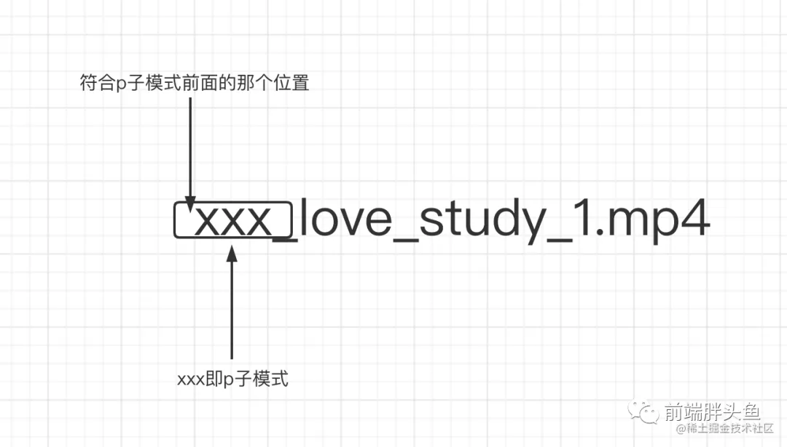
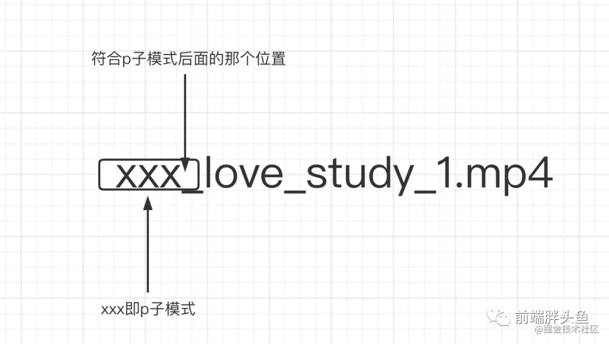

# 正则表达式

匹配模式，要么匹配字符，要么匹配位置

## 位置

正则中常用来表示位置的符号主要有：`^`、`$`、`\b`、`\B`、`?=p`、`(?!p)`、`(?<=p)`、`(?<!p)`

- `^`: 脱字符，匹配行的开头

```js
let string = "hello";
console.log(string.replace(/^/, "😄")); // 😄hello
```

- `$`: 美元符号，匹配行的结尾

```js
let string = "hello";
console.log(string.replace(/$/, "😄")); // hello😄
```

- `\b`: 单词的边界，具体讲有三点规则
  - `\w`和`\W`之间的位置
  - `^`与`\w`之间的位置
  - `\w`与`$`之间的位置

```js
"xxx_love_study_1.mp4".replace(/\b/g, "❤️"); // ❤️xxx_love_study_1❤️.❤️mp4❤️
```

画图理解


- `\B`: 非单词的边界，也就是`\b`反着来的意思
  - `\w`与`\w`之间的位置
  - `\W`与`\W`之间的位置
  - `^`与`\W`之间的位置
  - `\W`与`$`之间的位置

```js
"xxx_love_study_1.mp4".replace(/\B/g, "❤️");
// 'x❤️x❤️x❤️_❤️l❤️o❤️v❤️e❤️_❤️s❤️t❤️u❤️d❤️y❤️_❤️1.m❤️p❤️4'
```

画图理解


- `(?=p)`
  > 符合`p`子模式前面的那个位置。换句话说是，有一个位置，紧跟其后需要满足`p`子模式。也有一个学名叫**正向先行断言**。

```js
"xxx_love_study_1.mp4".replace(/(?=xxx)/g, "❤️"); // ❤️xxx_love_study_1.mp4
```

画图理解


- `(?!p)`
  > `(?=p)`反过来的意思，可以理解为`(?=p)`匹配到的位置之外的位置都是属于`(?!p)`的，它也有一个学名叫**负向先行断言**。

```js
"xxx_love_study_1.mp4".replace(/(?!xxx)/g, "❤️");
// (?=xxx)的输出
// ❤️xxx_love_study_1.mp4
// (?!xxx)的输出
// x❤️x❤️x❤️_❤️l❤️o❤️v❤️e❤️_❤️s❤️t❤️u❤️d❤️y❤️_❤️1❤️.❤️m❤️p❤️4❤️
// 除了(?=xxx)匹配到最前面那个位置，其他位置都是(?!xxx)匹配到的啦。
```

- `(?<=p)`
  > 符合`p`子模式后面(注意`(?=p)`表示的是前面)的那个位置。换句话说是，**有一个位置，其前面的部分需要满足`p`子模式**。

```js
"xxx_love_study_1.mp4".replace(/(?<=xxx)/g, "❤️"); //xxx❤️_love_study_1.mp4
```

画图理解


- `(?<!p)`
  > `(?<=p)`反过来的意思，可以理解为`(?<=p)`匹配到的位置之外的位置都是属于`(?<!p)`的，

```js
"xxx_love_study_1.mp4".replace(/(?<!xxx)/g, "❤️");

// (?<=xxx)的输出
// xxx❤️_love_study_1.mp4
// (?<!xxx)的输出
// ❤️x❤️x❤️x_❤️l❤️o❤️v❤️e❤️_❤️s❤️t❤️u❤️d❤️y❤️_❤️1❤️.❤️m❤️p❤️4❤️
```

### example 1

> `123456789 => 123,456,789`

```js
let price = "123456789";
let priceReg = /(?!^)(?=(\d{3})+$)/g;

console.log(price.replace(priceReg, ",")); // 123,456,789
//第一步，尝试先把后面第一个逗号弄出来
price.replace(/(?=\d{3}$)/, ",");
// 第二步，把所有的逗号都弄出来
price.replace(/(?=(\d{3})+$)/g, ",");
// 第三步，去掉首位的逗号，
"123456789".replace(/(?!^)(?=(\d{3})+$)/g, ",");
```

### example 2

> `18379836654 => 18379836654`

```js
let mobile = "18379836654";
let mobileReg = /(?=(\d{4})+$)/g;
// 每四个数字前的位置，并把这个位置替换为-
console.log(mobile.replace(mobileReg, "-")); // 183-7983-6654
```

### example 3

> 将手机号`11`位以内的数字转化为 `3-4-4` 格式

```js
// 123 => 123
// 1234 => 123-4
// 12345 => 123-45
// 123456 => 123-456
// 1234567 => 123-4567
// 12345678 => 123-4567-8
// 123456789 => 123-4567-89
// 12345678911 => 123-4567-8911
// 第一步, 将第一个-弄出来
"183".replace(/(?<=\d{3})/, "-"); // 183-
"1834".replace(/(?<=\d{3})/, "-"); // 183-4
// 将第二个-弄出来
// 将第一个-弄出来之后，字符的长度多了一位，原本1234567(这个位置插入-)8，要变成往后移一位
"word"
  .replace(/(?<=\d{3})\d+/, ($0) => "-" + $0)
  .replace(/(?<=[\d-]{8})\d{1,4}/, ($0) => "-" + $0);
```

 <!-- ^[a-zA-Z\d]{1,5}$ -->

### example 4

> 题目 4：验证密码的合法性

> 密码长度是 6-12 位，由数字、小写字符和大写字母组成，但必须至少包括 2 种字符

```js
// ① 密码长度是6-12位
// ② 由数字、小写字符和大写字母组成
// ③ 必须至少包括2种字符

// 第一步写出条件①和②和正则
/^[a-zA-Z0-9]{6,12}$/.test(12)
// 第二步，必须包含某种字符（数字、小写字母、大写字母）
let reg = /(?=.*\d)/
// 这个正则的意思是，匹配的是一个位置，这个位置需要满足`任意数量的符号，紧跟着是个数字`，注意它最终得到的是个位置，而不是数字或者是数字前面有任意的东西

console.log(reg.test('hello')) // false
console.log(reg.test('hello1')) // true
console.log(reg.test('hel2lo')) // true
// 第三步，写出完整的正则
// 必须包含两种字符，有下面四种排列组合方式:
// ① 数字和小写字母组合
// ② 数字和大写字母组合
// ③ 小写字母与大写字母组合
// ④ 数字、小写字母、大写字母一起组合（但其实前面三种已经覆盖了第四种了）
// 表示条件①和②
/((?=.*\d)((?=.*[a-z])|(?=.*[A-Z])))/
// 表示条件条件③
/(?=.*[a-z])(?=.*[A-Z])/
// 表示条件①②③
/((?=.*\d)((?=.*[a-z])|(?=.*[A-Z])))|(?=.*[a-z])(?=.*[A-Z])/
// 表示题目所有条件
/(((?=.*\d)((?=.*[a-z])|(?=.*[A-Z])))|(?=.*[a-z])(?=.*[A-Z]))^[a-zA-Z\d]{6,12}/
```

## 字符串匹配

### 模糊匹配

#### 横向

一个正则可匹配的字符串的长度不是固定的，可以是多种情况，通过量词`+`、`*`、`?`、`{m,n}`，可实现横向匹配

```js
let reg = /ab{2,5}c/g;
let str = "abc abbc abbbc abbbbc abbbbbc abbbbbbc";

str.match(reg); // [ 'abbc', 'abbbc', 'abbbbc', 'abbbbbc' ]
```

#### 纵向

一个正则匹配的字符串，具体到某一位字符时，可以不是某个确定的字符串，可以有多种可能，实现方式是字符组( 其实多选分支`|`也可以实现 )

```js
let reg = /a[123]b/g;
let str = "a0b a1b a2b a3b a4b";

str.match(reg); // [ 'a1b', 'a2b', 'a3b' ]
```

### 字符组

#### 范围表示法

[1-6a-zA-Z]

#### 排除字符组

某位字符可以是任何东西，但是就是不能是`xxx`, 使用`^`符号

#### 常见简写形式

```js
/\d/ // 数字
/\D/ // 非数字
/\w/ // [0-9a-zA-Z_]
/\W/ // [^0-9a-zA-Z_]
/\s/ // [\t\v\n\r\f]
/\S/ // [^\t\v\n\r\f]
/./
```

### 量词

#### 量词 & 简写

```js
/{m,}/ // 至少出现m次
/{m}/ // 出现m次
/?/ // 出现0次或者1次，等价于{0,1}
/+/ // 至少出现1次,等价于{1,}
/.*/ // 出现0次以上,等价于{0,}
```

#### 贪婪匹配 VS 惰性匹配 ⭐

> **正则本身是贪婪的**，会尽可能的多匹配符合模式的字符

```js
let regex = /\d{2,5}/g;
let string = "123 1234 12345 123456";
// 贪婪匹配
// string.match(regex) // [ 123, 1234, 12345, 12345 ]

// 惰性匹配
let regex2 = /\d{2,5}?/g;
// string.match(regex) // [ 12, 12, 34, 12, 34, 12, 34, 56  ]
```

#### 多选分支

一个模式可以实现横向和纵向的模糊匹配，而多选分支可以支持多个子模式任选其一，形式是(`p1|p2|p3`)

```js
let regex = /good|nice/g;
let string = "good idea, nice try.";

string.match(regex); // [ 'good', 'nice' ]

// 注意，用/good|goodbye/去匹配'goodbye' 匹配到的是good
// 因为分支结构是惰性的，前面的匹配上了，后面的就不再尝试了
```

## 括号的作用

括号的作用是提供了**分组**(括号内的正则是一个整体，即**提供子表达式**)，便于我们引用它

### 分组引用

#### 提取数据

```js
let reg = /(\d{4})-(\d{2})-(\d{2})/;
console.log("2021-08-14".match(reg));
//  ["2021-08-14", "2021", "08", "14", index: 0, input: "2021-08-14", groups: undefined]

// 第二种解法,通过全局的$1...$9读取 引用的括号数据, 最大$9
let reg = /(\d{4})-(\d{2})-(\d{2})/;
let string = "2021-08-14";
reg.test(string);
console.log(RegExp.$1); // 2021
console.log(RegExp.$2); // 08
console.log(RegExp.$3); // 14
```

#### 数据替换

```js
/*
将以下格式替换为mm/dd/yyy
2021-08-14
*/
// 第一种解法
let reg = /(\d{4})-(\d{2})-(\d{2})/;
let string = "2021-08-14";
// 第一种写法
let result1 = string.replace(reg, "$2/$3/$1");
console.log(result1); // 08/14/2021
// 第二种写法
let result2 = string.replace(reg, () => {
  return RegExp.$2 + "/" + RegExp.$3 + "/" + RegExp.$1;
});
console.log(result2); // 08/14/2021
// 第三种写法
let result3 = string.replace(reg, ($0, $1, $2, $3) => {
  return $2 + "/" + $3 + "/" + $1;
});
console.log(result3); // 08/14/2021
```

### 反向引用

> FIXME ?

### 非捕获性括号

> FIXME ?

非捕获性括号（`?:p`）

```js
// 非捕获型引用
let reg = /(?:ab)+/g;
console.log("ababa abbb ababab".match(reg)); // ["abab", "ab", "ababab"]
// 注意这里，因为是非捕获型分组，所以使用match方法时，不会出现在数组的1位置了
let reg = /(?:ab)+/;
console.log("ababa abbb ababab".match(reg)); // ["abab", index: 0, input: "ababa abbb ababab", groups: undefined]
let reg = /(ab)+/;
console.log("ababa abbb ababab".match(reg)); // ["abab", "ab", index: 0, input: "ababa abbb ababab", groups: undefined]
```

## Reference

- [就因为这三个知识点，我彻底学废了”正则表达式“](https://juejin.cn/post/7021672733213720613#heading-42)
- [JS 正则表达式完整教程（略长）](https://juejin.cn/post/6844903487155732494)
