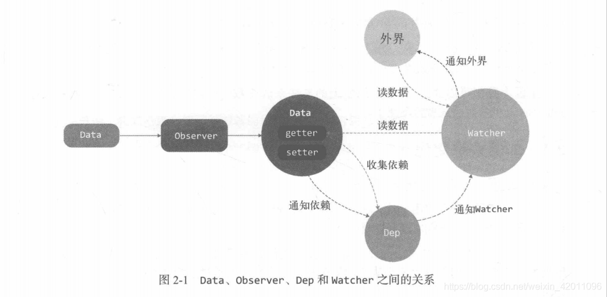

# Object的变化侦测
## 什么是变化侦测

Vue.js会自动通过状态生成DOM，并将其输出到页面上显示出来，这个过程叫做渲染。Vue.js的渲染过程是声明式的，我们通过模板来描述状态与DOM之间的映射关系。

通常，在运行时应用内部的状态会不断的发生变化，此时需要不停的重新渲染。这时如何确定状态中发生了什么变化呢？

变化侦测就是用来解决这个问题的，它分为两种类型：一种是“推”(push)，另一种是“拉”(pull)。

Angular和React中的变化侦测都属于"拉",这就是说当状态发生变化是,它不知道哪个状态发生了变化，只知道状态可能变了，然后会发送一个信号告诉框架，框架内部收到信号后，会进行一个暴力对比来找出哪些DOM节点需要重新渲染。这在Angular中是脏检查的流程，在React中使用的是虚拟DOM。

而Vue.js中的变化侦测属于“推”。当状态变化发生时，Vue.js立刻就知道了。而且在一定程度上知道哪些状态变了。因此它知道的信息越多，也就可以进行更细粒度的更新。

所谓细粒度的更新，就是说：假如一个状态绑定好多个依赖，每个依赖表示一个具体的DOM，那么当这个状态发生变化时，向这个状态的所有依赖发送通知，让他们进行DOM更新操作。

但是它也有一定的代价，因为粒度越细，每个状态绑定的依赖就越多，依赖在追踪在内存上的开销就会越大。因此从Vue.js 2.0开始，它引入了虚拟DOM，将粒度调整为中等粒度，即每一个状态所绑定的依赖不再是具体的DOM节点，而是一个组件。当状态发生变化时，会通知到组件，组件内部再使用虚拟DOM进行比对。这可以大大降低依赖数量从而降低追踪所消耗的内存。

## 如何追踪变化
js中如何追踪一个对象的变化：
- `Object.definProperty`：功能存在缺陷，不能处理新增的属性和被删除的属性
- ES6的`proxy`：兼容性有一点的局限性

```js
function defineReact(data, key, val){
  Object.defineProperty(data, key, {
  enumerable: true,
  configurable: true,
  getter(){
    return val
  },
  setter(newVal){
    if(val === newVal){
      return
    }
   val = newVal
  }
})
}
```
## 如何收集依赖
如果只是把`Object.definePropery`进行封装，那其实并没有什么实际用处，真正有用的是收集依赖。

如何收集依赖呢？假如我们有下面一段代码
```html
<template>
  <div>
    <h1>{{ name }}</h1>
  </div>
</template>
```
该模板中使用了数据name，所以当它发生变化时，要向使用了它的地方发送通知。

> 先收集依赖，即把用到数据name的地方收集起来，然后等属性发生变化时，把自取收集好的依赖循环触发一遍就好了。

总结起来就是：**在getter中收集依赖，在setter中触发依赖**

## 依赖收集在哪里

首先想到的是每个key都有一个数组，用来存储当前key的依赖。假设依赖是一个函数，保存在window.target上，现在我们就可以把`defineReactive`函数改造一下：
```js
function defineReactive(data, key, val){
  let dep = []
  Object.defineProperty(data, key, {
    enumerable: true,
    configurable: true,
    getter(){
      dep.push(window.target)
      return val
    },
    setter(newVal){
      if(newVal === val){
        return
      }
      for(let i=0;i<dep.length;i++){
        dep[i](newVal, val)
      }
      val = newVal
    }
  })
}
```

## 依赖是谁
在上面的代码中，我们收集的依赖是`window.target`，那么它到底是什么。

收集谁，换句话说，就是当属性发生变化后，通知谁。

我们要通知用到数据的地方，而使用这个数据的地方有很多，而且还类型不一样，有可能是模板，也有可能是用户写的一个watch，这是需要抽象出一个能集中处理这些情况的类。然后，我们在依赖收集阶段只收集这个封装好的类的实例进来，通知也只通知它一个，接着，它再负责通知其他地方。所以，我们要抽象的这个东西需要先起一个好听的名字。就叫`Watcher`吧。

## 什么是Watcher
watcher是一个**中介**的角色，数据发生变化时通知它，然后它再通知其他地方。

关于watcher的一个经典使用方式：
```js
this.$watch('a.b.c', function(newVal, oldVal) {
  // do some thing
})
```
要实现这个功能：
- 只要吧这个watcher实例添加到`data.a.b.c`的`Dep`中
- 当`data.a.b.c`的值发生变化时，通知`Watcher`
- `Watcher`在执行参数中的回调函数即可

## 递归侦测所有key
现在，其实已经可以实现变化侦测的功能了，但是前面介绍的代码只能数据中某一个属性，我们希望把数据中的的所有属性(包括子属性)都侦测到，所以要封装一个`Observer`类，这个类的作用是将一个数据内的所有属性(包括子属性)都转换成`getter/setter`的形式，然后再追踪他们的变化。

当data中的属性发生变化时，与这个属性对应的依赖都会接收到通知。
也就是说，只要将一个`object`传递给`Observer`，那么这个`object`将会变成响应式的`object`。

## 关于Object的问题

前面介绍了Object类型数据的变化侦测原理，了解了数据的变化是通过getter/setter来追踪的。也正是由于这种追踪方式，有些语法中，即便是数据发生了变化，Vue.js也不能追踪到。

- 添加的属性
- 删除的删除

为了解决这两个问题：`Vue.js`提供了`vm.$set`与`vm.$delete`这两个`API`。

## 总结
### Dep
收集依赖、删除依赖和向依赖发送消息
### Watcher
读取数据的getter中会收集正在读取数据的watcher，并把这个watcher收集到Dep中
### Observer
把数据变成响应式



`Data`通过`Observer`转换成`getter/setter`的形式来追踪变化

当外界通过`watcher`读取数据时，会触发`getter`从而将`watcher`添加到依赖Dep中

当数据发生了变化时，会触发`setter`，从而向Dep中的依赖(`watcher`)发送通知

`watcher`接收到通知后，会想外界发送通知，变化通知到外界后可能会触发视觉更新，也有可能触发用户的某个回调函数等