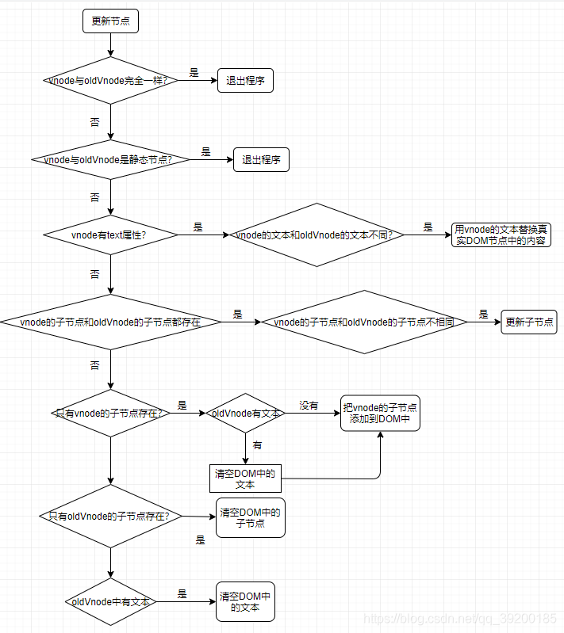

# Pactch

> patch本身就有补丁、修补等意思

虚拟DOM最核心的就是patch，它可以将 `vnode` 渲染成真实的DOM。

渲染真实DOM时，并不是暴力覆盖原有DOM，而是比对新旧两个 `vnode` 之间有哪些不同，然后根据对比结果找出需要更新的节点进行更新。

之所以这么做，是因为DOM操作的执行速度(跟底层C++)远不如JavaScript的运算速度快，因此把大量的DOM操作搬运到JavaScript中，使用patching算法来计算出真正需要更新的节点，最大限度地减少DOM操作，从而显著提升性能。本质上是用JavaScript的运算速度来替换DOM操作的执行成本，所以才有了虚拟DOM。

> 虚拟DOM是对真实DOM做了一层抽象，拓宽了前端的应用场景

## patch介绍

对比两个 `vnode` 之间的差异只是patch的一部分，这是手段，而不是目的。patch的目的是修改DOM节点，也可以理解为渲染视图。patch不是暴力替换节点，而是在现有的DOM上进行修改来达到渲染视图的目的。对现有DOM进行修改有三种方法：
* 创建新的节点
  + 什么情况下创建节点，插入到什么位置
* 删除已经废弃的节点
  + 什么情况下删除节点，删除哪个节点
* 修改需要更新的节点
  + 什么情况下修改节点，修改哪个节点

  我们的最终目的是渲染视图，所以可以发现渲染视图的标准是以 `vnode` (使用最新状态创建的 `vnode` )来渲染而不是以 `oldVnode` (上一次渲染的DOM所创建的 `vnode` )，也就是说，当 `oldVnode` 与 `vnode` 不一致的时候，以 `vnode` 来渲染视图。

### 新增节点

> 讨论在什么情况下需要新增节点

之所以讨论什么情况下需要新增节点，本质上是为了使用JavaScript的计算成本来换取DOM的操作成本。如果一个节点已经存在与DOM中，那就不再需要重新创建一个同样的节点去替换已经存在的节点。事实上，只有那些因为状态的改变而新增的节点在DOM中并不存在时，才需要创建一个节点并插入到视图中去。

#### 场景

* 当`oldVnode`不存在而`vnode`存在时，就需要使用`vnode`生成真实的DOM元素并将其插入到视图中。通常发生在首次渲染中，只有首次渲染时，`oldVnode`才是不存在的。
* 当odlVnode与`vnode`完全不是同一个节点时，就需要使用`vnode`生成真实的DOM并将其插入到视图中。

### 删除节点

当 `oldVnode` 以 `vnode` 完全不是同一个节点时，在DOM中需要使用 `vnode` 创建的新节点替换 `oldVnode` 所对应的旧节点，替换过程是将新创建的DOM节点插入到旧节点的旁边，然后再将旧节点删除

### 更新节点

除了上述的场景外，另一个更常见的场景是新旧两个节点是同一个节点，这时就需要对这两个节点进行细致的比对，然后对 `oldVnode` 在视图中所对应的真实节点进行更新。

> 需要根据节点的不同类型做不同的处理

### 小结

* 当`oldVnode`不存在时，直接使用`vnode`渲染视图；
* 当`oldVnode`和`vnode`都存在但并不是同一个节点，使用`vnode`创建的DOM元素来替换就的DOM元素；
* 当`oldVnode`和`vnode`是同一个节点是，就需要更详细的对比操作对真实的DOM节点进行更新。

## 创建节点

> 在什么情况下创建元素并将元素渲染到视图。

* 创建DOM元素所需信息保存在`vnode`中
* `vnode`有不同的类型，需要根据`vnode`的类型来创建出相同类型的DOM元素，然后将元素插入到视图中

事实上，只有三种类型的节点会被创建并插入到DOM中：元素节点、文本节点和注释节点。

* 创建：根据节点的`tag`，调用`createElement`生成真实的元素节点
* 插入：调用`appendChild`插入到指定的父节点中(如果父节点已经渲染到视图中，那么把元素插入它的下面将会自动将元素渲染到视图中)
* 还有一个步骤：元素节点通常会有子节点，因此这就存在一个递归的过程来创建子节点。`vnode`中的`children`属性保存了创建子节点所需的所有信息。创建子节点时，子节点的父节点就是刚创建出的这个节点，所以子节点被创建后，会插入到当前节点的下面。当所有的子节点都创建并插入到当前节点之中，会把当前节点插入到它的父节点下面。如果父节点已经渲染到视图中，那么将当前节点插入进去后，会将当前节点(包括其子节点)渲染到视图中。

如果 `vnode` 不存在 `tag` 属性时，它可能时文本节点或注释节点(可根据 `isComment` 来判断)
* 文本节点：`createTextNode`(`document.createTextNode`)
* 注释节点：`createComment`(`document.createComment`)

## 删除节点

删除节点的过程比较简单，调用 `removeVnodes` / `removeVnoed` 方法( `el.removeChild` )

```js
function removeVnodes(`vnode`
    s, startIdx, endIdx) {

    for (; startIdx < endIdx; ++startIdx) {
        const ch = `vnode`
        s[startIdx]
        if (isDef(ch)) {
            removeVnode(ch.elm)
        }
    }
}
/**
 * nodeOps是对节点操作的封装
 * 不直接调用parent.removeChild(child)是考虑到跨平台渲染的问题
 */
const nodeOps = {
    removeChild(node, child) {
        node.removeChild(child)
    }
}

function removeChild(el) {
    const parent = nodeOps.parentNode(el)
    if (isDef(parent)) {
        nodeOps.removeChild(parent, el)
    }
}
```

跨平台渲染的本质是在设计框架的时候，要让框架的渲染机制和DOM解耦，只需要把框架更新DOM时的节点操作进行封装，就可以进行跨平台渲染，在不同平台调用节点的操作
。

节点操作的封装看成渲染引擎。那么将这些渲染引起所提供的节点操作的api和框架的运行时对接一下，就可以实现将框架中的代码进行原生渲染的目的。

## 更新节点

> 详细过程

### 静态节点

更新节点时，需要判断新旧两个节点是否为静态节点，如果是，就不需要进行更新操作，可以直接跳过更新节点的过程。

静态节点指的是那些一旦渲染到界面上之后，无论日后状态如何变化，都不会发生任何变化的节点。

#### 新虚拟节点有文本属性

当虚拟节点不是静态节点，并且有不同的属性时，要以 `vnode` 为准来更新视图。根据 `vnode` 是否含有text属性，更新节点分为两种情况：
* 新生成的`vnode`有text属性，那么无论之前旧节点的子节点是什么，直接调用`setTextContent`方法(`node.textContent = 'xxx'`), 如果`oldVnode`也是文本节点，且和新节点的文本相同，就不需要执行`setTextContent`方法。

#### 新虚拟节点无文本属性

无文本属性-> 元素节点(便有了属性、children? 等)
1. 有children的情况
  + 旧虚拟节点有children属性：children之间需要一一进行比较，更新操作：移动子节点的位置，删除或新增某个子节点
  + 旧虚拟节点无children属性：旧节点要么是一个空标签，要么是有文本的文本节点
    - 文本节点：清空文本，变为空标签，再将新虚拟节点中的children挨个生成真实的DOM元素节点并将其插入到视图中的DOM节点下面

2. 无children的情况
  新创建的节点既无text属性也无children属性时，这说明新创建的节点就是一个空节点，它下面既无文本又无子节点。如果旧节点有子节点，就删除子节点；有文本节点，就删除文本。有什么删除什么，最后达到空标签的目的。

### 小结




## 更新子节点

当新节点的子节点和旧节点的子节点都存在且不相同时，会进行子节点的更新操作。

更新子节点大概分为四种操作：更新节点、创建节点、删除节点、移动节点位置。

更新子节点需要对比出**两个子节点都有哪些不同**，然后对不同的情况做不同的处理。

对比两个子节点列表(children)，首先需要做的事情就是循环。循环newChildren(新子节点列表)，每循环到一个新子节点，就去oldChildren(旧子节点列表)中找到和当前节点相同的那个子节点。如果oldChildren中找不到，说明当前子节点是由于状态变化而新增的节点，我们就需要进行创建节点并插入视图的操作；如果找到了，就做更新操作；如果找到的旧子节点的位置和新子节点不同，那么就需要移动节点等。

### 更新策略

#### 创建子节点

关于新增节点，主要讨论什么情况下需要创建节点，以及把创建的节点插入到真实DOM子节点中哪个位置的问题。

对于新增节点，我们需要执行创建节点的操作，并将新创建的节点插入到oldChildren中所有未处理的节点(未处理就是没有进行任何更新操作的节点)的前面。当节点成功插入DOM后，这一轮的循环就结束了。

> 为什么不能插入到所有已处理节点的后面不行吗？如果这个新节点后面也是一个新增节点呢，那这个后新增的节点的插入位置就乱了。

> 因为是使用虚拟节点进行对比，而不是真实DOM进行对比。所以是左下角的虚拟节点和右下角的就虚拟节点进行对比，而右下角的虚拟节点表示已处理的节点只有两个，不包括新插入的节点，所以如果用插入到已处理节点后面这样的逻辑来插入节点，就会插入一个错误的位置。

> 疑问：节点插入到真实DOM后，真实DOM中的节点越来越多，那怎么删除节点呢？

#### 更新子节点

> 本质是当一个节点同时存在于newChildren和oldChildren中时需要执行的操作。

**更新操作与上述的更新节点操作一致**

如果oldChildren中子节点的位置和本次循环所指向的新子节点的位置不一致时，除了对真实DOM进行更新操作外，还需要对这个真实DOM节点进行移动节点的操作。

#### 移动子节点

移动子节点通常发生在newChildren和oldChildren中某个节点为同一个节点，但是位置不同，所以在真实的DOM中需要将这个节点的位置以虚拟节点的位置为基准进行移动。

对应的DOM操作： `node.insertBefore()` ，可以将一个已有节点移动到一个指定位置。

> 如何知道应该把节点移动到哪里呢？ 索引位置

对比新旧两个子节点列表，通过从左到右循环newChildren这个列表，然后每循环一个节点，就去oldChildren中寻找与这个节点相同的节点进行处理。只需要将移动的节点移动所有未处理节点的最前面，就能实现目的。

节点更新并且移动完位置后，就进入下一轮循环。

> 如果分辨哪些节点是处理过的，哪些节点是未处理的呢？(索引位置?)

#### 删除子节点

本质上就是删除那些oldChildren中存在但newChildren中不存在的节点。

对应的DOM操作： `node.removeChild()`

当newChildren中所有的节点都被循环了一遍后，也就是循环结束后，如果oldChildren中还有剩余的没有被处理的节点，那么这些节点就是被废弃、需要删除的节点。

当废弃的节点被删除后，会发现真实DOM中的子节点和newChildren变成一样的了，这就达到了更新子节点的目的。

### 优化策略

通常情况下，并不是所有子节点的位置都会发生移动，**一个列表中总有几个节点的位置是不变的**。针对这些位置不变的或者说位置可以预测的节点，我们不需要循环来查找，因为我们有一个更快捷的查找方式。

场景一：只修改了列表中某个数据的内容，而没有新增数据或者删除数据等，这种情况下新旧两个子节点列表的所有节点的位置都是相同的，不需要循环也知道同一索引上的节点是同一个节点。

因此只需要尝试使用相同位置的两个节点来对比是否是同一个节点：如果恰巧是同一个节点，直接就可以进入更新节点的操作；如果失败了，再用循环的方式来查找节点。

这样就可以很大程度地避免循环oldChildren来查找节点，从而使执行速度得到很大的提升。

快捷查找四种方式：

* 新前与旧前：更新但不需要移动位置
* 新后与旧后：更新但不需要移动位置
* 新后与旧前：更新且需要移动位置
* 新前与旧后：更新且需要移动位置

* 新前：`newChildren`中所有未处理的第一个节点
* 新后：`newChildren`中所有未处理的最后一个节点
* 旧前：`oldChildren`中所有未处理的第一个节点
* 旧后：`oldChildren`中所有未处理的最后一个节点

> 先使用四种快捷方式(顺序)查找一遍，如果不行的话，再使用循环的方式来查找节点。

> 大部分情况下，通过前面这4种方式就可以找到相同的节点，所以节省了很多次循环操作。

#### 哪些节点是未处理过的

> 之前所有的对比都是针对未处理过的节点，已处理过的节点忽略不计。如何分辨哪些节点是处理过的，哪些节点是未经过处理的呢？

简单的来说：就是根据前后循环可知。但由于前面的优化策略，节点可能是会从后面对比的，对比成功就会进行更新处理。由于优化策略，不再是只处理所有未处理过的的节点的第一个，而是有可能会处理最后一个，这种情况下就不能从前往后循环，而应该是从两边向中间循环。

> 如何实现呢

首先准备4个变量： `oldStartIdx` , `oldEndIdx` , `newStartIdx` , `newEndIdx`

* `oldStartIdx`,  `newStartIdx`: 向后移动
* `oldEndIdx`,  `newEndIdx`：向前移动

当开始位置大于等于结束位置时，说明所有节点都遍历过了，则结束循环:

```js
  whilte(newStarIdx <= newEndIdx && oldStarIdx <= oldEndIdx) {
      // do something
  }
```

当新旧子节点列表只要有一个循环完毕后，就会退出循环。当新旧子节点的数量不一致时，会导致循环结束后仍然有未处理的节点，这个循环无法覆盖所有节点。

* 如果`oldChildren`先循环完毕，这个时候如果`newChildren`还有剩余的节点([`newStartIdx`,  `newEndIdx`])，则说明这些剩余的节点是需要新增的节点，直接把这些节点插入到`DOM`中就行。
* 如果`newChildren`先循环完毕，这个时候如果`oldChildren`还有剩余的节点([`oldStartIdx`,  `oldEndIdx`])，则说明这些剩余的节点需要删除的节点，直接将这些节点从`DOM`中移除就可以。
