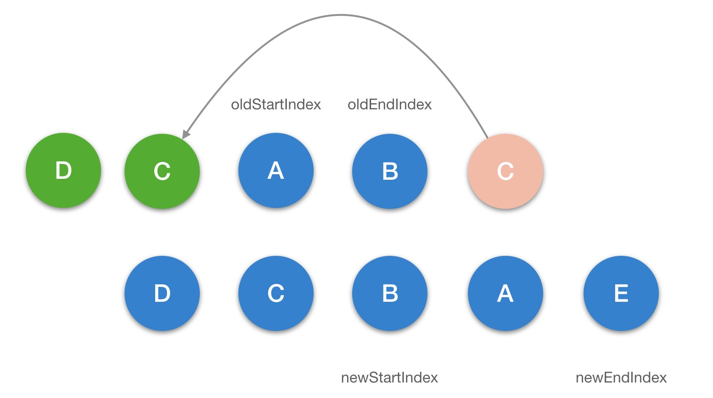
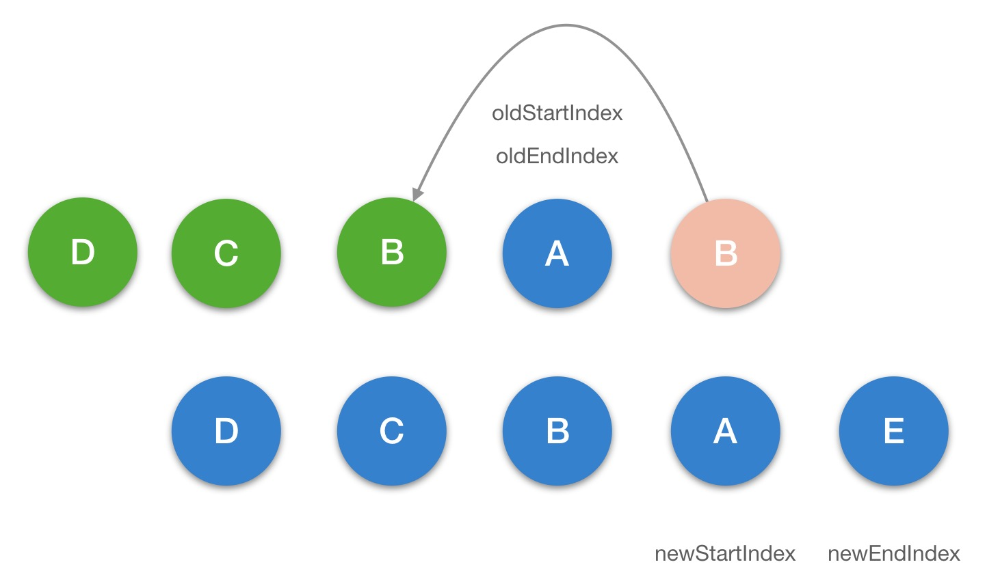
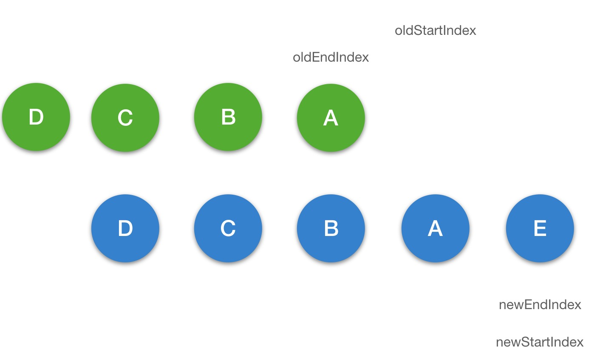
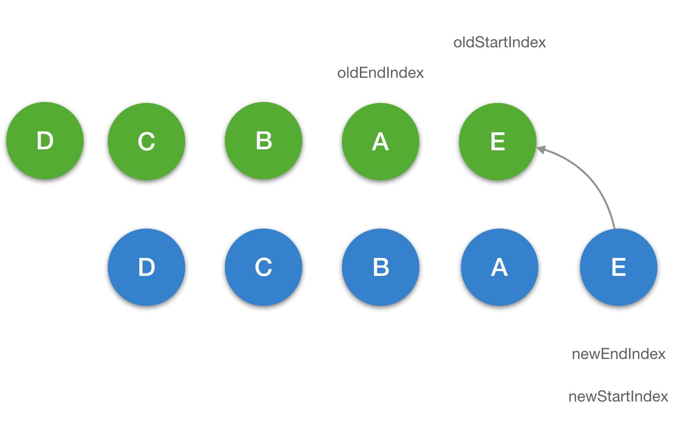

# 深入响应式原理

- 数据驱动初始化渲染 DOM
- 数据的变更引起 DOM 的变化

手动 DOM 操作要处理的问题：

- 我需要修改哪块的`DOM`？
- 我的修改效率和性能是不是最优的？
- 我需要对数据的每一次的修改都去操作`DOM`吗？
- 我需要`case by case`去修改`DOM`的逻辑吗？

## 响应式对象

### `Object.defineProperty`

- `get`: 给属性提供的 `getter` 方法，当访问该属性的时候会触发 `getter` 方法
- `set`: 给属性提供的 `setter` 方法，当我们对属性进行修改的时候会触发 `setter` 方法

### initState

Vue 的初始阶段，`_init`方法执行的时候，会执行`initState(vm)`方法，它的定义在`src/core/instance/state.js`

`initState` 方法主要是对 `props`、`methods`、`data`、`computed` 和 `wathcer` 等属性做了初始化操作。

#### initProps

```js
// 接收属性数据：
const propsData = vm.$options.propsData || {};
// 校验属性数据类型：
const value = validateProp(key, propsOptions, propsData, vm);
// 设置响应式：
defineReactive(props, key, value, () => {}); // 可通过vm._props.xxx来访问这个属性
if (!(key in vm)) {
  proxy(vm, `_props`, key); // 通过proxy把vm._props.xxx的访问代理到vm.xxx上
}
```

#### initData

```js
data = vm._data = typeof data === "function" ? getData(data, vm) : data || {}; // data值必需为一个函数
// 循环检验属性名是否已存在与props和或method中
if (!isReserved(key)) {
  // 不能为$或者_
  proxy(vm, `_data`, key); // vm._data.xxx 都代理到 vm.xxx
  observe(data, true /* asRootData */); // 为data添加观察者, 观测整个data的变化，把data也变成响应式
}
```

### proxy

首先介绍一下代理，代理的作用是把 `props` 和 `data` 上的属性代理到 `vm` 实例上，这也就是为什么比如我们定义了如下 `props`，却可以通过 `vm` 实例访问到它。

```js
const sharedPropertyDefinition = {
  enumerable: true,
  configurable: true,
  get: noop,
  set: noop,
};
export function proxy(target: Object, sourceKey: string, key: string) {
  sharedPropertyDefinition.get = function proxyGetter() {
    return this[sourceKey][key];
  };
  sharedPropertyDefinition.set = function proxySetter(val) {
    this[sourceKey][key] = val;
  };
  Object.defineProperty(target, key, sharedPropertyDefinition);
}
// 调用
proxy(vm, "_props", key);
proxy(vm, "_data", key);
```

### observe

`observe` 的功能就是用来监测数据的变化，它的定义在 `src/core/observer/index.js` 中:

`observe` 方法的作用就是给**非`VNode`** 的对象类型数据添加一个`Observer`，如果已经添加过则直接返回，否则在满足一定条件下去实例化一个`Observer`对象实例。

### Observer

`Observer` 是一个类，它的作用是给对象的属性添加`getter`和`setter`，用于**依赖收集**和**派发更新**：

`Observer` 的构造函数逻辑很简单，首先实例化 `Dep` 对象，这块稍后会介绍，接着通过执行 `def` 函数把自身实例添加到数据对象 `value` 的 `__ob__` 属性上，`def` 的定义在 `src/core/util/lang.js` 中：`def`函数是一个非常简单的`Object.defineProperty`的封装用方法。

回到 `Observer`的构造函数，接下来会对`value`做判断，对于数组会调用`observeArray`方法，否则对纯对象调用`walk`方法。可以看到

- `observeArray`是遍历数组再次调用`observe`方法
- `walk`方法是遍历对象的`key`调用`defineReactive`方法

### defineReactive

`defineReactive` 函数最开始初始化 `Dep` 对象的实例，接着拿到 `obj` 的属性描述符，**然后对子对象递归调用 `observe` 方法，这样就保证了无论 `obj` 的结构多复杂，它的所有子属性也能变成响应式的对象**，这样我们访问或修改 `obj` 中一个嵌套较深的属性，也能触发 `getter` 和 `setter`。最后利用 `Object.defineProperty` 去给 `obj` 的属性 `key` 添加 `getter` 和 `setter`

### 总结

这一节我们介绍了响应式对象，核心就是利用 `Object.defineProperty` 给数据添加了 `getter` 和 `setter`，目的就是为了在我们访问数据以及写数据的时候能自动执行一些逻辑：`getter` 做的事情是**依赖收集**，`setter` 做的事情是**派发更新**

## 依赖收集

### Dep

`Dep` 是整个 `getter` 依赖收集的核心，它的定义在 `src/core/observer/dep.js` 中。

`Dep` 是一个 `Class`，它定义了一些属性和方法，这里需要特别注意的是它有一个静态属性 `target`，这是一个全局唯一 `Watcher`，这是一个非常巧妙的设计，因为在同一时间只能有一个全局的 `Watcher` 被计算，另外它的自身属性 `subs` 也是 `Watcher` 的数组。

`Dep` 实际上就是对 `Watcher` 的一种管理，`Dep` 脱离 `Watcher` 单独存在是没有意义的，为了完整地讲清楚依赖收集过程，我们有必要看一下 `Watcher` 的一些相关实现，它的定义在 `src/core/observer/watcher.js` 中：

### Watcher

#### 过程分析

在 `Vue` 的 `mount` 过程中有一个 `mountComponent` 函数：

```js
updateComponent = () => {
  vm._update(vm._render(), hydrating);
};

new Watcher(
  vm,
  updateComponent,
  noop,
  {
    before() {
      if (vm._isMounted) {
        callHook(vm, "beforeUpdate");
      }
    },
  },
  true /* isRenderWatcher */
);

value = this.getter.call(vm, vm); // 执行updateComponent：vm._update(vm._render(), hydrating)方法
```

每个对象值的 `getter` 都持有一个 `dep`，在触发 `getter` 的时候会调用 `dep.depend()` 方法，也就会执行 `Dep.target.addDep(this)`。

在`vm._render()`过程中，会触发所有数据的`getter`，这样实际上已经完成了一个依赖收集的过程。

##### 依赖清除

考虑到一种场景，我们的模板会根据 `v-if` 去渲染不同子模板 `a` 和 `b`，当我们满足某种条件的时候渲染 `a` 的时候，会访问到 `a` 中的数据，这时候我们对 `a` 使用的数据添加了 `getter`，做了依赖收集，那么当我们去修改 `a` 的数据的时候，理应通知到这些订阅者。那么如果我们一旦改变了条件渲染了 `b` 模板，又会对 `b` 使用的数据添加了 `getter`，如果我们没有依赖移除的过程，那么这时候我去修改 `a` 模板的数据，会通知 `a` 数据的订阅的回调，这显然是有浪费的。

因此 `Vue` 设计了在每次添加完新的订阅，会移除掉旧的订阅，这样就保证了在我们刚才的场景中，如果渲染 `b` 模板的时候去修改 `a` 模板的数据，`a` 数据订阅回调已经被移除了，所以不会有任何浪。

#### 总结

收集依赖的目的是为了当这些响应式数据发生变化，触发它们的 `setter` 的时候，能知道应该通知哪些订阅者去做相应的逻辑处理，我们把这个过程叫**派发更新**，其实 `Watcher` 和 `Dep` 就是一个非常经典的**观察者设计模式**的实现。

## 派发更新

> FIXME
> `defineReactive`中的`setter`的逻辑有两个关键的点，一个是`childOb = !shallow && observe(newVal)`，如果 `shallow` 为 `false` 的情况，会对新设置的值变成一个响应式对象。另一个是 `dep.notify()`，通知所有的订阅者

`dep.notify()` 方法， 它是 `Dep` 的一个实例方法，定义在 `src/core/observer/dep.js` 中：

遍历所有的 `subs`，也就是 `Watcher` 的实例数组，然后调用每一个 `watcher` 的 `update` 方法，它的定义在 `src/core/observer/watcher.js` 中：

`update`最后一个 `queueWatcher(this)` 的逻辑，`queueWatcher` 的定义在 `src/core/observer/scheduler.js` 中：

这里引入了一个**队列**的概念，这也是 `Vue` 在做派发更新的时候的一个优化的点，它并不会每次数据改变都触发 `watcher` 的回调，而是把这些 `watcher` 先添加到一个队列里，然后在 `nextTick` 后执行 `flushSchedulerQueue`。

flushSchedulerQueue:

- 队列排序
  `queue.sort((a, b) => a.id - b.id)` 对队列做了从小到大的排序，这么做主要有以下要确保以下几点：

1. 组件的更新由父到子；因为父组件的创建过程是先于子的，所以 `watcher` 的创建也是先父后子，执行顺序也应该保持先父后子。
2. 用户的自定义 `watcher` 要优先于渲染 `watcher` 执行；因为用户自定义 `watcher` 是在渲染 `watcher` 之前创建的。
3. 如果一个组件在父组件的 `watcher` 执行期间被销毁，那么它对应的 `watcher` 执行都可以被跳过，所以父组件的 `watcher` 应该先执行。

- 队列遍历
  在对 `queue` 排序后，接着就是要对它做遍历，拿到对应的 `watcher`，执行 `watcher.run()`。这里需要注意一个细节，在遍历的时候每次都会对 `queue.length` 求值，因为在 `watcher.run()` 的时候，很可能用户会再次添加新的 `watcher`，这样会再次执行到 `queueWatcher`，如下：

## nextTick

`nextTick` 是 `Vue` 的一个核心实现，在介绍 `Vue` 的 `nextTick` 之前，为了方便大家理解，我先简单介绍一下 `JS` 的运行机制。

### JS 运行机制

JS 执行是单线程的，它是基于事件循环的。事件循环大致分为以下几个步骤：

- （1）所有同步任务都在主线程上执行，形成一个执行栈（`execution context stack`）。
- （2）主线程之外，还存在一个"任务队列"（`task queue`）。**只要异步任务有了运行结果**，就在"任务队列"之中放置一个事件。
- （3）一旦"执行栈"中的所有同步任务执行完毕，系统就会读取"任务队列"，看看里面有哪些事件。那些对应的异步任务，于是结束等待状态，进入执行栈，开始执行。
- （4）主线程不断重复上面的第三步。
  

主线程的执行过程就是一个`tick`，而所有的**异步结果都是通过 “任务队列” 来调度**。消息队列中存放的是一个个的任务（`task`）。 规范中规定 `task` 分为两大类，分别是 `macro task` 和 `micro task`，并且每个 `macro task` 结束后，都要清空所有的 `micro task`。

```js
for (macroTask of macroTaskQueue) {
  // 1. Handle current MACRO-TASK
  handleMacroTask();
  // 2. Handle all MICRO-TASK
  for (microTask of microTaskQueue) {
    handleMicroTask(microTask);
  }
}
```

在浏览器环境中，常见的 **macro task** 有 `setTimeout`、`MessageChannel`、`postMessage`、`setImmediate`；常见的 **micro task** 有 `MutationObsever` 和 `Promise.then`。

### Vue 的实现

在 `Vue` 源码 `2.5+` 后，`nextTick` 的实现单独有一个 `JS` 文件来维护它，在 `src/core/util/next-tick.js` 中：

### 总结

从**数据的变化到`DOM`的重新渲染是一个异步过程**，发生在下一个 `tick`。这就是我们平时在开发的过程中，比如从服务端接口去获取数据的时候，数据做了修改，如果我们的某些方法去依赖了数据修改后的 `DOM` 变化，我们就必须在 `nextTick` 后执行。比如下面的伪代码：

```js
getData(res).then(() => {
  this.xxx = res.data;
  this.$nextTick(() => {
    // 这里我们可以获取变化后的 DOM
  });
});
```

`Vue.js` 提供了 2 种调用 `nextTick` 的方式，一种是全局 API `Vue.nextTick`，一种是实例上的方法 `vm.$nextTick`，无论我们使用哪一种，**最后都是调用 `next-tick.js` 中实现的 `nextTick` 方法**。

## 检测变化的注意事项

### 属性增加

#### 对象

对于使用 `Object.defineProperty` 实现响应式的对象，当我们去给这个对象添加一个新的属性的时候，是不能够触发它的 `setter` 的，比如：

```js
// vm.b 是非响应的
vm.b = 2;
```

`Vue` 为了解决这个问题，定义了一个全局 API `Vue.set` 方法，它在 `src/core/global-api/index.js` 中初始化：

```js
Vue.set = set;
```

这个 `set` 方法的定义在 `src/core/observer/index.js` 中：

#### 数组

Vue 也是不能检测到以下变动的数组：

1. 当你利用索引直接设置一个项时，例如：`vm.items[indexOfItem] = newValue` => `Vue.set(example1.items, indexOfItem, newValue)`
2. 当你修改数组的长度时，例如：`vm.items.length = newLength` => `vm.items.splice(newLength)`

在`observe`方法去观察对象的时候会实例化`Observer`，在它的构造函数中是专门对数组做了处理，它的定义在`src/core/observer/index.js`中:

```js
export class Observer {
  constructor(value: any) {
    // ...
    if (Array.isArray(value)) {
      const augment = hasProto // 判断对象中是否存在 __proto__
        ? protoAugment // 原型上添加 <- 大部分游览器
        : copyAugment; // 循环遍历更新
      augment(value, arrayMethods, arrayKeys); // value的原型指向arrayMethods，arrayMethods：重写了原型方法的几个Array方法(src/core/observer/array.js)
      this.observeArray(value);
    } else {
      // ...
    }
  }
}
```

### 移除属性

全局 API`Vue.del`方法，它在 `src/core/global-api/index.js` 中初始化：

## 计算属性 VS 侦听属性

### computed

计算属性的初始化是发生在`Vue`实例初始化阶段的`initState`函数中，执行了`if (opts.computed) initComputed(vm, opts.computed)`，`initComputed`的定义在`src/core/instance/state.js`中：

计算属性本质上就是一个 `computed watcher`，也了解了它的创建过程和被访问触发 `getter` 以及依赖更新的过程，其实这是最新的计算属性的实现，之所以这么设计是因为 Vue 想确保**不仅仅是计算属性依赖的值发生变化，而是当计算属性最终计算的值发生变化才会触发渲染** `watcher` 重新渲染，本质上是**一种优化**。

### watch

侦听属性的初始化也是发生在 `Vue` 的实例初始化阶段的 `initState` 函数中，在 `computed` 初始化之后，执行了：

`watch handler`方式：

```js
    a: function (val, oldVal) {
      console.log('new: %s, old: %s', val, oldVal)
    },
    // string method name
    b: 'someMethod',
    // the callback will be called whenever any of the watched object properties change regardless of their nested depth
    c: {
      handler: function (val, oldVal) { /* ... */ },
      deep: true
    },
    // the callback will be called immediately after the start of the observation
    d: {
      handler: 'someMethod',
      immediate: true
    },
    // you can pass array of callbacks, they will be called one-by-one
    e: [
      'handle1',
      function handle2 (val, oldVal) { /* ... */ },
      {
        handler: function handle3 (val, oldVal) { /* ... */ },
        /* ... */
      }
    ],
    // watch vm.e.f's value: {g: 5}
    'e.f': function (val, oldVal) { /* ... */ }
```

- Deep Watcher

```js
{
  handler(n,o){}, deep:true
}
```

- User Watcher

```js
{
  vm.$watch();
}
```

- Computed Watcher
- Sync Watcher
  响应式数据发送变化后，触发了 `watcher.update()`，只是把这个 `watcher` 推送到一个队列中，在 `nextTick` 后才会真正执行 `watcher` 的回调函数。一旦设置了`sync`，就可以在当前`Tick`中同步执行`Watcher`的回调函数。

### 总结

计算属性本质上是 `computed watcher`，而侦听属性本质上是 `user watcher`。

应用场景而言，**计算属性适合用在模板渲染中**，某个值是依赖了其它的响应式对象甚至是计算属性计算而来；而**侦听属性适用于观测某个值的变化去完成一段复杂的业务逻辑**。

## 组件更新

数据发生变化的时候，会触发渲染`Watcher`的回调函数，进而执行组件的更新过程。

```js
updateComponent = () => {
  vm._update(vm._render(), hydrating);
};
new Watcher(
  vm,
  updateComponent,
  noop,
  {
    before() {
      if (vm._isMounted) {
        callHook(vm, "beforeUpdate");
      }
    },
  },
  true /* isRenderWatcher */
);
```

组件更新的过程，会执行`vm.$el = vm.__patch__(prevVnode, vnode)`，它仍然会调用`patch`函数，在`src/core/vdom/patch.js`中定义:

这里执行 `patch` 的逻辑和首次渲染是不一样的，因为 `oldVnode` 不为空，并且它和 `vnode` 都是 `VNode` 类型，接下来会通过 `sameVNode(oldVnode, vnode)` 判断它们是否是相同的 `VNode` 来决定走不同的更新逻辑：

```js
function sameVnode(a, b) {
  return (
    a.key === b.key &&
    a.asyncFactory === b.asyncFactory &&
    ((a.tag === b.tag &&
      a.isComment === b.isComment &&
      isDef(a.data) === isDef(b.data) &&
      sameInputType(a, b)) ||
      (isTrue(a.isAsyncPlaceholder) && isUndef(b.asyncFactory.error)))
  );
}

function sameInputType(a, b) {
  if (a.tag !== "input") return true;
  let i;
  const typeA = isDef((i = a.data)) && isDef((i = i.attrs)) && i.type;
  const typeB = isDef((i = b.data)) && isDef((i = i.attrs)) && i.type;
  return typeA === typeB || (isTextInputType(typeA) && isTextInputType(typeB));
}
export const isTextInputType = makeMap(
  "text,number,password,search,email,tel,url"
);
```

`sameVnode` 的逻辑非常简单，如果两个 `vnode` 的 `key` 不相等，则是不同的；否则继续判断对于同步组件，则判断 `isComment`、`data`、`input` 类型等是否相同，对于异步组件，则判断 `asyncFactory` 是否相同。

### 新旧节点不同

如果新旧`vnode`不同，那么更新的逻辑非常简单，它本质上是要替换已存在的节点，大致分为 3 步：

- 创建新节点
- 更新父的占位符节点
- 删除旧节点

### 新旧节点相同

调用`patchVNode`方法，它的定义在`src/core/vdom/patch.js`:

```js
function patchVnode(oldVnode, vnode, insertedVnodeQueue, removeOnly): void
```

### updateChildren







## Questions

- `Watcher`对象
- `Observer`对象
- `Dep`对象：响应式数据的依赖对象
