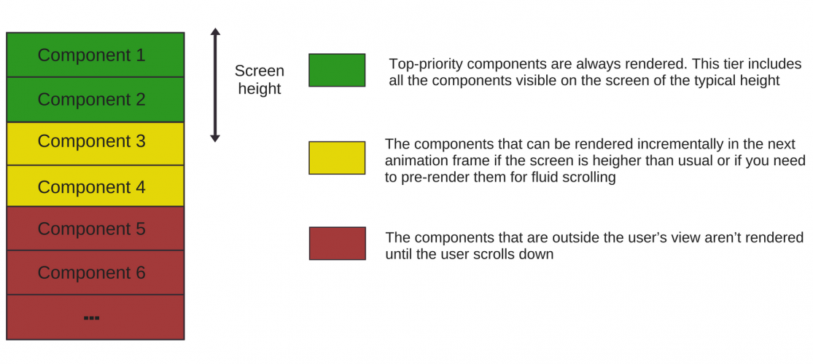

# Web performance

## METRICS

### First Contentful Paint(FCP) 首次内容绘制 ✨✨

First Contentful Paint marks the time at which the first text or image is painted. [Learn more about the First Contentful Paint metric](https://developer.chrome.com/docs/lighthouse/performance/first-contentful-paint/?utm_source=lighthouse&utm_medium=lr).
First Contentful Paint（首次内容绘制）标志着首次绘制文本或图像的时间。

### Largest Contentful Paint(LCP)✨✨✨✨ 最大内容绘制

Largest Contentful Paint marks the time at which the largest text or image is painted. [Learn more about the Largest Contentful Paint metric](https://developer.chrome.com/docs/lighthouse/performance/lighthouse-largest-contentful-paint/?utm_source=lighthouse&utm_medium=lr)
Largest Contentful Paint（最大内容绘制）标志着页面加载过程中最大文本块或图像被渲染到屏幕上的时间。

> 如何确定最大文本块，设置埋点

### Total Blocking Time✨✨✨✨✨

Sum of all time periods between FCP and Time to Interactive, when task length exceeded 50ms, expressed in milliseconds. [Learn more about the Total Blocking Time metric](https://developer.chrome.com/docs/lighthouse/performance/lighthouse-total-blocking-time/?utm_source=lighthouse&utm_medium=lr).
"在首次内容绘制（FCP）到**可交互时间（Time to Interactive）**之间，所有超过 50 毫秒的任务持续时间之和，以毫秒为单位表达。"

### Cumulative Layout Shift✨✨✨✨

Cumulative Layout Shift measures the movement of visible elements within the viewport. [Learn more about the Cumulative Layout Shift metric](https://web.dev/articles/cls?utm_source=lighthouse&utm_medium=lr).
Cumulative Layout Shift（累积布局偏移）衡量了视口中可见元素的移动。

Cumulative Layout Shift（CLS）确实包括页面布局抖动。这个指标衡量的是用户在浏览页面时，可见元素由于布局的变化而发生意外移动的程度。页面布局抖动通常指的是页面元素的位置或尺寸发生突然变化，导致用户之前看到的内容被覆盖或需要重新定位，这会影响用户体验。

CLS 考虑了以下几个因素：

1. 可见元素的移动：任何在视口中可见的元素，如果在渲染过程中发生位置变化，都会被计算在内。
2. 移动距离：元素移动的距离越远，对 CLS 的影响越大。
3. 元素大小：较大元素的移动对 CLS 的影响大于较小元素的移动。
4. 页面生命周期：CLS 会在页面的整个生命周期内进行测量，从页面开始加载直到用户可以与之交互。
5. 意外移动：用户没有预料到的布局变化，比如由于**图片加载**、**广告插入**或**异步内容加载导致**的页面元素重新排列。

为了优化 CLS 得分，开发者应该：

- 避免使用不指定大小的图片或其他媒体元素。
- 使用占位符来保留异步加载内容的空间。
- 避免在文档主体中使用全宽元素。
- 确保所有元素在加载和渲染时都有明确定义的尺寸。
- CLS 是现代前端性能评估中的一个重要指标，它直接关联到用户体验的平滑性和可预测性。

### Speed Index✨✨

Speed Index shows how quickly the contents of a page are visibly populated. [Learn more about the Speed Index metric](https://developer.chrome.com/docs/lighthouse/performance/speed-index/?utm_source=lighthouse&utm_medium=lr).
Speed Index（速度指数）衡量的是页面内容在视觉上被填充的速度有多快。它显示了页面加载过程中可见内容变化的速率，即页面上文本和图像等元素变得可见的时间。Speed Index 的值越小，表示页面内容加载得越快。

## Light House 分数计算

提供一个量化的分数指标，包含实际的响应时间

| Audit                    | Weight |
| ------------------------ | ------ |
| First Contentful Paint   | 10%    |
| Speed Index              | 10%    |
| Largest Contentful Paint | 25%    |
| Total Blocking Time      | 30%    |
| Cumulative Layout Shift  | 25%    |

## Web Vitals

Web Vitals 是 Google 提出的一个性能评估指标集合，旨在帮助开发者和网站所有者理解、测量和改进网页的用户体验。Web Vitals 包括三个核心指标，专注于不同方面的性能：

1. **加载性能（Loading Performance）**:

   - 这部分主要关注页面加载的速度，包括首次内容绘制（First Contentful Paint, FCP）和最大内容绘制（Largest Contentful Paint, LCP）等指标。

2. **交互性能（Interactivity）**:

   - 交互性能评估页面达到可交互状态所需的时间，主要通过可交互时间（Time to Interactive, TTI）来衡量。

3. **视觉稳定性（Visual Stability）**:
   - 视觉稳定性关注页面元素的布局稳定性，主要通过累积布局偏移（Cumulative Layout Shift, CLS）来衡量。

Web Vitals 还包括其他一些指标，如：

- **First Input Delay (FID)**: 首次输入延迟，衡量用户首次与页面交互时的延迟时间。
- **Total Blocking Time (TBT)**: 总阻塞时间，衡量页面达到可交互状态前，主线程被阻塞的总时间。

Web Vitals 强调的是用户体验的性能，而不仅仅是加载速度。这些指标帮助开发者识别和解决影响用户体验的问题，如长时间的加载、不流畅的交互和意外的布局变化。

为了测量 Web Vitals，你可以使用各种工具，包括：

- Chrome DevTools
- Lighthouse
- PageSpeed Insights
- WebPageTest 等

这些工具可以提供关于页面性能的详细报告，帮助你优化网站并改善用户体验。

## Web Performance Metrics

### FP

~400ms✨

### FCP

~400ms✨

### DCL

~600ms✨

### L

### LCP

~1100ms✨

### [TTI](https://developers.google.com/web/tools/lighthouse/audits/time-to-interactive)

Time To Interactive✨✨✨✨✨

### TBT

Total Blocking Time

### [FMP](https://developers.google.com/web/tools/lighthouse/audits/first-meaningful-paint)

### FID

First Input Delay

## Resources

- [pagespeed](https://pagespeed.web.dev/analysis), pagespeed test tools
- [lighthouse performance-scoring](https://developer.chrome.com/docs/lighthouse/performance/performance-scoring/?utm_source=lighthouse&utm_medium=lr)
- [About PageSpeed Insights](https://developers.google.com/speed/docs/insights/v5/about)
- [rspack split-chunk 分享](https://rsbuild.dev/zh/guide/optimization/split-chunk)

## 技术分享

- [WebView 性能、体验分析与优化](https://tech.meituan.com/2017/06/09/webviewperf.html)
- [美团性能优化之路——性能指标体系](https://tech.meituan.com/2014/03/03/performance-metric.html)

## TODO

- 页面错误监控
  - 设置埋点代码来分析/fun-debugger(错误监控) 来分析
- 页面用户分析
  - 借助 google analyze/baidu analyze
- 页面性能量化指标
  - 借助 web 测试分析网站获取指标数据
  - 分析 nginx 日志，获取接口请求速度
- 业界技术分享

## Idea

- 借助缓存
- 尽可能少的资源请求(含资源大小和请求数)
- **尽快让用户可以进行交互**
  - 业务上做修改 ✨✨✨✨✨
  - 延迟加载 ✨✨✨✨✨
  - 懒加载/code split ✨✨✨✨✨
  - 移除无用的代码/tree-shaking✨✨✨✨✨
  - src 下的 component 组件等没有按需加载 ✨✨✨✨
  - import/react.lazy
  - 代码压缩
  - 资源 gzip
  - 图片资源压缩
  - 使用 nginx 缓存
  - Next.js
- 产品给出的质量指标
- 产品侧
  - web mobile
  - web desktop
  - app webview
- 用户首次打开/非首次打开 ✨✨✨✨✨
- 优化的结果需要有量化数据
  - 被动地实际性能数据采集监控
  - 主动地性能数据采集
- 实际落地的性能指标
- **需要有统计意义**
- http/1.1: 请求多，存在对头阻塞问题，会导致页面加载性能下降
- http/2: 由于存在多路复用，会加快资源的加载时间，并提高缓存命中率
- 带宽影响
- 首屏请求数/请求大小 一个阈值？
- 单域名，请求数跑满 6 个？
- 多域名/外部资源
- modern js assets/legacy js assets

## 落地方案(用户侧)

### 用户分析

- google analyze
- baidu analyze

### 错误监控

- fundebug 改造接入

### 性能监控

- 使用 web Vitals api 获取实际的性能数据
- 按不同的业务场景来定制化 LCP/TTI 的指标: ~1100ms
- 首屏白屏时间
- 骨架屏： 优化 FP 效果
  - 基于 tailwindcss 的项目其骨架屏幕的样式如何设置

## 落地方案(研发侧)

> 代码层优化

### 编译时优化

- **拆包**
  - 充分利用缓存机制，减少**请求数量**，加快页面加载速度
  - cacheGroup：精细拆包：最佳的**请求数量**
  - 异步动态模块拆成单个 chunk(看数量，数量多，则合并)
  - webpack module graph
  - node_modules 的 tree-shanking
  - src 的 tree-shanking
- lazy loading with code split

### 运行时优化

- debounce/throttle
- 虚拟滚动列表(可选)
- 图片资源优化
- 减少不必要的渲染
  - babel 插件注入埋点输出
  - memo function wrap
  - useCallback
  - xhr 请求
  - hooks 内合适的组件状态定义
- 页面资源使用
  - GPU/CPU/Memory
  - 合适的数据结构

### 定位性能瓶颈

- React DevTools
  - profile panel
- 本地 chrome 使用 lighthouse/performance

### 接口质量分析(待)

- nginx

## LAZILY RENDER BELOW-THE-FOLD CONTENT

Another performance boost may come from assigning the **rendering priorities** to all components on the page (so the browser won’t render all simultaneously).

