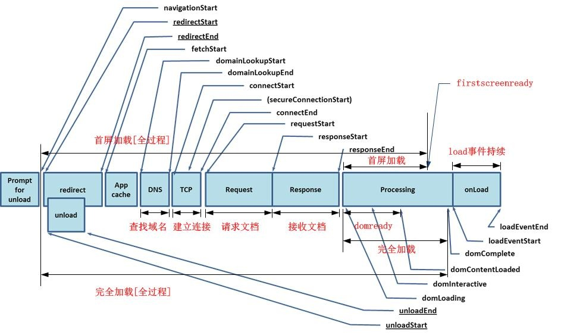
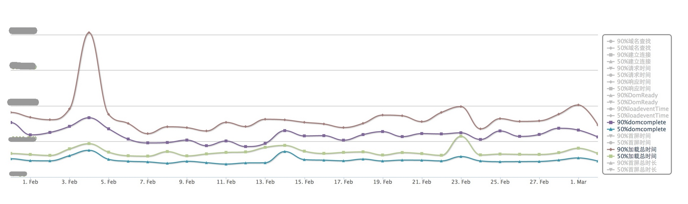

几个关于响应时间的重要条件：

- 用户在浏览网页时，**不会注意到少于 0.1 秒的延迟**；
- **少于 1 秒**的延迟不会中断用户的正常思维， 但是一些延迟会被用户注意到；
- 延迟时间**少于 10 秒**，用户会继续等待响应；
- 延迟时间**超过 10 秒**后，用户将会放弃并开始其他操作；

## 指标分类

- Perceived system performance✨✨：这类指标主要从工程师的角度去衡量，如后端的响应时间，当前并发的用户数，请求数，请求的错误率等等。
- Perceived user experience✨✨✨📌：这类指标用来衡量⽤户的真实体验，从用户体验的角度出发，如首屏时间，白屏时间，完全加载时间之类，即用户能实际感觉到得网页加载延迟。
- System performance：这类指标从服务器的角度出发，监测目前服务器的 CPU、内存、网络带宽、流量等等物理资源。✨

## Perceived system performance

> 分析 nginx 日志

1. 响应时间

在美团，响应时间是性能的主要 kpi，对于响应时间，美团做了很多精细化的处理； 首先对每个业务的整体(集群)响应时间有个衡量：

- 95%的响应时间：将一段时间内所有请求的响应时间中取一个值，使 95%的请求响应时间均小于或等于它，此值即为 95%请求覆盖的响应时间。
- 90%的响应时间：将一段时间内所有请求的响应时间中取一个值，使 90%的请求响应时间均小于或等于它，此值即为 90%请求覆盖的响应时间。
- 50%的响应时间：将一段时间内所有请求的响应时间中取一个值，使 50%的请求响应时间均小于或等于它，此值即为 50%请求覆盖的响应时间。

更精细化的统计

- 最大响应时间：某请求的某段时间范围内响应时间的最大值。
- 最小响应时间: 某请求的某段时间范围内响应时间的最小值。
- 时间标准差：某请求某段时间范围内的波动情况，用来衡量某请求是否存在很大波动，标准差越大，波动越大。

2. 请求数（按天或小时统计）

3. 错误率

关于错误率的统计主要有以下几种：

- connection timeout:http 请求中出现 504 的次数和比例。
- error response：http 请求中出现 500 的次数和比例。
- 错误网关数：http 请求中出现 502 的次数和比例。
- 异常日志统计:统计业务中出现得异常的数量和趋势。

## Perceived user experience

> web Vitals 量化

这类指标从用户的角度出发，通过模拟用户请求或对真实用户抽样，来监控用户对网站的实际体验效果，主要利用 js 来收集不同浏览器下访问网站的加载速度和性能；对于一次完整用户请求来说，http 请求可以划分为如下几个阶段：

- DNS：域名解析阶段，通常在几毫秒左右
- TCP：建立网络连接
- Requesting：发送请求
- WebServer 处理
- Transferring：传输数据
- Parsing：浏览器解析。几个重要的时间点为：
  a. 首屏时间 客户端第一屏资源加载完毕
  b. domready 时间 DOM 解析完毕，可以进行动态修改
  c. load 时间 所有资源加载完毕

对于上述的几个阶段，我们设立了多种时间参数（每个参数又有 90% 和 50% 两种指标）来衡量，具体如下：

- 查找域名：开始查找域名到查找结束,计算公式为（domainLookupEnd - domainLookupStart）
- 建立连接：开始发出连接请求到连接成功,计算公式为（connectEnd - connectStart）
- 请求文档：开始请求文档到开始接收文档,计算公式为（responseStart - requestStart）
- 接收文档：开始接收文档到文档接收完成,计算公式为（responseEnd - responseStart）
- domready：开始解析文档到 DOMContentLoaded 事件被触发,计算公式为（domContentLoadedEventStart - domLoading）
- load 事件持续：load 事件被触发到 load 事件完成,计算公式为（loadEventEnd - loadEventStart）
- 完全加载：开始解析文档到文档完全加载,计算公式为（domComplete - domLoading）
- 首屏加载：开始解析文档到首屏加载完毕,计算公式为（firstscreenready - domLoading）
- 完全加载【全过程】：此次浏览最开始时刻到完全加载完毕,计算公式为（domComplete - navigationStart）
- 首屏加载【全过程】：此次浏览最开始时刻到首屏加载完毕,计算公式为（firstscreenready - navigationStart）

为了更清楚的说明每个参数的意义，用下图说明如下：

其中不同的指标对于用户体验的影响权重不同，对于用户来说白屏时间（浏览最开始时刻到首屏加载前）和首屏时间是最重要的。

某应用的上述时间参数趋势图：

## System performance

这类指标主要监测目前服务器的 cpu，内存，硬盘 io 率，网络带宽,流量等等物理资源的使用情况，这类指标比较常见。

> 接入[prometheus](https://github.com/prometheus)
